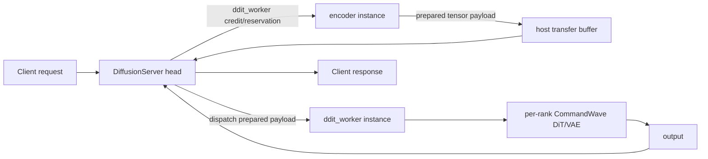
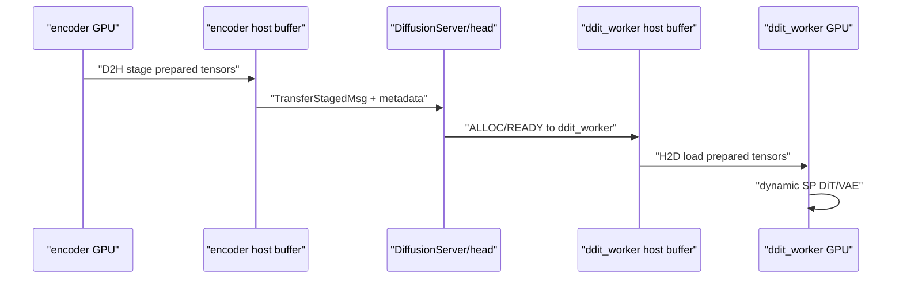
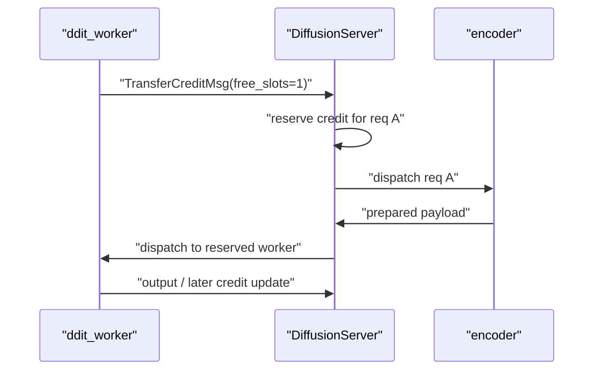
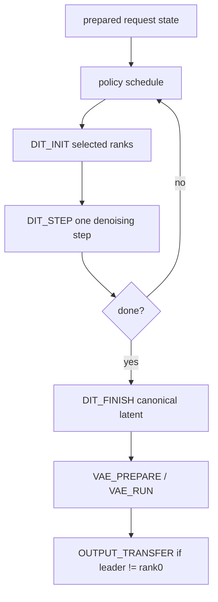
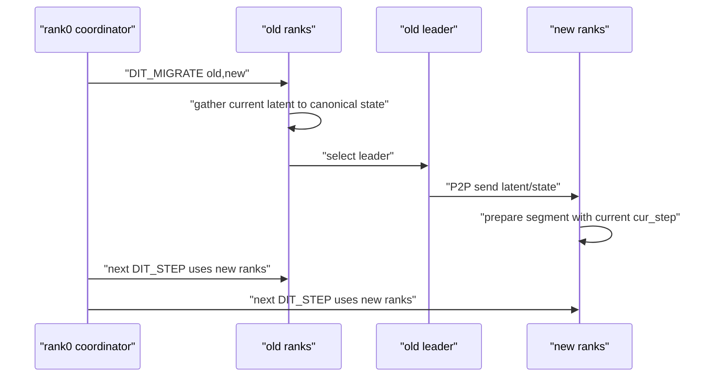
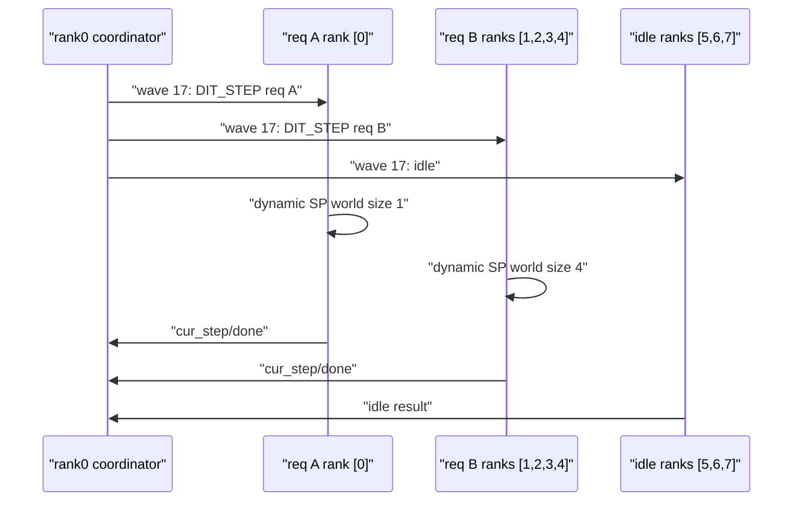

# SGLang Diffusion DDiT 代码 Cookbook

本文解释本轮 DDiT/FlexDiT 在 SGLang Diffusion 中的实现。重点是：two-instance disaggregation、text encoder admission、disagg buffer warmup、per-step DiT、dynamic SP correctness、rank switch state migration、DiT/VAE rank separation，以及多请求只在 DiT/VAE 阶段的真并发。

## 1. 核心不变式

- Text/image encoder 权重 shard 在 encoder instance 的 full ranks 上，所以 encoder 阶段必须 full-rank TP 执行。
- DiT/VAE 权重 replicated 在 ddit_worker 每个 rank 上，所以 DiT/VAE 可以只用 selected subgroup 执行。
- 调度只在 denoising step boundary 发生，不在单个 DiT step 中途切 rank。
- 并发 DiT/VAE 路径不使用 world device broadcast，只允许 selected subgroup collective 或明确配对的 P2P tensor transfer。
- `hungry_first` / `forced_switch` 支持 DiT/VAE rank 分离；`fixed_baseline`、`naive`、`naive_greedy`、`wsjf`、`wsjf_scale_up` 使用 VAE same ranks。

## 2. Two-instance Workflow

推荐真机 E2E 使用 `encoder + ddit_worker`：



主要文件：

- `scripts/launch_ddit_disagg_wan_t2v.py`：单机启动 head、encoder、ddit_worker。
- `runtime/disaggregation/diffusion_server.py`：two-stage routing、credit、reservation、transfer dispatch。
- `runtime/managers/scheduler.py`：ddit_worker 进入 concurrent DDiT event loop。
- `runtime/ddit/scheduler.py`：hungry、baseline、forced、profile-backed policies。
- `runtime/disaggregation/scheduler_mixin.py`：transfer buffer、warmup calibration、inbound/outbound transfer。

## 3. Buffer And Disagg Warmup

Encoder 不直接 NCCL 发 tensor 到 ddit_worker GPU。two-instance transfer 使用 host shared/pinned buffer：



`--disagg-max-slots-per-instance` 表示每个 role instance 可同时容纳多少个 prepared payload slot，不是 running DiT request 数。forced/fixed/naive/greedy/hungry 推荐 `1`，避免 text-encoder prepared backlog；WSJF/Scale-Up 推荐等于 `--ddit-window-size`，因为窗口策略需要多个 prepared request 才能排序。

`--disagg-warmup` 会让 head 在 role 注册完成后发送 startup calibration request。该 request 走完整 two-instance path，但它是 warmup request：不写 DDiT lifecycle、rank switch、op trace 实验日志。

Warmup resize 有两侧：

- encoder outbound：warmup prepared payload stage 完成后，用 outbound data/meta size 调用 `_schedule_transfer_reconfigure(...)`。
- ddit_worker inbound：收到 warmup prepared payload 后，用 inbound data/meta size 调用 `_schedule_transfer_reconfigure(...)`。

空闲时 `_maybe_apply_pending_transfer_reconfigure()` 会重建 transfer manager，实际 pool size 至少是 configured lower bound，并可按 `round_allocation_size(measured_payload) * max_slots * redundancy` 扩大。

## 4. Credit And Admission

DiffusionServer 不在没有 ddit_worker credit 时把请求送进 encoder。这样避免 req A/B 占满 DiT/VAE ranks 后，req C 仍然进入 text encoder 并堆积在 prepared phase。



关键状态：

- `_ddit_worker_free_slots`：worker 当前可接收 prepared request 的 credit。
- `_ddit_worker_admission_reservations`：已经允许进入 encoder、但尚未被 ddit_worker 接收的 request。
- `_drain_encoder_tta`：只有能 reserve ddit_worker credit 时才 dispatch encoder。
- `_drain_ddit_worker_tta`：prepared payload 到达后优先投递到 reserved worker。

Single-instance 仍保留 backpressure：`FULL_PREPARE` 是 full-rank exclusive wave；没有 policy credit 时只写 `prepare_backpressure` trace，不 pop waiting queue。

## 5. Per-step DiT

Per-step runner 把传统完整 DiT loop 拆成可调度的 step：



入口：

- `prepare_hungry_request`：single-instance full-rank prepare。
- `register_hungry_prepared_request`：ddit_worker 注册 encoder 已准备好的 state，不重跑 text encoder。
- `start_hungry_dit`：在 selected ranks 初始化 DiT segment state。
- `run_hungry_dit_step`：只推进一个 denoising step，返回 `cur_step/done`。
- `migrate_hungry_dit`：rank switch 时迁移 latent 和 loop state。
- `finish_hungry_dit`：canonicalize final latent。

Scheduler 看到的是 completed step count，因此可以在 step boundary 做 hungry expansion、WSJF-ScaleUp migration 或 forced switch。

## 6. Dynamic SP Correctness

`DynamicSPGroupRegistry` 按 sorted rank tuple 缓存 subgroup，例如 `(0, 3, 5, 7)`。`use_dynamic_sp_group(server_args, ranks)` 在单个 DiT step 或 VAE decode 期间临时设置当前 SP context。

`--ddit-sp-degree-map shortpath` 是当前 DDiT 实验推荐的 degree solver。它不改变 prebuild 的外层逻辑：`prebuild_dynamic_sp_groups` 仍然枚举 allowed rank tuples 并调用 registry；registry 在解析 degree 时发现 `shortpath`，就按 model id 和 rank count 查内置表。`wan2.1-t2v-1.3b` 使用 `1->1x1, 2->2x1, 4->4x1, 8->2x4`；`z-image` 使用 `1->1x1, 2->2x1, 4->2x2, 8->2x4`。这个规则只在 DDiT dynamic SP group 中生效，用来避免某些 rank count 下 Ulysses degree 与模型 attention heads 不兼容；text encoder full-rank TP、普通 SP 和非 DDiT disagg path 都不会走它。

正确性约束：

- rank tuple 必须来自同一节点 local ranks。
- rank count 必须属于 allowed power-of-two 集合。
- 模型 forward 内动态读取当前 SP world size / rank，避免初始化时缓存的 `sp_size` 在扩容后过期。
- 并发路径不走 full world broadcast latent/output，避免不同 request 的 subgroup collective 互相阻塞。

结果是：req A 可在 rank `[0]` 跑一个 DiT step，同时 req B 在 ranks `[1,2,3,4]` 跑另一个 DiT step。

## 7. Rank Switch Migration

Rank switch 只发生在 completed step boundary。迁移时 old/new union ranks 进入同一个 `DIT_MIGRATE` op：



迁移不重跑 preprocess，不重置 latent，不回到 step 0。forced switch 使用 request 的 `ddit_switch_plan` 生成固定 migration；hungry/WSJF-ScaleUp 使用 policy starvation score 生成 migration。

## 8. DiT/VAE Rank Handling

DiT 完成后先在 final DiT ranks 上执行 `DIT_FINISH`，得到 canonical final latent。

- `hungry_first` / `forced_switch`：`resolve_vae_ranks` 选择 VAE ranks，优先级是 request `ddit_vae_ranks` > request `ddit_vae_k` > server `--ddit_vae_gpus`。
- `fixed_baseline` / `naive` / `naive_greedy` / `wsjf` / `wsjf_scale_up`：`vae_same_as_dit=True`，VAE ranks 等于 final DiT ranks。
- 若 VAE ranks 与 final DiT ranks 不同，`VAE_PREPARE` 分发 final latent 到 VAE ranks。
- 若 VAE leader 不是 rank0，runtime 追加 `OUTPUT_TRANSFER`，把 output tensor P2P 交给 rank0。

## 9. True Concurrent Runtime

`CommandWaveBuilder` 保证同一 wave 内的 ops rank-disjoint：



Text encoder 不参与这种长期并发 ownership；它在 encoder instance 中 full-rank TP 执行。真正多请求多 rank 并发只发生在 ddit_worker 的 DiT/VAE 阶段。

`ddit_op_trace.jsonl` 是验收主证据：同一 `wave_id` 内不同 request 的 `dit_step` / `vae_run` 时间区间应重叠，且 ranks 不重叠。

## 10. Scheduling Policies

- `ForcedSwitchScheduler`：正确性验证策略；按 request `initial_ranks` 启动，并在指定 completed step 切换到计划 ranks。
- `FixedBaselineScheduler`：固定 k ranks 跑 DiT/VAE。
- `HungryFirstScheduler`：running request 按 starvation score 扩容，再启动 waiting request；VAE 可分离。
- `NaiveScheduler`：FCFS head-of-line，必须拿到 profile opt GPU 数才启动。
- `NaiveGreedyScheduler`：FCFS head-of-line，资源不足时降级到最大可用 power-of-two。
- `WSJFScheduler`：在 prepared waiting window 内按 estimated remaining DiT time 选择短作业。
- `WSJFScaleUpScheduler`：先按 hungry-first 扩容 running request，再用 WSJF 选择 waiting request。

Policy 输出统一 rank decision，runtime 转成 `DIT_INIT` 或 `DIT_MIGRATE`：

```python
{
    "request_id": request_id,
    "stage": "dit",
    "old_ranks": old_ranks,
    "new_ranks": new_ranks,
    "reason": policy_name,
    "policy": policy_name,
}
```

## 11. Logs

- `ddit_lifecycle.csv`：request add、DiT start/end、VAE start/end，最后三行写 p50/p90/p99 lifespan。
- `ddit_rank_switch.jsonl`：DiT rank assignment、DiT migration、DiT->VAE rank choice。
- `ddit_op_trace.jsonl`：每个 wave、rank、op 的 start/end 时间。

Warmup request 用于 transfer calibration，不进入这些 DDiT 实验日志。

## 12. 当前边界

已实现：

- 单机 full-rank text/image encoder。
- 单机 DiT/VAE dynamic SP subgroup。
- step-boundary rank switch。
- DiT/VAE rank separation 与 same-ranks 策略。
- per-rank `CommandWave` 真并发。
- single-instance prepare backpressure。
- two-instance encoder -> ddit_worker disaggregation。
- disagg transfer warmup sizing for encoder outbound and ddit_worker inbound payloads。

暂不实现：

- 跨节点 SP。
- 跨节点 latent migration。
- 跨节点 VAE。
- 同一实例内 overlapping encoder parent group 与 compute parent group 并发执行。
