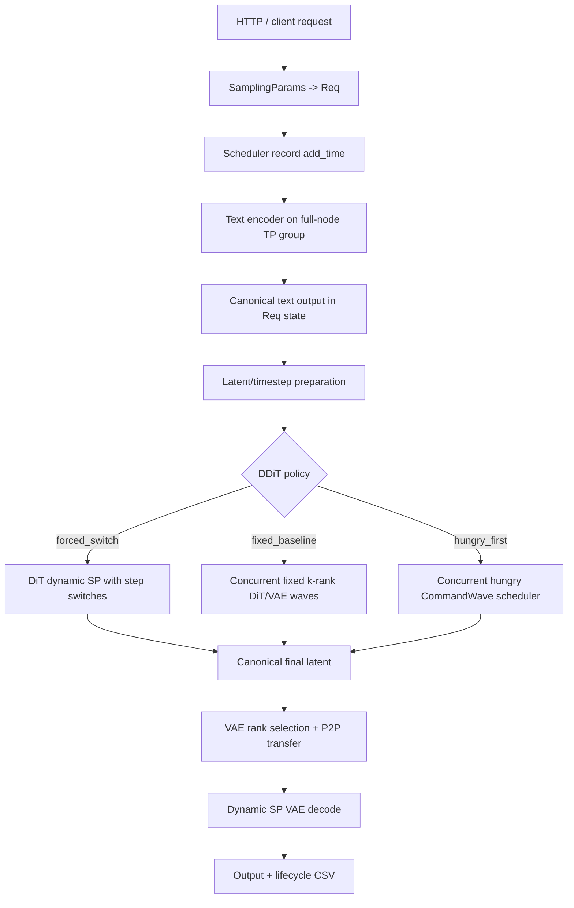
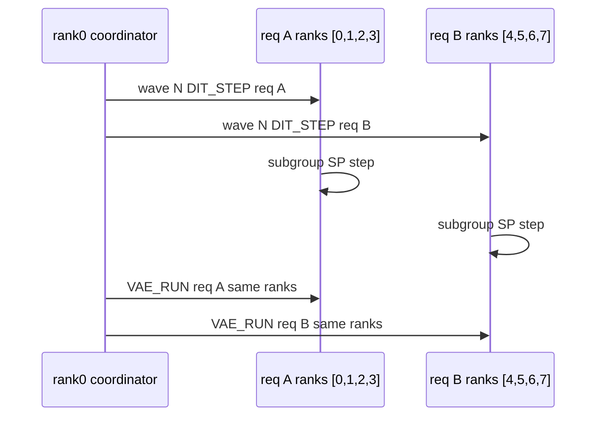
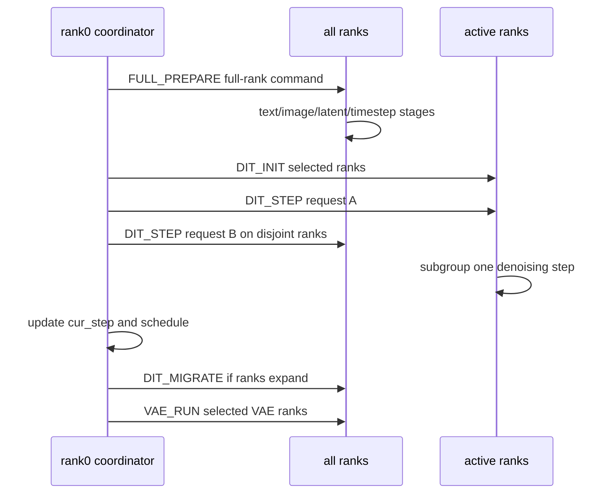
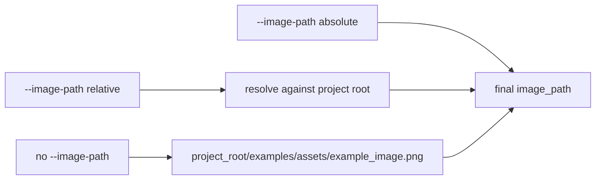

# SGLang Diffusion DDiT 代码 Cookbook

本文档解释本次 DDiT/FlexDiT 开发涉及的核心文件、类、函数和 workflow。正文用中文说明，源码符号保持英文。

## 1. 总体 Workflow



核心原则：

- text encoder 参数 shard 到本节点全机 TP group，因此 text encoder 永远使用全机 ranks。
- DiT/VAE 参数 replicated 到每个 rank，因此 DiT/VAE 可以切到 selected dynamic SP ranks。
- DDiT 扩缩容只发生在 denoising step 边界。
- fixed baseline 中，`k` 只表示 DiT/VAE 固定卡数，不影响 text encoder。
- hungry schedule 中，rank0 coordinator 在每个 step boundary 生成 per-rank `CommandWave`，不同请求的 disjoint rank groups 可以同 wave 并发。

## 2. `runtime/ddit/config.py`

职责：解析 DDiT 参数，生成每个请求的执行计划。

关键类型：

```python
@dataclass(frozen=True)
class DDiTExecutionPlan:
    initial_ranks: tuple[int, ...]
    switches: tuple[DDiTSwitchEvent, ...]
    policy: str = "forced_switch"
    force_dynamic: bool = False
```

关键函数：

- `resolve_schedule_policy`：校验并返回 `forced_switch`、`hungry_first` 或 `fixed_baseline`。
- `select_preferred_rank_tuple`：从 free ranks 中选 k 个 ranks，优先连续 block，否则稳定选择 sorted free ranks 的前 k 个。
- `build_execution_plan`：生成 DiT ranks 和 step switch events。
- `resolve_vae_ranks`：非 fixed-baseline 下按 `ddit_vae_ranks > ddit_vae_k > --ddit-vae-gpus` 选择 VAE ranks；fixed-baseline 下直接复用 final DiT ranks。

fixed-baseline 特殊逻辑：

```python
if policy == "fixed_baseline":
    initial_ranks = parse_rank_list(batch.extra.get("ddit_baseline_ranks"))
    if not initial_ranks:
        initial_ranks = select_preferred_rank_tuple(local_rank_tuple, baseline_gpus)
    switch_plan = ()
```

这保证 `ddit_initial_gpus` 和 `ddit_switch_plan` 不会干扰 fixed baseline。

## 3. `runtime/ddit/scheduler.py`

职责：提供可单元测试的调度策略。

`HungryFirstScheduler`：

- 维护 waiting/running requests 和 rank ownership。
- running DiT 请求根据 starvation score 排序。
- waiting 请求优先尝试 opt GPU 数，资源不足时选小于等于 free 数的最大 power-of-two。
- rank 选择复用 `select_preferred_rank_tuple`，因此不再要求连续 ranks。
- `transition_to_vae`：DiT 结束后释放不再用于 VAE 的 ranks，并把 selected VAE ranks 继续标记为该请求持有。
- `build_hungry_scheduler_config`：从 `--ddit-profile-path` 读取 `opt_gpus_num` 和 `dit_step_times`，缺失时使用默认占位表。

`FixedBaselineScheduler`：

```python
class FixedBaselineScheduler:
    def add_request(self, request): ...
    def mark_text_encoder_done(self, request_id): ...
    def schedule(self) -> list[dict[str, Any]]: ...
    def complete_request(self, request_id): ...
```

主体逻辑：

- 请求先进入 `TEXT_ENCODER_PENDING`，表示它还需要全机 TP text encoder。
- text encoder 完成后进入 `DIT_WAITING`。
- `schedule()` 只根据 DiT/VAE free ranks 分配 `baseline_gpus` 张卡。
- DiT/VAE 使用同一组 ranks，直到请求结束才释放。
- 分配时优先连续 ranks，例如 `[0,1,2,3]`；没有连续 block 时允许 `[0,2,5,7]` 这类非连续组合。

## 4. `runtime/ddit/dynamic_sp.py`

职责：缓存 dynamic sequence-parallel process groups。

关键类：

```python
class DynamicSPGroupRegistry:
    def get(self, ranks: tuple[int, ...]): ...
    def prebuild(self): ...
    def use(self, ranks: tuple[int, ...]): ...
```

主体逻辑：

- key 是 sorted rank tuple 加 Ulysses/Ring degree。
- 支持 arbitrary same-node power-of-two rank tuple，不要求 ranks 连续。
- active ranks 使用配置的 Ulysses/Ring degree。
- inactive ranks 建 singleton groups，使所有进程都可以进入相同 control flow。
- `use_dynamic_sp_group(server_args, ranks)` 临时替换全局 SP context。

## 5. Denoising 接入

文件：`runtime/pipelines_core/stages/denoising.py`

关键函数：

- `_forward_ddit`：执行 dynamic SP denoising。
- `_prepare_ddit_segment`：在当前 active ranks 下准备 denoising invariant state。
- `_canonicalize_ddit_latents`：forced-switch 路径把 active SP shard gather 成 canonical latent，再 broadcast 给全 ranks。
- `_canonicalize_ddit_latents_local`：concurrent runtime 只在 active ranks 内 gather，不做 world broadcast。
- `ddit_hungry_start`：hungry runtime 中初始化单个请求的 denoising state。
- `ddit_hungry_step`：在 scheduler 指定的 ranks 上只执行一个 denoising step；如果 ranks 改变，先做 latent canonicalize 和 segment re-prepare。
- `ddit_hungry_migrate`：concurrent runtime 在 old/new ranks union 内迁移 latent；old leader 使用 P2P send/recv 分发给 new ranks。
- `ddit_hungry_finish`：DiT 完成后 canonicalize final latent，执行 post-denoising hook，并记录 `dit_end`。

fixed-baseline 行为：

- `build_execution_plan` 返回 `force_dynamic=True`，所以即使没有 switch plan 也会进入 `_forward_ddit`。
- `record_rank_switch(... stage="baseline", step=None, reason="fixed_baseline")` 记录固定 rank assignment。
- DiT 所有 steps 都在同一个 active ranks tuple 中执行。



hungry-first 行为：



## 6. Concurrent Runtime

文件：`runtime/managers/scheduler.py` 和 `runtime/managers/gpu_worker.py`

Scheduler 侧：

- `_ddit_concurrent_event_loop`：`hungry_first` 和 `fixed_baseline` 的 E2E runtime 入口。
- `_ddit_run_wave`：rank0 通过 multiprocessing pipes 给每个 rank 下发不同 command，随后收集每个 rank 的 result。
- `CommandWave`：一个 wave 内包含多个 rank-disjoint ops；未参与的 ranks 收到 `idle`。
- `_ddit_enqueue_schedule_decisions`：把 hungry 扩容、waiting start、baseline assignment 转成 `DIT_INIT` 或 `DIT_MIGRATE`。
- `_ddit_build_compute_wave`：优先放入 output transfer、VAE、finish、migration、init，再尽量填充 disjoint DiT steps。

GPUWorker 侧：

- `prepare_hungry_request`：执行 denoising 前所有 stages，text encoder 在 full ranks 上运行。
- `start_hungry_dit`：初始化 request-local denoising state。
- `run_hungry_dit_step`：推进一个 denoising step。
- `migrate_hungry_dit`：old ranks gather latent，old leader P2P 发送给 new ranks。
- `finish_hungry_dit`：concurrent 模式下只在 final DiT ranks 内 canonicalize latent。
- `prepare_hungry_vae`：必要时把 final latent P2P 分发到 VAE ranks。
- `run_concurrent_vae`：只在 VAE ranks decode；leader 保存或返回 output。
- `transfer_concurrent_output`：VAE leader 用 P2P 把 output tensor 发给 rank0。

并发 runtime 的粒度是 step-level wave，不是每个请求一个无限后台线程。这样可以在 step boundary 做 hungry-first 扩容和 full-rank text encoder rendezvous，同时允许 disjoint DiT/VAE rank groups 同 wave 真并发。

## 7. VAE 接入

文件：`runtime/pipelines_core/stages/decoding.py`

关键函数：

- `_forward_ddit_vae`：forced-switch/旧路径选择 VAE ranks 并在 dynamic SP context 中 decode。
- `ddit_decode_local`：concurrent runtime 在 VAE ranks 内 decode，只让 VAE leader 产生 OutputBatch。
- `_broadcast_ddit_tensor`：仅保留给 forced-switch/旧路径；concurrent runtime 使用 P2P output transfer。

fixed-baseline 行为：

- `resolve_vae_ranks` 直接返回 `ddit_final_dit_ranks`。
- 请求级 `ddit_vae_k`、`ddit_vae_ranks` 和服务级 `--ddit-vae-gpus` 不改变 ranks。
- rank switch JSONL 会记录 `reason="fixed_baseline_same_ranks"`，用于说明 VAE 复用 DiT ranks。

## 8. Server Args

文件：`runtime/server_args.py`

新增/相关参数：

- `--enable-ddit`
- `--ddit-schedule-policy forced_switch|hungry_first|fixed_baseline`
- `--ddit-baseline-gpus`
- `--ddit-initial-gpus`
- `--ddit-initial-ranks`
- `--ddit-switch-plan`
- `--ddit-vae-gpus`
- `--ddit-local-ranks`
- `--ddit-allowed-gpu-counts`
- `--ddit-sp-degree-map`
- `--ddit-prebuild-sp-groups`
- `--ddit-log-dir`

参数关系：

- forced-switch：`ddit_initial_gpus` / `ddit_initial_ranks` 决定 DiT 起始 ranks。
- fixed-baseline：`ddit_baseline_gpus` 决定 DiT/VAE 固定 ranks；`ddit_initial_gpus` 不生效。
- fixed-baseline：VAE 复用 DiT ranks，`ddit_vae_gpus` 只会产生 warning，不改变行为。
- hungry-first：`ddit_initial_gpus` 不驱动调度；runtime 使用 `HungryFirstScheduler` 和 profile 表选择 DiT ranks。
- hungry-first：VAE 默认从 final DiT ranks 中选择 `--ddit-vae-gpus` 张卡。

## 9. Mixed Workload Client

文件：`examples/multimodal_gen/ddit_mixed_workload_client.py`

关键函数：

- `counts_from_ratios`：按比例生成数量，最后一类补齐总数。
- `build_workload`：生成请求 payload，并写入 `resolution_key` / `ddit_resolution_key`。
- `detect_project_root`：从脚本路径向上查找项目根目录。
- `resolve_project_image_path`：解析 `--image-path`，默认使用 `<project_root>/examples/assets/example_image.png`。

图片路径优先级：



## 10. 日志

文件：`runtime/ddit/logging.py`

生命周期 CSV：

- 文件名：`ddit_lifecycle.csv`
- 一行一个请求。
- 最后三行自动写入 `p50/p90/p99` lifespan time。

rank switch JSONL：

- 文件名：`ddit_rank_switch.jsonl`
- forced-switch 记录 DiT step 扩容和 VAE ranks。
- fixed-baseline 记录 baseline rank assignment，以及 VAE 复用 DiT ranks。
- hungry-first 记录 waiting start、hungry expansion 和 DiT->VAE rank selection。

op trace JSONL：

- 文件名：`ddit_op_trace.jsonl`
- 由 rank0 汇总每个 rank 的 op start/end 时间写入。
- 用于验证同一 `wave_id` 内不同请求、不同 rank groups 的 DiT/VAE 并发。

## 11. 当前边界与后续

已经实现：

- fixed-baseline 参数语义。
- text encoder 全机 TP、DiT/VAE 固定 k-rank dynamic SP 的真并发 runtime。
- hungry-first 单机 per-rank command wave runtime。
- arbitrary non-contiguous same-node dynamic SP group 支持。
- fixed-baseline rank allocator 单测。
- hungry-first scheduler/profile/VAE rank 单测。
- mixed workload client project-root image path 修复。

仍需后续实现：

- 多节点 worker 注册、节点级资源池和跨节点日志汇总。
