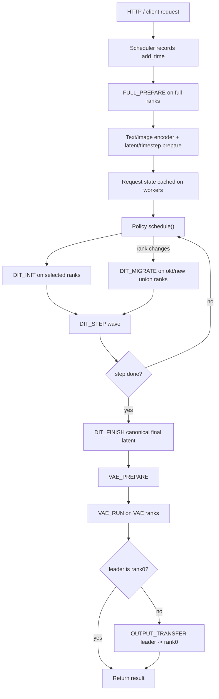
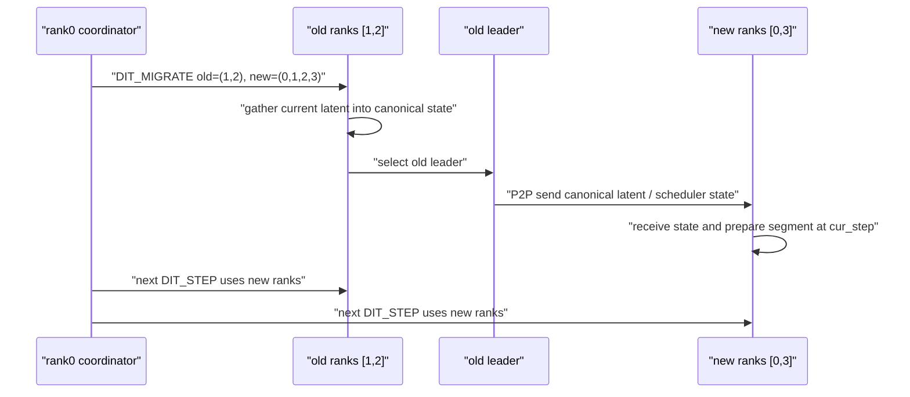
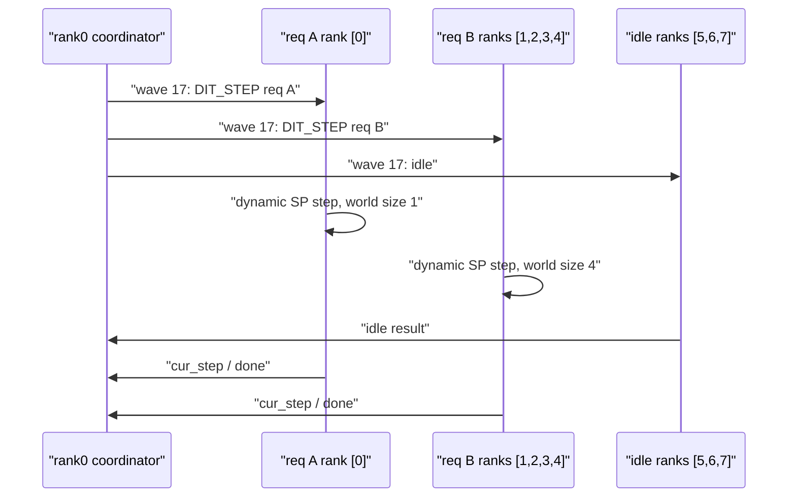

# SGLang Diffusion DDiT 代码 Cookbook

本文档解释 DDiT/FlexDiT 在 SGLang Diffusion 中的实现机制。重点是 per-step DiT、dynamic SP 正确性、rank switch 状态迁移、DiT/VAE rank 分离，以及多请求在 DiT/VAE 阶段的真并发。

## 1. End-to-End Workflow



核心不变量：

- Text encoder 权重 shard 在当前服务 full ranks 上，因此 text/image encoder 和 pre-DiT prepare 必须以 full-rank collective 执行。
- DiT/VAE 权重 replicated 在每个 rank 上，因此 DiT/VAE 可以只用某个 selected dynamic SP subgroup 执行。
- 调度只在 denoising step boundary 发生，绝不在单个 DiT step 中途切换 ranks。
- Concurrent runtime 不使用 world device broadcast 迁移 latent/output；只使用 subgroup collective 或 P2P，避免不同请求互相阻塞。

## 2. Per-step DiT Runner

相关入口：

- `Scheduler._ddit_concurrent_event_loop`
- `GPUWorker.prepare_hungry_request`
- `GPUWorker.start_hungry_dit`
- `GPUWorker.run_hungry_dit_step`
- `GPUWorker.finish_hungry_dit`
- `DenoisingStage.ddit_hungry_start`
- `DenoisingStage.ddit_hungry_step`
- `DenoisingStage.ddit_hungry_finish`

调用链：

1. rank0 收到 request 后创建 `FULL_PREPARE` exclusive wave，所有 ranks 都执行 `prepare_hungry_request(req)`。
2. `prepare_hungry_request` 只做一次 denoising 前置工作：input validation、text/image encoder、latent preparation、timestep/scheduler preparation。
3. full-rank prepare 完成后，request 进入 policy 的 waiting queue；此时还没有长期占用 DiT/VAE ranks。
4. policy 返回 DiT rank decision 后，runtime 生成 `DIT_INIT`，selected ranks 调用 `start_hungry_dit`。
5. `start_hungry_dit` 在 selected ranks 下调用 `ddit_hungry_start`，为当前 rank group 准备 DiT segment state。
6. 每个 `DIT_STEP` 只执行一个 denoising step；`run_hungry_dit_step` 返回 `cur_step` 和 `done` 给 rank0。
7. rank0 更新 `DDiTRequestState.cur_step`，再调用 `policy.schedule()` 决定下一轮是继续 step、扩容、finish，还是启动其他 request。

Per-step 执行的关键是：scheduler 看到的是 completed step count，而不是长时间占用的完整 DiT loop。这样每个 step boundary 都可以成为安全调度点。

## 3. Dynamic SP Correctness

相关入口：

- `DynamicSPGroupRegistry`
- `use_dynamic_sp_group`
- `DenoisingStage._prepare_ddit_segment`
- `DenoisingStage.ddit_hungry_step`
- `DecodingStage.ddit_decode_local`

Dynamic SP 的正确性来自四层约束：

1. **Rank tuple 稳定**：每个 subgroup 使用 sorted rank tuple 作为 key，例如 `(1, 2, 3, 4)`。同一个 tuple 总是映射到同一个 cached process group。
2. **Power-of-two 约束**：调度器只分配 allowed GPU counts，默认是 `1,2,4,8`，并按当前 local ranks 自动裁剪。
3. **Context 临时切换**：进入 DiT step 或 VAE decode 前，`use_dynamic_sp_group(server_args, ranks)` 临时设置当前 SP context；模型 forward 内动态读取当前 SP world size/rank。
4. **Collective 范围受限**：并发路径只允许 selected subgroup 内 collective，或者 old/new ranks 之间 P2P；不走 full world device broadcast。

因此，rank `[0]` 跑 request A 的 step 时，不会被 request B 在 ranks `[1,2,3,4]` 的 subgroup collective 卡住。

## 4. Rank Switch State Migration

相关入口：

- `Scheduler._ddit_enqueue_schedule_decisions`
- `GPUWorker.migrate_hungry_dit`
- `DenoisingStage.ddit_hungry_migrate`
- `DenoisingStage._canonicalize_ddit_latents_local`
- `runtime/ddit/transport.py`

Rank switch 只发生在 completed step boundary。以 old ranks `(1,2)` 扩到 new ranks `(0,1,2,3)` 为例：



正确性要点：

- old ranks 先把当前 latent gather 成 canonical state。
- old leader 负责把 canonical state 发送给新增 ranks。
- 新 ranks 收到 state 后，以当前 `cur_step` 重新 prepare segment。
- 不重新跑 text encoder，不重新初始化 latent，不回到 step 0。
- migration op 使用 old/new union ranks，确保旧 ranks 和新 ranks 都在同一个 wave 中完成交接。

## 5. DiT/VAE Rank Separation

相关入口：

- `resolve_vae_ranks`
- `GPUWorker.finish_hungry_dit`
- `GPUWorker.prepare_hungry_vae`
- `GPUWorker.run_concurrent_vae`
- `GPUWorker.transfer_concurrent_output`
- `DecodingStage.ddit_decode_local`

DiT finish 后，runtime 先在 final DiT ranks 上执行 `DIT_FINISH`，把 final latent canonicalize。随后进入 VAE：

- `hungry_first` 和 forced correctness path：调用 `resolve_vae_ranks`，按 request override 或 server `--ddit-vae-gpus` 从 final DiT ranks 中选择 VAE ranks。
- `fixed_baseline` 与 profile-backed 策略：`vae_same_as_dit=True`，VAE ranks 直接等于 final DiT ranks。
- 如果 VAE ranks 与 final DiT ranks 不同，`prepare_hungry_vae` 使用 P2P 把 final latent 分发到 VAE ranks。
- `run_concurrent_vae` 只在 VAE ranks 中执行 decode；非 VAE ranks 不参与该 subgroup collective。
- 如果 VAE leader 不是 rank0，runtime 追加 `OUTPUT_TRANSFER`，由 leader P2P 把 output tensor 交给 rank0，再返回 client。

这保证了 DiT/VAE 可以使用不同 ranks，同时 output 最终仍由 rank0 统一返回。

## 6. True Concurrent Multi-request Runtime

相关入口：

- `CommandWave`
- `CommandWaveBuilder`
- `Scheduler._ddit_run_wave`
- `Scheduler._ddit_build_compute_wave`
- `Scheduler._ddit_add_step_ops`

并发只发生在 DiT/VAE 阶段，不发生在 text encoder 阶段：

- `FULL_PREPARE` 是 full-rank exclusive wave。所有 ranks 短暂进入 text/image encoder collective，完成后释放回 coordinator。
- DiT/VAE ownership 由 policy 的 `gpu_owner` 维护；text encoder 的短暂 full-rank collective 不进入长期 ownership。
- `CommandWaveBuilder` 在同一 wave 内只接受 rank-disjoint ops；如果某 op 的 ranks 与已加入 op 重叠，就会留到后续 wave。
- rank0 给每个 rank 下发不同 command；没参与计算的 rank 收到 `idle`。
- `ddit_op_trace.jsonl` 汇总每个 rank 的 op start/end，是确认真并发的证据。



## 7. Scheduling Policies

相关入口：

- `HungryFirstScheduler`
- `FixedBaselineScheduler`
- `ProfileBackedScheduler`
- `NaiveScheduler`
- `NaiveGreedyScheduler`
- `WSJFScheduler`
- `WSJFScaleUpScheduler`

Policy 输出 rank decisions，runtime 把它们转换为 `DIT_INIT` 或 `DIT_MIGRATE`：

```python
{
    "request_id": request_id,
    "stage": "dit",
    "old_ranks": old_ranks,
    "new_ranks": new_ranks,
    "reason": policy_name,
    "policy": policy_name,
}
```

策略语义：

- `hungry_first`：running 请求按 starvation score 扩容，再启动 waiting 请求；VAE 可与 DiT 分离。
- `fixed_baseline`：每个请求固定 k ranks 跑 DiT/VAE，VAE same ranks。
- `naive`：FCFS head-of-line，必须拿到 profile opt GPU 数才启动。
- `naive_greedy`：FCFS head-of-line，资源不足时降级到不超过 free ranks 的最大 power-of-two。
- `wsjf`：维护 prepared waiting window，按 estimated remaining DiT time 选择最短任务。
- `wsjf_scale_up`：先按 hungry-first 扩容 running request，再用 WSJF 选择 waiting request。

## 8. Profile Data

相关入口：

- `DDiTProfile`
- `ProfileStore`
- `resolve_profile_model_id`

Profile 查找优先级：

1. 如果传 `--ddit-profile-path`，从 JSON 文件加载。
2. 如果 JSON 是 multi-model schema，用 `--ddit-profile-model-id` 选择模型。
3. 如果没有 profile path，用内置 deterministic placeholder。
4. resolution 缺失时 fallback 到 `opt=1`、`step_time=1.0`。

Profile 只影响调度决策，不改变模型 forward 数值逻辑。

## 9. Logs and Observability

相关入口：

- `record_lifecycle`
- `record_rank_switch`
- `record_op_trace`

日志闭包：

- `ddit_lifecycle.csv` 记录 request add、DiT start/end、VAE start/end，以及最后三行 p50/p90/p99 lifespan。
- `ddit_rank_switch.jsonl` 记录 DiT rank assignment、DiT migration、DiT->VAE rank choice。
- `ddit_op_trace.jsonl` 记录每个 wave、每个 rank、每个 op 的 start/end 时间。

并发验收：

- 在同一 `wave_id` 中找不同 `request_id` 的 `dit_step` 或 `vae_run`。
- 确认这些 op 的 `ranks` 不重叠。
- 确认这些 op 的时间区间重叠。

正确性验收：

- forced-switch 在 step 15/30/45 有 rank switch。
- dynamic SP switch 后 `cur_step` 单调递增。
- VAE same-ranks 策略的 VAE event 中 `old_ranks == new_ranks`。
- hungry-first 的 VAE 分离策略中，VAE ranks 是 final DiT ranks 的子集或 request 指定 ranks。

## 10. Current Boundaries

已经实现：

- 单机 full-rank text encoder。
- 单机 DiT/VAE dynamic SP subgroup。
- step boundary rank switch。
- DiT/VAE rank separation。
- DiT/VAE same-ranks 策略。
- per-rank `CommandWave` 真并发。
- profile-backed `naive`、`naive_greedy`、`wsjf`、`wsjf_scale_up`。

仍需后续实现：

- 多节点 worker 注册与节点级资源池。
- 跨节点日志汇总和实验 launcher。
- 真实 profile 数据替换内置 placeholder。
