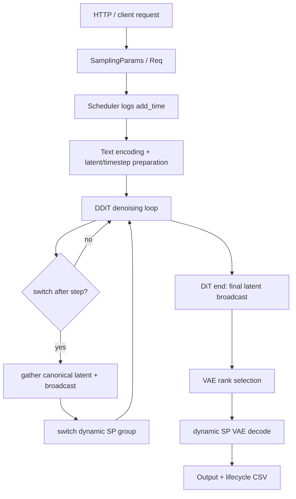
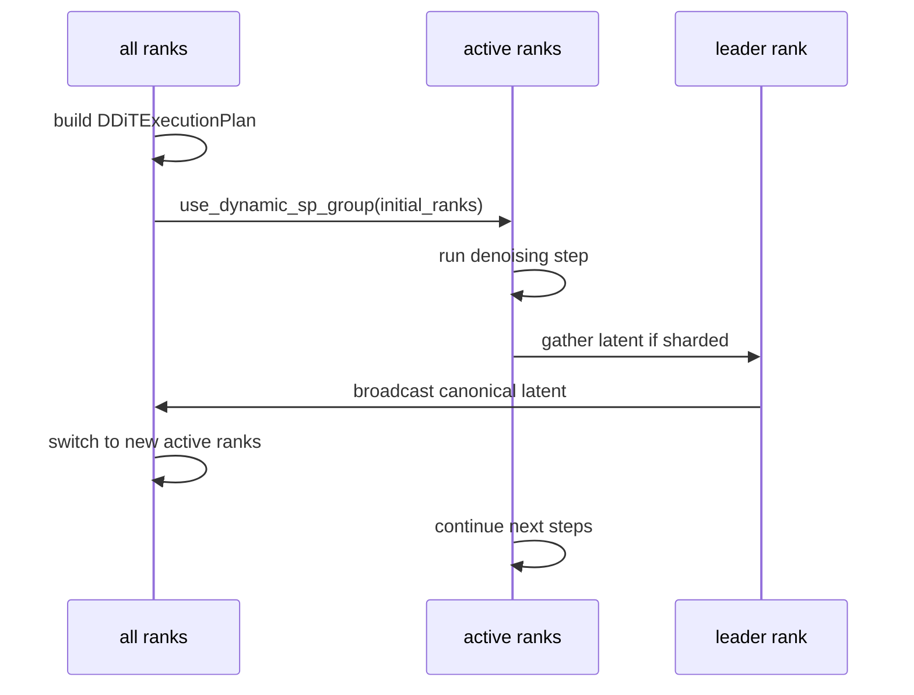
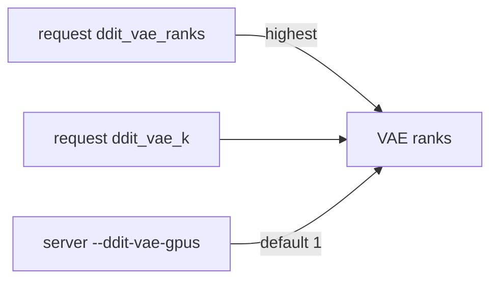

# SGLang Diffusion DDiT 代码 Cookbook

本文档解释本次 DDiT/FlexDiT 风格开发涉及的核心文件、类、函数和工作流。

## 1. 总体流程



核心原则：

- text encoder 和 latent/timestep preparation 不在扩容时重跑。
- DiT 扩容只发生在 denoising step 边界。
- 扩容时使用当前 latent 的 gather/broadcast，不重新采样初始 noise。
- VAE 默认 1 卡，但支持请求级或服务级 k 卡。

## 2. 新增 DDiT 模块

### `runtime/ddit/config.py`

负责解析和校验 DDiT 配置。

关键类型：

```python
@dataclass(frozen=True)
class DDiTSwitchEvent:
    after_step: int
    ranks: tuple[int, ...]
    reason: str = "switch_plan"

@dataclass(frozen=True)
class DDiTExecutionPlan:
    initial_ranks: tuple[int, ...]
    switches: tuple[DDiTSwitchEvent, ...]
```

关键函数：

- `parse_switch_plan`：支持 `15:1->2;30:2->4` 和 `15:0,1;30:0,1,2,3`。
- `build_execution_plan`：合并请求级和服务级配置，生成 DiT 初始 ranks 和 step switch events。
- `resolve_vae_ranks`：根据 `ddit_vae_ranks > ddit_vae_k > --ddit-vae-gpus` 选择 VAE ranks。
- `resolve_resolution_key`：优先使用请求里的 resolution key，否则从 height/width 推断。

### `runtime/ddit/dynamic_sp.py`

负责动态 SP process group。

关键类：

```python
class DynamicSPGroupRegistry:
    def get(self, ranks: tuple[int, ...]) -> SequenceParallelGroupCoordinator | None:
        ...

    def prebuild(self) -> None:
        ...

    @contextlib.contextmanager
    def use(self, ranks: tuple[int, ...]) -> Iterator[None]:
        ...
```

主体逻辑：

- 按 active rank tuple 缓存 `SequenceParallelGroupCoordinator`。
- 对 active ranks 使用配置的 Ulysses/Ring degree。
- 对 inactive ranks 建 singleton group，让所有进程都能进入同一个上下文逻辑。
- context 内临时替换全局 `_SP` 和 `PROCESS_GROUP.ULYSSES_PG/RING_PG`。

### `runtime/ddit/logging.py`

负责实验日志。

输出：

- `ddit_lifecycle.csv`：一行一个请求，记录 add/DiT/VAE 时间戳。
- `ddit_lifecycle.csv` 最后三行：`p50/p90/p99` lifespan time，即 `vae_end_time - add_time`。
- `ddit_rank_switch.jsonl`：一行一个 rank switch 事件。

关键函数：

- `record_lifecycle(server_args, batch, event)`
- `record_rank_switch(server_args, batch, stage, step, old_ranks, new_ranks, ...)`

### `runtime/ddit/scheduler.py`

实现可单测的 hungry-first policy。

关键类：

```python
class HungryFirstScheduler:
    def add_request(...)
    def update_cur_step(...)
    def schedule(...)
    def complete_dit(...)
    def complete_vae(...)
```

调度逻辑：

- waiting 请求按 FIFO 入队。
- running DiT 请求根据饥饿度排序。
- 饥饿度为：`(cur_step - last_scheduled_step) * (t(current_k) - t(opt_k))`。
- hungry 请求先扩容，最多到 opt GPU 数。
- DiT 结束后按 `vae_k` 保留 VAE ranks，VAE 结束后释放全部 ranks。

## 3. Denoising 接入

文件：`runtime/pipelines_core/stages/denoising.py`

新增主体函数：

- `_run_single_denoising_step`：把原来 forward loop 中单步 DiT 逻辑抽出来，普通路径和 DDiT 路径共用。
- `_forward_ddit`：执行 step-wise rank switching。
- `_canonicalize_ddit_latents`：在 switch 点把 active SP shard gather 成 canonical latent，再 broadcast 到所有 ranks。
- `_prepare_ddit_segment`：在新的 dynamic SP group 下准备当前 segment 的 denoising invariant state。

DDiT denoising 的关键流程：



Wan DiT 修正：

文件：`runtime/models/dits/wanvideo.py`

原来 Wan 在初始化时缓存 `self.sp_size`。DDiT 扩容后这个值会过期，所以 forward 内改为每次读取：

```python
sp_size = get_sp_world_size()
sequence_shard_enabled = forward_batch.enable_sequence_shard and sp_size > 1
```

## 4. VAE 接入

文件：`runtime/pipelines_core/stages/decoding.py`

新增主体函数：

- `_forward_ddit_vae`：根据 `resolve_vae_ranks` 选择 VAE ranks，在 dynamic SP context 中 decode。
- `_broadcast_ddit_tensor`：如果 VAE leader 不是 rank0，也把 decoded tensor broadcast 回所有 ranks，保证 rank0 可以返回结果。

VAE rank 选择优先级：



## 5. 请求与服务参数

### 服务级参数

文件：`runtime/server_args.py`

新增：

- `--enable-ddit`
- `--ddit-node-id`
- `--ddit-advertised-host`
- `--ddit-local-ranks`
- `--ddit-allowed-gpu-counts`
- `--ddit-initial-gpus`
- `--ddit-initial-ranks`
- `--ddit-switch-plan`
- `--ddit-vae-gpus`
- `--ddit-sp-degree-map`
- `--ddit-prebuild-sp-groups`
- `--ddit-log-dir`
- `--ddit-profile-path`
- `--ddit-debug-cpu-backup`

### 请求级参数

文件：`configs/sample/sampling_params.py`

新增：

- `resolution_key`
- `ddit_resolution_key`
- `ddit_initial_ranks`
- `ddit_switch_plan`
- `ddit_vae_k`
- `ddit_vae_ranks`

OpenAI video endpoint 也支持这些字段，并支持 client 指定 `request_id`。

## 6. 实验脚本

### `examples/multimodal_gen/ddit_forced_switch_wan.py`

用途：单请求正确性实验。

默认行为：

- `num_inference_steps=50`
- `initial_ranks=0`
- `switch_plan=15:1->2;30:2->4;45:4->8`
- `ddit_vae_k=1`

### `examples/multimodal_gen/ddit_mixed_workload_client.py`

用途：mixed workload E2E 压测。

主体逻辑：

- 根据 `num_requests`、`resolutions`、`ratios` 生成请求数量。
- 最后一类分辨率补齐总数。
- shuffle 后按 `rate` 发送。
- `rate=burst` 时不 sleep。

## 7. 当前边界与多机后续

当前代码完成：

- 单机 dynamic SP group。
- 请求级 forced switch。
- VAE k 卡选择与日志。
- hungry-first policy 的独立实现和单测。
- 非 `127.0.0.1` 的 advertised host 参数。
- 本节点 rank 约束。

后续多机需要：

- worker 注册协议。
- 节点级资源池和节点选择策略。
- 跨节点故障恢复。
- 多机启动脚本和日志聚合。
- 多机 E2E 验收。

明确不做：

- 跨节点 SP。
- 跨节点 latent migration。
- 同一请求跨节点 VAE。
