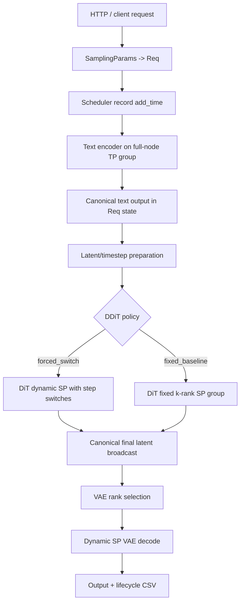
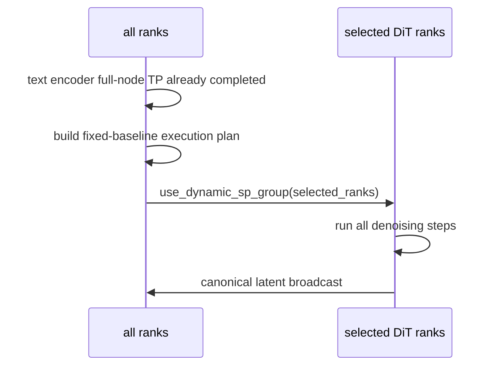
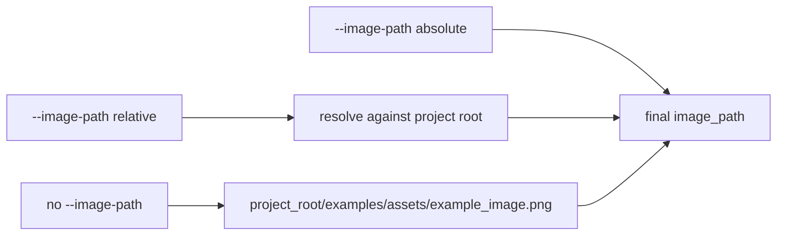

# SGLang Diffusion DDiT 代码 Cookbook

本文档解释本次 DDiT/FlexDiT 开发涉及的核心文件、类、函数和 workflow。正文用中文说明，源码符号保持英文。

## 1. 总体 Workflow



核心原则：

- text encoder 参数 shard 到本节点全机 TP group，因此 text encoder 永远使用全机 ranks。
- DiT/VAE 参数 replicated 到每个 rank，因此 DiT/VAE 可以切到 selected dynamic SP ranks。
- DDiT 扩缩容只发生在 denoising step 边界。
- fixed baseline 中，`k` 只表示 DiT/VAE 固定卡数，不影响 text encoder。

## 2. `runtime/ddit/config.py`

职责：解析 DDiT 参数，生成每个请求的执行计划。

关键类型：

```python
@dataclass(frozen=True)
class DDiTExecutionPlan:
    initial_ranks: tuple[int, ...]
    switches: tuple[DDiTSwitchEvent, ...]
    policy: str = "forced_switch"
    force_dynamic: bool = False
```

关键函数：

- `resolve_schedule_policy`：校验并返回 `forced_switch`、`hungry_first` 或 `fixed_baseline`。
- `select_preferred_rank_tuple`：从 free ranks 中选 k 个 ranks，优先连续 block，否则稳定选择 sorted free ranks 的前 k 个。
- `build_execution_plan`：生成 DiT ranks 和 step switch events。
- `resolve_vae_ranks`：非 fixed-baseline 下按 `ddit_vae_ranks > ddit_vae_k > --ddit-vae-gpus` 选择 VAE ranks；fixed-baseline 下直接复用 final DiT ranks。

fixed-baseline 特殊逻辑：

```python
if policy == "fixed_baseline":
    initial_ranks = parse_rank_list(batch.extra.get("ddit_baseline_ranks"))
    if not initial_ranks:
        initial_ranks = select_preferred_rank_tuple(local_rank_tuple, baseline_gpus)
    switch_plan = ()
```

这保证 `ddit_initial_gpus` 和 `ddit_switch_plan` 不会干扰 fixed baseline。

## 3. `runtime/ddit/scheduler.py`

职责：提供可单元测试的调度策略。

`HungryFirstScheduler`：

- 维护 waiting/running requests 和 rank ownership。
- running DiT 请求根据 starvation score 排序。
- waiting 请求优先尝试 opt GPU 数，资源不足时选小于等于 free 数的最大 power-of-two。
- rank 选择复用 `select_preferred_rank_tuple`，因此不再要求连续 ranks。

`FixedBaselineScheduler`：

```python
class FixedBaselineScheduler:
    def add_request(self, request): ...
    def mark_text_encoder_done(self, request_id): ...
    def schedule(self) -> list[dict[str, Any]]: ...
    def complete_request(self, request_id): ...
```

主体逻辑：

- 请求先进入 `TEXT_ENCODER_PENDING`，表示它还需要全机 TP text encoder。
- text encoder 完成后进入 `DIT_WAITING`。
- `schedule()` 只根据 DiT/VAE free ranks 分配 `baseline_gpus` 张卡。
- DiT/VAE 使用同一组 ranks，直到请求结束才释放。
- 分配时优先连续 ranks，例如 `[0,1,2,3]`；没有连续 block 时允许 `[0,2,5,7]` 这类非连续组合。

## 4. `runtime/ddit/dynamic_sp.py`

职责：缓存 dynamic sequence-parallel process groups。

关键类：

```python
class DynamicSPGroupRegistry:
    def get(self, ranks: tuple[int, ...]): ...
    def prebuild(self): ...
    def use(self, ranks: tuple[int, ...]): ...
```

主体逻辑：

- key 是 sorted rank tuple 加 Ulysses/Ring degree。
- 支持 arbitrary same-node power-of-two rank tuple，不要求 ranks 连续。
- active ranks 使用配置的 Ulysses/Ring degree。
- inactive ranks 建 singleton groups，使所有进程都可以进入相同 control flow。
- `use_dynamic_sp_group(server_args, ranks)` 临时替换全局 SP context。

## 5. Denoising 接入

文件：`runtime/pipelines_core/stages/denoising.py`

关键函数：

- `_forward_ddit`：执行 dynamic SP denoising。
- `_prepare_ddit_segment`：在当前 active ranks 下准备 denoising invariant state。
- `_canonicalize_ddit_latents`：把 active SP shard gather 成 canonical latent，再 broadcast 给全 ranks。

fixed-baseline 行为：

- `build_execution_plan` 返回 `force_dynamic=True`，所以即使没有 switch plan 也会进入 `_forward_ddit`。
- `record_rank_switch(... stage="baseline", step=None, reason="fixed_baseline")` 记录固定 rank assignment。
- DiT 所有 steps 都在同一个 active ranks tuple 中执行。



## 6. VAE 接入

文件：`runtime/pipelines_core/stages/decoding.py`

关键函数：

- `_forward_ddit_vae`：选择 VAE ranks 并在 dynamic SP context 中 decode。
- `_broadcast_ddit_tensor`：把 VAE leader 上的 decoded frames broadcast 回全 ranks，保证 rank0 能返回结果。

fixed-baseline 行为：

- `resolve_vae_ranks` 直接返回 `ddit_final_dit_ranks`。
- 请求级 `ddit_vae_k`、`ddit_vae_ranks` 和服务级 `--ddit-vae-gpus` 不改变 ranks。
- rank switch JSONL 会记录 `reason="fixed_baseline_same_ranks"`，用于说明 VAE 复用 DiT ranks。

## 7. Server Args

文件：`runtime/server_args.py`

新增/相关参数：

- `--enable-ddit`
- `--ddit-schedule-policy forced_switch|hungry_first|fixed_baseline`
- `--ddit-baseline-gpus`
- `--ddit-initial-gpus`
- `--ddit-initial-ranks`
- `--ddit-switch-plan`
- `--ddit-vae-gpus`
- `--ddit-local-ranks`
- `--ddit-allowed-gpu-counts`
- `--ddit-sp-degree-map`
- `--ddit-prebuild-sp-groups`
- `--ddit-log-dir`

参数关系：

- forced-switch：`ddit_initial_gpus` / `ddit_initial_ranks` 决定 DiT 起始 ranks。
- fixed-baseline：`ddit_baseline_gpus` 决定 DiT/VAE 固定 ranks；`ddit_initial_gpus` 不生效。
- fixed-baseline：VAE 复用 DiT ranks，`ddit_vae_gpus` 只会产生 warning，不改变行为。

## 8. Mixed Workload Client

文件：`examples/multimodal_gen/ddit_mixed_workload_client.py`

关键函数：

- `counts_from_ratios`：按比例生成数量，最后一类补齐总数。
- `build_workload`：生成请求 payload，并写入 `resolution_key` / `ddit_resolution_key`。
- `detect_project_root`：从脚本路径向上查找项目根目录。
- `resolve_project_image_path`：解析 `--image-path`，默认使用 `<project_root>/examples/assets/example_image.png`。

图片路径优先级：



## 9. 日志

文件：`runtime/ddit/logging.py`

生命周期 CSV：

- 文件名：`ddit_lifecycle.csv`
- 一行一个请求。
- 最后三行自动写入 `p50/p90/p99` lifespan time。

rank switch JSONL：

- 文件名：`ddit_rank_switch.jsonl`
- forced-switch 记录 DiT step 扩容和 VAE ranks。
- fixed-baseline 记录 baseline rank assignment，以及 VAE 复用 DiT ranks。

## 10. 当前边界与后续

已经实现：

- fixed-baseline 参数语义。
- text encoder 全机 TP、DiT/VAE 固定 k-rank dynamic SP 的 pipeline 路径。
- arbitrary non-contiguous same-node dynamic SP group 支持。
- fixed-baseline rank allocator 单测。
- mixed workload client project-root image path 修复。

仍需后续实现：

- phase-aware worker-pool serving loop，让不同请求的 DiT/VAE subgroup 真正并发。
- text encoder full-node TP rendezvous 与 running DiT step-boundary rendezvous 的统一调度。
- 多节点 worker 注册、节点级资源池和跨节点日志汇总。
