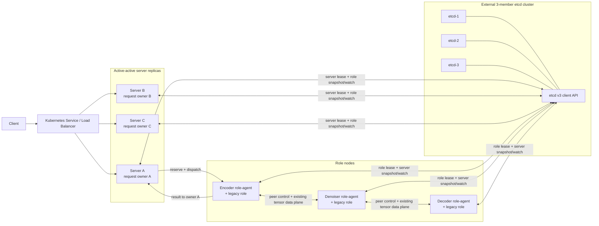
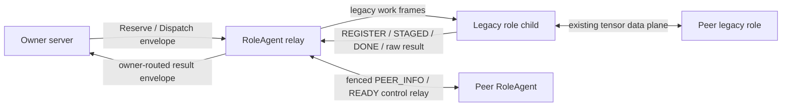
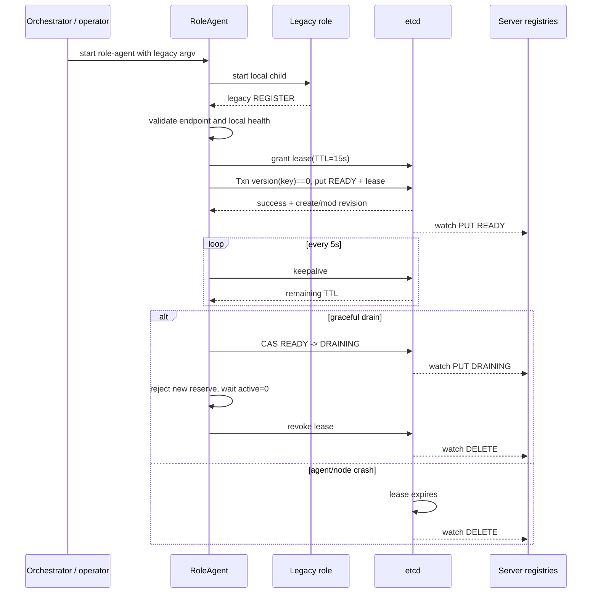
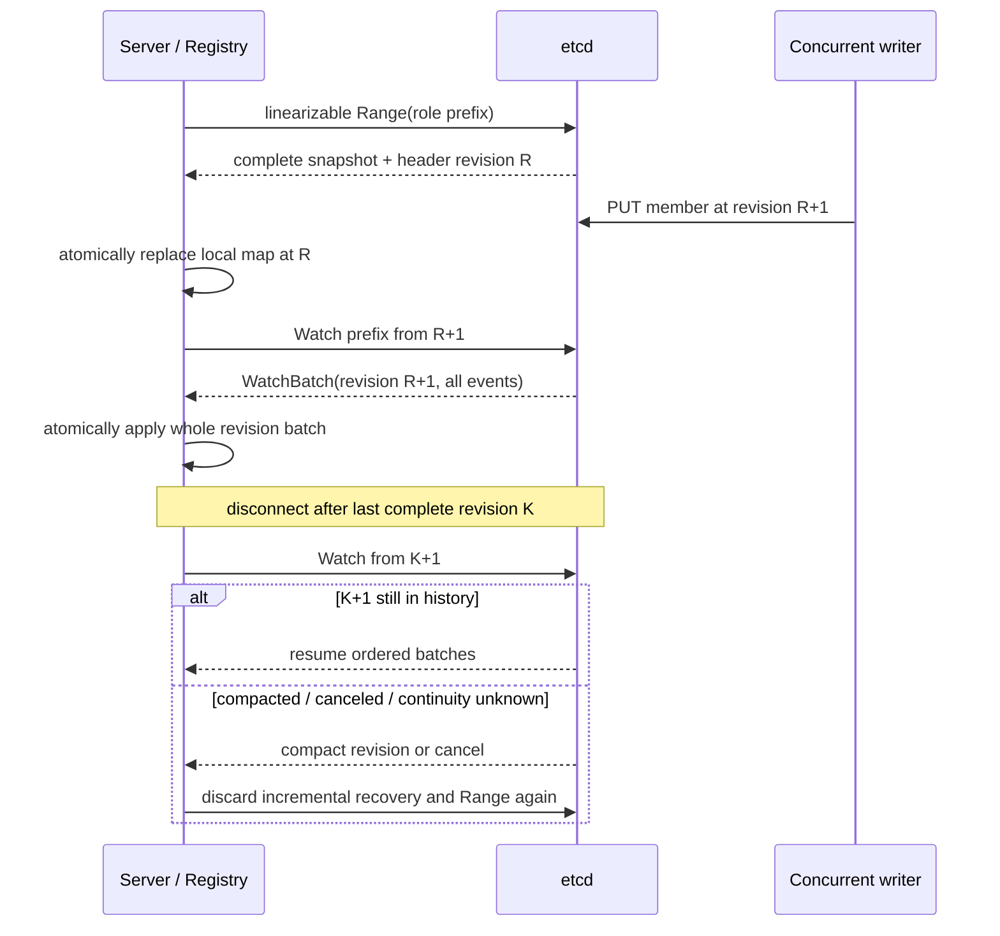
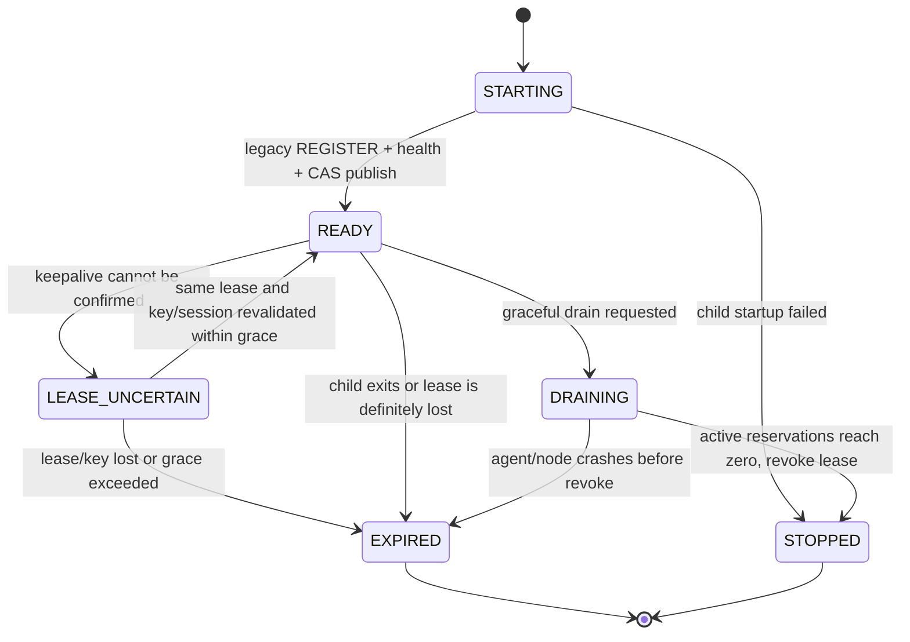
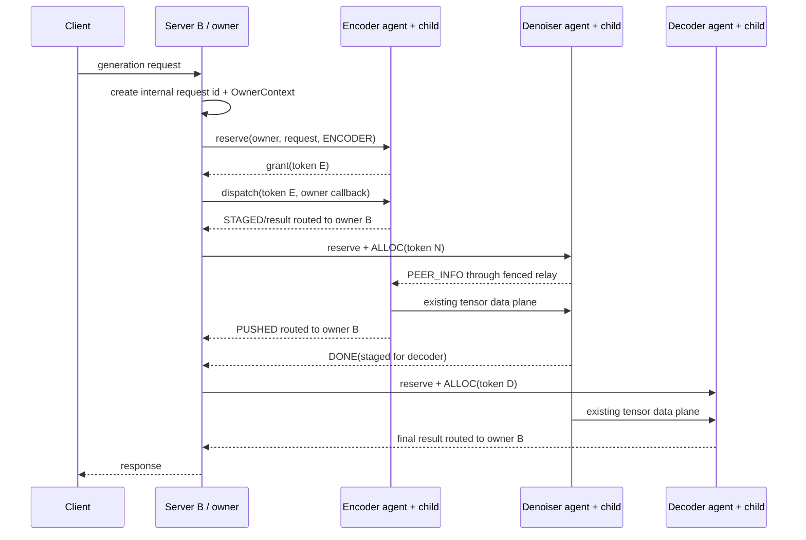
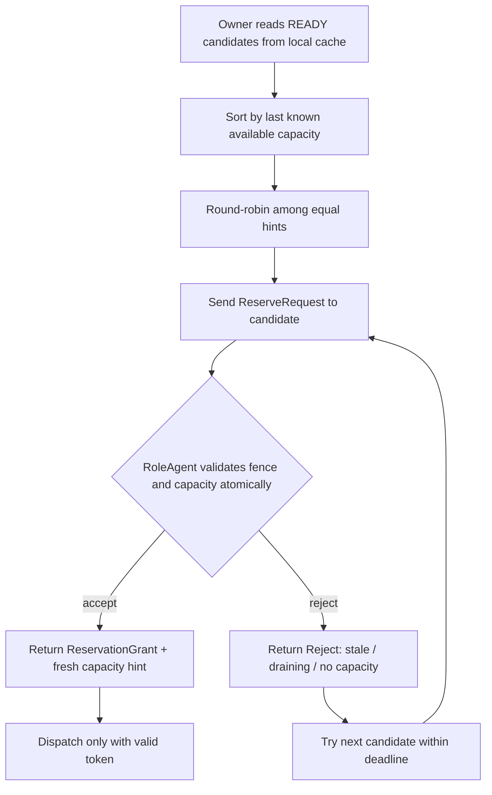
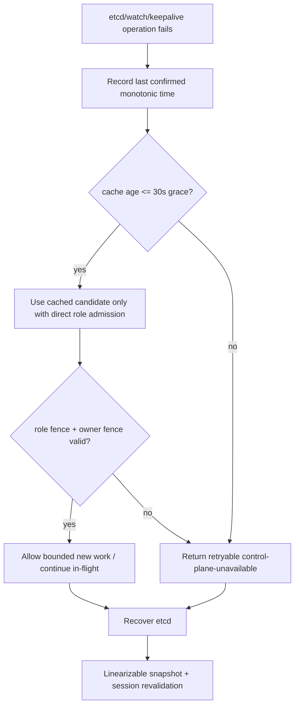
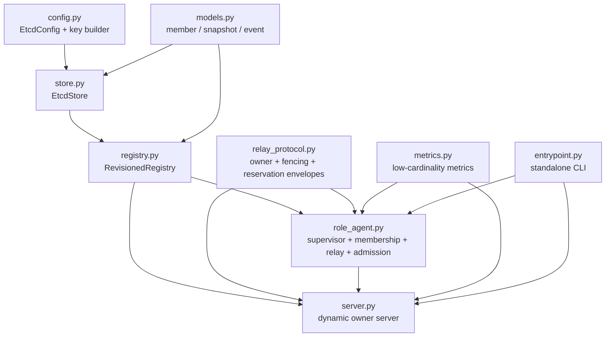

# Etcd Diffusion Server 直观设计

> - 设计基线：`clean_disaggregated_diffusion@363b4fb85b1af927be280d3d53fc17dff745f52a`
> - 开发分支：`etcd_diffusion_server_hhy`
> - 文档阶段：阶段 01，仅描述设计，不代表运行时代码已经实现
> - 最后更新：2026-07-22

## 1. 先给结论

本方案不在 SGLang 里实现 Raft，也不让 etcd 承担生成请求、TTA 队列或高频容量计数。外部 etcd 集群只是一份强一致、带生命周期的**成员目录**；真正的请求状态仍由接入请求的 server 副本保存，真正的容量裁决仍在 role-agent 本地完成。

最终形态是：

- 多个 diffusion server 副本同时工作，不选应用层主节点。
- 客户端经 Kubernetes Service、负载均衡器或显式地址选择任一健康 server。
- 接入请求的 server 成为 request owner，只保存自己的请求状态。
- encoder、denoiser、decoder 由 Kubernetes、Slurm、systemd 或人工命令启动；server 不通过 SSH 拉起它们。
- role-agent 在 legacy role 真正完成 REGISTER 和本地健康检查后，才把该 role 以 lease 绑定的 key 发布到 etcd。
- 每个 server 用“线性一致 snapshot + 从下一 revision 开始的 watch”维护本地 role 目录。
- server 根据本地提示选择候选，但 role-agent 用原子 reserve/renew/release 做最终 admission；所以多个 server 的容量视图短暂不一致也不会超卖。
- role 结果沿请求携带的 owner route 直接回 owner；不经过固定中心 server。
- owner 宕机时只丢失它自己的在途请求，客户端重新提交；其他副本继续接新请求。
- etcd 不可用时只允许明确、有限的缓存 grace；超过 grace 后停止新 admission，不把陈旧成员猜成健康成员。

这不是 RFC 中“上游 role 自己 watch etcd 并完全去中心化路由”的最终形态，而是一个兼顾现有 `DiffusionServer` 状态语义、legacy transfer protocol 和无旧文件修改约束的 active-active 过渡架构。

## 2. 阅读依据与事实边界

本设计以以下材料为依据：

- SGLang RFC：[Diffusion Disaggregation #19512](https://github.com/sgl-project/sglang/issues/19512)。
- 本地 `sglang_diffusion_disaggregation_cookbook.md`，实现锚点覆盖到 `acf71cc38`。
- 本地 `disagg_diffusion_commit_reviewbook_20260331.md`，重点解释集中式 DS、transport、scheduler、capacity 与 cleanup 的收敛过程。
- 当前固定 base 的实际源码，尤其是：
  - `runtime/launch_server.py`
  - `runtime/server_args.py`
  - `runtime/disaggregation/diffusion_server.py`
  - `runtime/disaggregation/scheduler_mixin.py`
  - `runtime/disaggregation/transport/protocol.py`
- etcd 官方的 [v3 API](https://etcd.io/docs/v3.6/learning/api/)、[API guarantees](https://etcd.io/docs/v3.5/learning/api_guarantees/)、[transport security](https://etcd.io/docs/v3.6/op-guide/security/) 和 [etcd Raft library](https://github.com/etcd-io/raft)。
- Python 客户端固定为 [etcd3gw 2.7.0](https://pypi.org/project/etcd3gw/)。

本文件区分三种内容：

- **当前事实**：固定 base 现在确实如何运行。
- **冻结设计**：阶段 02～07 必须维持的边界。
- **阶段性接口草案**：后续编码时可以细化名字，但不能改变正确性语义。

阶段 01～07 不读取或适配最新 main；阶段 08 才对当时 main 做一次性验证。

## 3. 当前集中式实现是否满足跨机晚启动

### 3.1 当前启动链的真实行为

当前 `launch_disagg_server()` 要求启动时同时给出：

- `--encoder-urls`
- `--denoiser-urls`
- `--decoder-urls`

它据此一次性构造固定长度的 work PUSH socket、`_num_encoders/_num_denoisers/_num_decoders`、free-slot 数组、capacity epoch 数组和 dispatcher。随后它启动 `DiffusionServer` 内部线程，但在启动 HTTP server 之前调用 `_wait_for_disagg_role_registration()`，等待三个 role peer dict 的数量等于预声明数量。

standalone role 通过 `--disagg-server-addr` 推导固定 result PUSH endpoint，启动 transfer manager 后发出 `TransferRegisterMsg`。当前 REGISTER 包含 `instance_id`、`session_id`、work/control endpoint、host、buffer 和 capacity 信息。server 收到后更新 peer dict 和固定数组中的容量。

### 3.2 对用户三个问题的准确回答

| 问题 | 当前 base 的答案 | 限制 |
|---|---|---|
| A 上 encoder/server 先启动，B 上 denoiser/decoder 后启动，能否汇合？ | **有条件可以** | A 启动时必须预先知道 B 的固定 work URL 和实例数量；此时 server 内部线程等待 REGISTER，HTTP 尚未启动 |
| 能否在 B 上用命令行启动 role 后注册到 server？ | **可以** | role 必须显式配置 A 的 `--disagg-server-addr`，且 `instance_id`/URL 必须与 A 的固定数组约定一致 |
| server 能否知道 role 已启动成功？ | **只能知道初次 REGISTER 到达** | `REGISTER_ACK` 仍是未使用的保留类型；没有 lease、心跳或持续健康证明，之后 role 死亡不会被可靠摘取 |
| 能否新增未预声明的 role？ | **不能安全支持** | REGISTER 虽可进入 dict，但 socket、数组和 dispatcher 不扩容；记录的 `work_endpoint` 也不会据此动态建连接 |
| server 已对外服务后能否动态摘取/补入 role？ | **不能完整支持** | 没有成员状态机、心跳、租约删除和动态 member map |
| server 能否主动 SSH 拉起 B 上 role？ | **不支持，也不在本方案实现** | 进程编排属于 Kubernetes/Slurm/systemd/人工命令 |

因此，当前实现具备“固定拓扑下等待晚到 REGISTER”的能力，却不具备真正的动态服务发现和生命周期管理。两者不能混为一谈。

### 3.3 当前动态摘取和多副本的缺口

当前 server 的核心状态都以固定实例下标组织：

- `_encoder/_denoiser/_decoder_pushes: list[Socket]`
- `_encoder/_denoiser/_decoder_free_slots: list[int]`
- `_encoder/_denoiser/_decoder_capacity_limits: list[int]`
- `_encoder/_denoiser/_decoder_capacity_epochs: list[int]`
- `_encoder/_denoiser/_decoder_peers: dict[int, dict]`
- 每类 role 一个 TTA deque

这带来五个缺口：

1. **拓扑固定**：未预声明实例无法成为可调度成员。
2. **READY 不可信**：初始 free slots 在 REGISTER 前已经存在；启动等待只保护初始 HTTP 启动，不是持续 readiness。
3. **死亡不可见**：REGISTER 后没有心跳，role/主机崩溃不会自动删除成员。
4. **单点状态**：请求 tracker、TTA、handoff、slot 账本和 client identity 都在一个 server 进程。
5. **不能直接复制多份**：如果简单复制 server，每个副本都会独立扣减 free slots，同一 role 可能被并发超卖；legacy role 结果也只连接一个固定 result endpoint，不知道请求 owner。

本设计逐项补齐这些缺口，但不推翻已经验证过的 sender/receiver slot 生命周期、ALLOC/PEER_INFO/PUSHED/DONE 语义和 role-to-role tensor 数据面。

## 4. 目标、非目标与设计原则

### 4.1 目标

- 支持 server、encoder、denoiser、decoder 按任意顺序、跨机器启动并最终自动汇合。
- server 在零 role 时也能启动并对外报告 health；具备 role 后再报告 readiness。
- 支持 role 动态增加、DRAINING、优雅退出、异常死亡、同 member 重启和自动摘取。
- 消除单 server 的故障域和集中式接入瓶颈，支持 active-active server。
- 维持容量不超卖、旧 session 不复活、结果不回错 owner 等可验证不变量。
- 控制面测试 GPU-free，并能在单机模拟真实多机网络和三节点 etcd。
- 所有运行时代码位于新增目录，最终可作为文件闭集复制到 main。

### 4.2 非目标

- 不实现 Raft、etcd server、WAL、leader election、quorum 或 etcd 运维 snapshot。
- 不用 SSH 启动远端 role。
- 不让 etcd 保存 request、TTA、payload、reservation 表、free-slot 高频变化或 tensor 地址。
- 不自动接管 owner 宕机时的在途请求。
- 不修改现有 ZMQ、shared-memory、Mooncake/RDMA tensor 数据面。
- 本阶段不实现代码，不启动 etcd 或 server，不运行 GPU 测试。
- TLS 范围只覆盖到 etcd；不把现有数据面描述成已经具备 mTLS。

### 4.3 设计原则

1. **etcd 保存事实，不保存热状态**：成员是谁、哪一代 session、是否 READY/DRAINING；请求热路径不进入 etcd。
2. **缓存用于性能，role admission 用于正确性**：server 的容量提示可以旧，role-agent 的原子 reserve 不能错。
3. **一请求一 owner**：不做跨 server 的细粒度共享状态，active-active 才能保持简单。
4. **generation 必须可 fence**：任何会跨 lease、重启或网络分区存活的消息都携带 session 和 registration revision。
5. **故障时明确降级**：不能证明健康时，宁可 retryable 503，也不把陈旧节点当活节点。
6. **兼容放在边缘**：legacy 协议由新增 role-agent/adapter 包装，核心 registry 和调度模型不依赖旧 server 的固定数组。

## 5. 总体架构



为什么这样设计：

- 外部负载均衡只决定新请求进入哪个 server；进入后 owner 不再变化，所以不需要 server 间复制 request tracker。
- etcd 集群是所有副本共享的成员事实源，但 request、tensor 和容量 token 都不经过 etcd，因此请求 QPS 不会直接变成 etcd 写 QPS。
- role-agent 位于新控制面与 legacy role 之间：它能在不修改旧 role 文件的前提下拦截 REGISTER、执行 lease、admission 和 owner 路由。
- role 间的 PEER_INFO 和 tensor 传输仍走现有直连路径；agent 只包装控制消息，不中转大 tensor。
- 任一 server 失败，负载均衡把新请求送到其他副本；任一 etcd member 失败，只要多数派仍在，所有副本继续工作。

失败时：owner 的内存请求状态不会迁移，相关客户端重试；role token 到期后容量回收。这个有界失败面比复制整个 handoff 状态机更容易证明正确。

## 6. 控制面与请求热路径的边界

| 数据 | 保存位置 | 更新频率 | 是否进入 etcd | 原因 |
|---|---|---:|---|---|
| role/server 成员身份 | etcd + 各进程本地缓存 | 启停/状态切换 | 是 | 需要强一致发现和生命周期 |
| lease/keepalive | etcd | TTL 周期 | 是 | 自动摘取死亡进程 |
| request owner context | owner 内存 | 每请求 | 否 | 高频、短命、只被一个 owner 使用 |
| TTA/pipeline 状态 | owner 内存 | 每 stage | 否 | 热路径，写 etcd 会放大延迟和 QPS |
| 声明 capacity | role member 元数据 | 启动/重配 | 是 | 低频静态上限，用于初始排序 |
| 当前 available capacity | role-agent + server hint | 每 reserve/release | 否 | 高频，正确性在 role 本地 |
| reservation token | role-agent 和 owner 内存 | 每 stage | 否 | 短命、session-bound，不需要全局共识 |
| tensor/pool pointer/shm name | legacy role/peer control | 每 session/transfer | 否 | host/session 局部信息，不应进入成员目录 |
| metrics | 各进程本地/监控系统 | 高频 | 否 | etcd 不是 metrics 数据库 |

设计上的关键判断是：etcd 解决“这个成员现在是否仍有有效身份”，并不解决“这个瞬间还有几个 slot”。后者通过 role-agent 单点临界区裁决，避免把每个生成请求变成 Raft 日志。

## 7. 组件职责

### 7.1 `EtcdStore`

- 唯一允许直接依赖 `etcd3gw==2.7.0` 的模块。
- 封装 endpoint failover、TLS/auth、deadline 和错误分类。
- 提供 lease grant/refresh/revoke、CAS transaction、线性一致 prefix Range、revision watch。
- 高层客户端不能表达 header revision 或 Txn 时，只在该层调用标准 etcd v3 gateway API。
- 不暴露 `etcd3gw` 类型给 registry、role-agent 或 server。

### 7.2 `RevisionedRegistry`

- 把 etcd 前缀投影成进程内不可变 member map。
- 用 snapshot revision 和 watch batch 保证没有 snapshot/watch 窗口丢事件。
- watch 断线从最后完整 revision 续接；compaction/cancel 时全量重建。
- server 实例维护 role registry；role-agent 维护 server registry，用于 owner fencing。

### 7.3 `RoleAgent`

- 作为本机 legacy role supervisor，不跨机器启动进程。
- 把 legacy child 的 result endpoint 指向本机 relay，从而截获 REGISTER 和后续结果。
- 只有 child REGISTER、endpoint 校验和健康探测都成功，才发布 etcd READY key。
- 暴露稳定 relay endpoint，接收多个 server 的 reserve/dispatch/control。
- 将 legacy child 的 PEER_INFO/READY/PUSHED/DONE/raw result 按 request route 转给正确 owner。
- 维护 session fence、reservation 表和有限期 owner route table。
- child 退出、lease 丢失或 drain 时停止新 admission 并清理成员身份。

### 7.4 `DynamicDiffusionServer`

- 独立于旧 `DiffusionServer` 的固定数组实现，使用 `member_id -> RoleHandle` 动态 map。
- 在零 role 状态启动；`/health` 与 `/ready` 分离。
- 每个请求创建 `OwnerContext` 和本地 pipeline/handoff 状态。
- 从本地 registry 选择候选，向 role-agent reserve 成功后才 dispatch。
- 结果回调验证 owner/session/request/stage/token 后推进状态。
- 不写请求状态到 etcd，不与其他 server 同步 TTA。

### 7.5 `entrypoint.py`

- 提供新增模块自己的 Linux CLI，不修改旧 SGLang CLI 文件。
- 至少支持 `server` 与 `role-agent` 子命令。
- role-agent 接受 legacy role argv 并以子进程方式启动；这就是“在 B 上人工启动 role”的推荐入口。
- 阶段 08 若 main 协议变化，只在新增 compatibility adapter 内转换。

## 8. Role-agent 与 legacy role 的兼容边界



为什么需要这一层：

- legacy role 只知道一个固定 `disagg_server_addr`，无法天然把不同请求结果发给不同 owner。
- legacy REGISTER 没有 lease，也没有持续健康语义。
- 旧协议不认识 reservation token 和 owner session。
- 直接修改旧 role/launcher 会破坏“新增文件闭集”要求。

role-agent 通过本地 endpoint 重定向解决这些问题：child 仍说旧协议，agent 在外层补上 owner、session、revision 和 token。大 tensor 仍由 legacy sender/receiver 直接传输，agent 不复制 payload。

失败时：如果 agent 崩溃，child 不再有可达 relay 且 lease 到期，所有 server 删除该 member；如果 child 崩溃，supervisor 立即撤销或停止续租。任何一种都不会留下可持续接受新请求的“幽灵 role”。

## 9. Key schema 与成员数据

### 9.1 Key schema

```text
/{namespace}/diffusion/v1/{cluster_id}/roles/{role_type}/{member_id}
/{namespace}/diffusion/v1/{cluster_id}/servers/{server_id}
```

示例：

```text
/sglang/diffusion/v1/kling-prod/roles/denoising/denoiser-b-0
/sglang/diffusion/v1/kling-prod/servers/diffusion-server-a-2
```

约束：

- `namespace` 和 `cluster_id` 必须经过字符集/长度校验，防止跨集群读写。
- `member_id/server_id` 是部署身份，不等于 IP；IP 可复用，不能作为 generation fence。
- 每次进程启动生成新的不可预测 `session_id`。
- role key 和 server key 都绑定各自 lease。
- key 删除是“当前 session 不再是有效成员”的事实；EXPIRED 不需要永久 tombstone key。

### 9.2 `RoleMember` JSON v1

```json
{
  "schema_version": 1,
  "kind": "role",
  "cluster_id": "kling-prod",
  "role_type": "denoising",
  "member_id": "denoiser-b-0",
  "session_id": "9cae...",
  "state": "READY",
  "relay_endpoint": "tcp://10.0.2.15:41000",
  "protocol_version": 1,
  "capacity_units": 8,
  "capabilities": ["legacy-transfer-v1", "owner-route-v1"],
  "host_id": "node-b",
  "zone": "zone-b",
  "lease_id": "diagnostic-only",
  "started_at_unix_ms": 1784650000000
}
```

### 9.3 `ServerMember` JSON v1

```json
{
  "schema_version": 1,
  "kind": "server",
  "cluster_id": "kling-prod",
  "server_id": "diffusion-server-a-2",
  "session_id": "75bf...",
  "state": "READY",
  "client_endpoint": "http://10.0.1.12:30000",
  "callback_endpoint": "tcp://10.0.1.12:42000",
  "protocol_version": 1,
  "lease_id": "diagnostic-only",
  "started_at_unix_ms": 1784650001000
}
```

成员 JSON 不包含：密码、证书内容、生成 payload、当前 free slots、reservation、pool pointer、shm name 或 request ID。

`ServerMember.state=READY` 只表示该 server 自身的 callback/event loop 已可工作，不代表三类 role 已齐全。面向负载均衡器的 `/ready` 还必须检查 registry 已初次同步、控制面未超过 grace、每类必需 role 至少有一个 READY 候选；两种 readiness 不得混用。

### 9.4 Revision 的两种用途

registry 记录在 JSON 外保存：

- `create_revision`：该 key 当前这一代从无到有的 revision；key 删除重建后一定变化，作为稳定 generation fence。
- `mod_revision`：该 value 最近一次状态更新的 revision；用于 CAS READY→DRAINING，更新后会变化。

消息中的 `member_revision` 指 `create_revision`，不能用会随 DRAINING 更新的 `mod_revision` 充当稳定 token。状态写入则比较期望 `mod_revision + 完整旧 value/session`，避免旧进程覆盖新状态。

### 9.5 注册和状态更新 CAS

注册：

```text
IF version(member_key) == 0
THEN put(member_key, READY_member_json, lease_id)
ELSE return existing record; do not overwrite
```

进入 DRAINING：

```text
IF mod_revision(member_key) == expected_mod_revision
   AND value(member_key) == expected_current_value
THEN put(member_key, DRAINING_member_json, same_lease_id)
ELSE reject stale updater
```

JSON 内字段无法作为 etcd 的“局部字段比较”，所以实现不能伪造 `value.session_id == ...` 的局部 CAS；要么比较完整确定性序列化 value，要么用 `mod_revision` 锁定已读取版本，必要时两者同时比较。

## 10. Lease 与 keepalive 生命周期



为什么这样设计：

- child 启动成功不等于可服务；必须等 REGISTER 和健康校验后才发布 READY。
- graceful drain 用 PUT DRAINING 让 server 立即停止新调度，不必等 TTL。
- 非优雅崩溃无法执行 cleanup，lease 到期删除 key 是最终兜底。
- lease 是 liveness 证据，不是万能锁；旧进程暂停后恢复仍可能发送消息，所以每条消息还要做 fencing。

失败时：keepalive 一次超时不能被记成成功。agent 记录最后一次确认时间，进入 `LEASE_UNCERTAIN` 并停止或在有限 grace 内收紧 admission；一旦确认 lease/key/session 已丢失，该进程不能把旧 session 恢复为 READY，只能停止服务或建立全新 session。

## 11. Snapshot/watch 无缝衔接



固定算法：

1. 做线性一致 prefix Range，得到完整集合和 header revision `R`。
2. 解析、校验后，在锁内原子替换本地 map，设置 `last_applied_revision=R`。
3. 从 `R+1` 建立 watch。
4. 以**完整 revision batch**为单位应用 PUT/DELETE；同一 transaction 修改多个 key 时，先应用该 revision 的全部事件，再推进 `last_applied_revision`。
5. 正常断线从最后完整 batch 的下一 revision 续接。
6. compact/cancel/无法证明连续时丢弃增量假设，重新执行 1～5。

为什么必须是 batch：etcd 的一个事务只增加一次 revision，同一 revision 可以含多个 key 事件。如果处理第一个事件就推进 revision，再用“`event.revision <= last_applied_revision` 忽略”过滤后续事件，会错误丢掉同事务的其他成员变化。

etcd watch 保证历史窗口内 ordered、unique、reliable、atomic、resumable，但 watch 本身不是线性一致读。因此必须显式拼接 snapshot revision 与 watch start revision，不能“先 watch 一会儿，再猜缓存是否完整”。

## 12. Role 状态机与动态摘取



状态分两层：

- **agent 本地状态**：包含 STARTING、LEASE_UNCERTAIN、EXPIRED、STOPPED。
- **etcd 广告状态**：正常只发布 READY 或 DRAINING；agent 崩溃时用 DELETE 表达过期，因为它无法可靠写 EXPIRED。

server 候选过滤规则：

- 只有 registry 中 schema/协议兼容、state=READY、session/revision 完整的 member 才是候选。
- DRAINING PUT 到达后立即从新请求候选中摘取，但已有 token 按 deadline 完成或超时。
- DELETE 到达后删除 handle、关闭对应连接，并让尚未 dispatch 的请求换候选。
- 同 `member_id` 重建 key 后 `create_revision/session_id` 都变化；旧连接和旧 token 不能复用。

动态新增就是 watch PUT 一个新 READY member；动态摘取就是 READY→DRAINING 或 lease DELETE。server 不再维护需要整体重建的固定数组。

## 13. Request owner 与结果回传



`OwnerContext` 至少包含：

```text
owner_server_id
owner_session_id
owner_create_revision
callback_endpoint
internal_request_id
client_request_id / optional idempotency key
deadline
```

内部 request ID 必须跨 server 全局唯一，不能只信任客户端可能重复的 `request_id`。推荐由 owner session + UUID 组成，client request ID 另存映射。

为什么结果能回对 owner：首次 dispatch 时 role-agent 把 `internal_request_id -> OwnerRoute` 写入有限期本地表；legacy child 的 STAGED/PUSHED/DONE/raw result 回到 agent 后，由 agent包装 owner context 并直连 callback endpoint。owner 收到时再次校验 owner session、request、stage、role session 和 token。

失败时：callback 失败不改发其他 server；其他 server 没有该请求状态。token 最终到期并释放容量，客户端根据 retryable 结果或连接失败重新提交。

## 14. Capacity admission



role-agent 在一个本地临界区中完成：

```text
validate current role session/create_revision/state
expire old tokens
validate owner session/create_revision
check active_units + requested_units <= capacity_units
insert token bound to owner/request/stage/session/expiry
return grant
```

`ReservationToken` 至少绑定：

- 随机 token ID。
- role member/session/create revision。
- owner server/session/create revision。
- internal request ID 和 pipeline stage。
- units。
- role-agent 本地单调时钟 expiry。

默认建议 TTL 30 秒、每 10 秒 renew，可配置。跨机器不能比较彼此的 monotonic timestamp；owner 只根据 grant 返回的相对 TTL 安排续约，过期最终由 role-agent 自己的单调时钟裁决。

正确性由 role-agent admission 保证，server 的“最大可用容量优先 + round-robin tie-break”只影响效率。reserve reject 后换候选，不会突破容量；owner 宕机后停止 renew，token 在 TTL 内回收。每个 request 的 reserve/renew/release 都是 role 直连消息，不写 etcd。

## 15. Fencing：为什么 lease 之外还需要 token

lease 只能证明 etcd 最近收到过续约，不能阻止以下场景：

1. role 进程被暂停 40 秒，lease 过期、key 被删除；进程恢复后仍持有旧内存和 socket。
2. server 重启复用同一个 server ID，旧 callback 晚到。
3. role 重启后 member ID 相同，但 transfer buffer/session 已经重建。
4. owner 已释放 token，重复/乱序 dispatch 或 result 晚到。

因此每个关键消息必须验证三层 fence：

- **membership fence**：`member_id + session_id + create_revision`。
- **owner fence**：`server_id + owner_session_id + owner_create_revision`。
- **reservation fence**：`token_id + request_id + stage + units + expiry`。

旧消息的处理原则是“拒绝并计数，不改变容量，不推进请求状态”。fencing 是正确性机制，不是身份认证；攻击者仍需由 TLS/RBAC 和数据面网络边界防护。

## 16. 故障流与 30 秒 grace



grace 从“最后一次可证明成功的 snapshot/watch progress 或 keepalive 响应”开始，用本地单调时钟计算：

- server 的 role cache 未超过 grace 时，可以尝试直连候选；role-agent 仍作最终 admission。
- role-agent 自己的 lease 确认未超过 grace 时才可有限接受；超过后新 reserve 必须为 0。
- 恢复后先做线性一致 snapshot 和 session 重验证，再退出 degraded；不能直接把断线期间的猜测状态并回缓存。
- 在途 token 仍受 request deadline 和 reservation TTL 限制，不能因 etcd 故障无限续命。

grace 是可用性权衡，不是把 etcd 变成最终一致系统。默认 30 秒会在阶段 06 通过故障注入验证。

## 17. 故障矩阵

| 故障 | 发现机制 | 新请求行为 | 在途请求行为 | 恢复/清理 |
|---|---|---|---|---|
| legacy child 正常退出 | supervisor | agent 先 DRAINING，拒绝新 reserve | 等 active=0 或 deadline | revoke lease，停止 child |
| legacy child SIGKILL | supervisor 立即发现 | agent 停止 admission | 相关请求明确失败/换候选 | revoke；若 agent 同时死则等 lease |
| role-agent/主机崩溃 | lease DELETE | watch 后从候选删除 | 直连失败或 token 失效 | token/route 随进程消失，客户端/owner处理失败 |
| 同 member 重启 | 新 session + 新 create revision | 只选新 generation | 旧 generation 消息全部拒绝 | 旧连接关闭 |
| role READY→DRAINING | CAS PUT + watch | 立即不再选 | 已 grant token 按策略收束 | active=0 后 revoke |
| 一个 server 副本崩溃 | server lease DELETE + LB | 其他副本继续接新请求 | 仅该 owner 的请求失败 | role token TTL 回收 |
| server 同 ID 重启 | 新 owner session/revision | 新请求使用新 owner fence | 旧 callback/renew/release 拒绝 | 旧 token 到期 |
| 单 etcd member 停止 | client endpoint failover/Raft quorum | 正常 | 正常 | endpoint 切换 |
| etcd 丢 quorum | KV/lease/watch 不可确认 | grace 内受限，之后 retryable 503 | token/deadline 内收束 | quorum 恢复后 full snapshot |
| server 与 etcd 分区 | cache age | grace 内直连 admission | 可继续有限完成 | 超 grace 停新请求，恢复后 resync |
| role 与 etcd 分区 | keepalive age | role 超 grace 后拒绝 | 既有 token 到期 | 重新确认同 lease，或新 session |
| server 与 role 分区 | reserve/dispatch timeout | 换下一候选或 503 | 明确 stage 失败 | 连接恢复后重新探测 |
| watch 断线 | stream error | 缓存 grace | admission 兜底 | 从 last revision+1 续接 |
| watch revision compacted | compact/cancel | registry 标 degraded | admission 兜底 | 丢弃增量并 full snapshot |
| 重复 member 注册 | `version(key)==0` CAS | 只有一个成功 | 无影响 | 失败实例停止或使用新 ID |
| 重复/乱序 result | owner/token state | 不推进 | 拒绝并计数 | 保持容量和状态幂等 |
| owner callback 不可达 | role-agent 直连失败 | 不改投其他 owner | 请求由 client 重试 | route/token 到期 |

## 18. 安全边界

### 18.1 TLS/mTLS 做什么

server/role-agent 到 etcd 支持：

- CA 校验：确认连接到可信 etcd。
- server hostname/SAN 校验：防止证书虽受信但主机名不匹配。
- client certificate/key：etcd 开启 `client-cert-auth` 后识别客户端身份。
- username/password：作为 etcd auth 身份补充；必须在 TLS 内传输。
- RBAC：约束身份可读写的 key prefix。

生产配置若 TLS 错误必须失败，不能自动降级成明文。日志、异常和 `repr` 不得包含 password、Authorization header、私钥内容或证书内容。

### 18.2 建议最小权限

- server 身份：读/watch role 和 server 前缀；只写自身 server key/lease。
- role-agent 身份：读/watch server 前缀；只写自身 role key/lease。
- 测试管理员身份：仅用于建立/回收测试 key 和账号，不进入服务配置。

etcd RBAC 的精细程度取决于部署是否能为每个实例签发独立身份；做不到时至少按 cluster prefix 隔离 server 与 role 权限。

### 18.3 明确未覆盖

本次 TLS 不改变 role-agent/legacy role、server/role relay、ZMQ、shared-memory 或 Mooncake/RDMA 的传输安全。它们应部署在受信网络或由基础设施网络策略隔离；未来若需要端到端认证，应单独设计，不在本阶段暗示已经具备。

## 19. 为什么不用 Redis primary-replica 或自研 Raft

### 19.1 不自研 Raft

etcd 已使用成熟 Raft 实现处理 leader election、日志复制、多数派提交、线性一致读和成员变化。SGLang 只调用 KV、Lease、Watch、Txn API。自行实现 election timer、WAL、snapshot 恢复或 quorum，不但重复工作，还会把成员发现功能升级成一个新的分布式数据库项目。

### 19.2 不选基础 Redis primary-replica

本需求的核心不是缓存吞吐，而是：

- CAS 注册只有一个成功。
- 成员 key 与 liveness lease 原生绑定。
- watch 可以从 revision 恢复，并能识别 compaction。
- 读取/事务具备明确的强一致语义。
- generation revision 可直接参与 fencing。

Redis 可以通过 TTL、Lua、Streams、Sentinel/Cluster 和自定义 token 组合出相似能力，但需要我们额外定义可靠消费位置、故障切换丢写边界和 fencing 证明。etcd 的原生语义使实现面更小。这里的 etcd watch 是变更事件流；Redis `WATCH` 是事务乐观锁，两者不要混淆。

### 19.3 不在 etcd 里选 server leader

server 之间没有需要单写者维护的共享 request 状态，因此应用层 leader 只会重新制造瓶颈。所有副本都可以注册、watch、接请求；etcd 内部是否有 Raft leader 与 SGLang server 谁接请求无关。

## 20. 配置草案

`EtcdConfig` 至少包含：

```text
endpoints: list[str]
namespace: str
cluster_id: str
connect_timeout_s: float
request_timeout_s: float
watch_timeout_s: float
lease_ttl_s: int = 15
keepalive_interval_s: float = 5
control_plane_grace_s: float = 30
retry_initial_backoff_s / retry_max_backoff_s / jitter
ca_cert / client_cert / client_key / server_name
username / password
allow_plaintext_for_test: bool
```

配置校验：

- keepalive interval 必须显著小于 lease TTL。
- 生产模式不允许 TLS 配置不完整后自动明文。
- namespace/cluster/member ID 必须规范化并防止路径穿越。
- endpoint 为空、重复、scheme 非法要在启动时失败。
- password 等敏感字段的 `repr` 永远脱敏。

## 21. 未来新增文件与模块关系



为什么这样拆：

- `store.py` 隔离第三方客户端和 HTTP/gateway 细节，后续换客户端不会污染业务类。
- `registry.py` 只负责 revision 连续性，不知道 role 调度或请求。
- `role_agent.py` 是旧协议适配和最终 admission 的资源端。
- `server.py` 是 owner 状态机，不承担 lease client 的底层实现。
- `relay_protocol.py` 让 owner/fencing/token 词汇表独立于 legacy transfer dataclass。
- `metrics.py` 与控制逻辑分离，避免“为了统计”改变状态机。
- `entrypoint.py` 提供新文件闭集的入口，不要求修改旧 CLI。

阶段 02 只完成 config/models/store/registry；阶段 03 才加入 role-agent；阶段 04 才有单 server；阶段 05 才打开 active-active 和 admission。这个顺序让每层都能单独验收。

## 22. 关键接口草案

### 22.1 `EtcdStore`

```text
grant_lease(ttl) -> LeaseHandle
refresh_lease(lease_id) -> remaining_ttl
revoke_lease(lease_id) -> None
create_if_absent(key, value, lease_id) -> PutResult
compare_and_put(key, expected_mod_revision, expected_value, new_value, lease_id) -> PutResult
delete_if_matches(key, expected_mod_revision, expected_value) -> DeleteResult
get_prefix_snapshot(prefix) -> RegistrySnapshot[bytes]
watch_prefix(prefix, start_revision, stop_event) -> stream[WatchBatch]
close() -> None
```

### 22.2 `RevisionedRegistry`

```text
start()
wait_initial_sync(deadline)
snapshot() -> immutable RegistryView
health() -> RegistryHealth
stop()
```

### 22.3 `RoleAgent`

```text
start()
wait_ready(deadline)
reserve(request) -> grant | reject
renew(token) -> renewed | reject
release(token) -> released | already_released
request_drain(deadline)
stop()
```

### 22.4 `DynamicDiffusionServer`

```text
start()
health() -> process health
readiness() -> registry + required role readiness
submit(request) -> response | retryable error
stop()
```

所有关闭方法必须幂等并能有限时间退出 watch、keepalive、socket 和子进程。watch 回调不能直接做阻塞网络 I/O；它只构造新 registry view/变更队列。

## 23. 正确性不变量与验证映射

| 不变量 | 设计机制 | 未来测试阶段 |
|---|---|---|
| 同一 `role/member_id` 同时最多一个有效 session | `version(key)==0` CAS + lease | 02、03 |
| registry = snapshot R + R 后完整事件 | revision-aware Range + whole-revision WatchBatch | 02 |
| watch 断线/compaction 不猜事件 | last complete revision resume / full resync | 02、06 |
| READY 前不被调度 | REGISTER+health 后才 CAS publish | 03 |
| role 死亡最终摘取 | supervisor revoke + lease DELETE | 03、04、06 |
| DRAINING 后不接新请求 | CAS state + candidate filter + agent reject | 03、04 |
| active reservations 不超过 capacity | role-agent 单临界区 admission | 05、06 |
| 旧 role session 接受数为 0 | session + create revision fence | 03、05、06 |
| 旧 owner session 接受数为 0 | server member fence + token binding | 05、06 |
| wrong-owner callback 为 0 | OwnerRoute + owner callback validation | 05、06 |
| owner 宕机只影响自己请求 | owner-local state + token TTL | 05、06 |
| 请求 QPS 不增加 etcd 写 QPS | etcd 仅成员/lease，reserve 直连 role | 05、06 |
| lease 不确定不伪装成功 | last-confirmed time + grace + revalidation | 02、03、06 |
| grace 后陈旧成员新 admission 为 0 | server/agent 双侧 degraded gate | 06 |

阶段 02 的真实三节点 etcd 是硬门禁；mock 只能制造精确竞态，不能证明 lease/watch/compaction/单 member 故障语义。

## 24. 测试设计的直观说明

控制面本身不依赖 GPU。大多数核心错误是成员时序、revision、lease、进程死亡、socket 路由和并发 capacity 错误，使用 CPU mock legacy role 反而更容易确定性复现。

后续测试分四层：

1. **etcd 语义层**：真实三节点集群验证 CAS、lease DELETE、snapshot/watch、compaction、TLS/auth。
2. **role 生命周期层**：CPU child 模拟迟到 REGISTER、优雅退出、SIGKILL、暂停恢复和旧 session 消息。
3. **pipeline/active-active 层**：多个本地进程模拟跨机 server/role，验证 owner 路由、三段 pipeline、容量竞争和 owner 崩溃。
4. **故障压力层**：网络代理注入延迟、断连、乱序和 etcd quorum 故障，记录恢复时间、错误接受数、CPU/RSS 和 etcd QPS。

多机不是逻辑正确性的必要条件：单机用不同 network namespace/container/端口即可验证绝大多数协议。真实跨机仍需补一次，以发现 advertised address、NAT、防火墙、SAN 和时钟暂停等环境问题。GPU 只用于最后确认现有 tensor 数据面未被 wrapper 破坏，不是 etcd 控制面门禁。

## 25. 观测指标

必须从一开始设计低基数指标，禁止把 request ID/member ID 直接作为 metrics label：

- registry：snapshot revision、last applied revision、member count、watch lag、reconnect、resync、parse failure。
- lease：grant、keepalive success/failure、last confirmed age、lost、revoke、expiry observed latency。
- role lifecycle：STARTING/READY/DRAINING/EXPIRED 数量与转换延迟。
- admission：reserve grant/reject/timeout、active units、capacity、renew/release/expiry、stale reject。
- server：health/readiness、missing roles、503、owner in-flight、dispatch/retry、wrong-owner reject。
- transport compatibility：legacy REGISTER、relay messages、callback failure、stale protocol version。
- resources：CPU、RSS、线程/任务/socket、测试后遗留进程和容器。
- etcd：Range/Watch/Put/Txn/Lease QPS，重点证明 request QPS 与 etcd 写 QPS解耦。

## 26. 设计取舍与已知限制

### 26.1 为什么保留 owner server

现有 `DiffusionServer` 已经形成复杂但明确的两跳 handoff、timeout、abort、sender/receiver slot cleanup 语义。把所有这部分一次性下沉到上游 role 会扩大变更面，并使旧文件闭集目标失效。owner 模型先消除单实例接入/SPOF，同时保留每请求一个清晰状态机。

代价是：单个重请求仍由一个 owner 控制；owner 崩溃要重算。这个代价已被用户接受。

### 26.2 为什么 role-agent 是必要复杂度

不修改 legacy role 时，必须有人把固定 result endpoint 转成按 owner 路由，并在资源端执行 admission/fencing。role-agent 正好是这两个职责的边界；它也让 Kubernetes 只管理“agent + child”这一部署单元。

代价是控制消息多一跳，且 agent/child 需要共同生命周期。大 tensor 不经过 agent，所以不会形成主要带宽瓶颈。

### 26.3 owner 结果不是 exactly-once

协议追求“旧/错消息不被接受”和本地幂等，不承诺网络故障下端到端 exactly-once。客户端重试若需要业务去重，应提供 idempotency key，并由更上层决定缓存/计费语义；该状态不进入 etcd。

### 26.4 etcd 不是无限可用

三节点 etcd 可以容忍一个 member 故障，不能容忍多数派长期丢失。grace 只提供短时连续性；超过窗口后主动停止新工作是正确行为。

### 26.5 数据面安全仍是独立课题

etcd mTLS 不会自动保护 ZMQ/Mooncake/RDMA。生产部署必须配合 NetworkPolicy、安全组、受信 RDMA 网络或未来单独的数据面认证设计。

## 27. 分阶段落地顺序

| 阶段 | 只解决什么 | 明确不提前做什么 |
|---|---|---|
| 02 | etcd store、模型、lease、CAS、snapshot/watch | 不接 role/server |
| 03 | role-agent、legacy REGISTER、生命周期、基础 fencing | 不做完整 server 调度 |
| 04 | 单 server 动态发现、health/ready、CPU mock pipeline | 不打开多 server 竞争 |
| 05 | active-active owner、reserve/renew/release、结果直回 | 不做 owner 自动接管 |
| 06 | quorum/partition/compaction/TLS/压力与 grace | 不改旧测试/CI |
| 07 | walkthrough、测试用法、base 全量验收与反馈收敛 | 不读取 main |
| 08 | 用户按需调用后，一次性复制到当时 main | 不持续跟踪 main |

阶段间必须由用户明确验收。任何阶段发现必须修改旧源码才能继续，都要停止并说明，不得自行突破新增文件闭集。

## 28. 阶段 01 请用户重点审阅的决定

以下不是未决实现细节，而是进入阶段 02 前需要确认的架构契约：

1. 接受 active-active server，但每个请求只有一个 owner，owner 崩溃时客户端重试而非自动接管。
2. 接受 role-agent 作为 legacy role 的本机 wrapper/relay；人工在 B 启动时运行新的 role-agent CLI，由它启动 legacy child。
3. 接受 etcd 只存低频成员元数据，不存 TTA/request/free-slot/reservation。
4. 接受 role-agent admission 是容量最终真相，server capacity 只是提示。
5. 接受阶段 01～07 不修改旧文件、不查询 main；独立 entrypoint 代替修改旧 CLI。
6. 接受 30 秒 control-plane grace 的保守语义：超过后停止新 admission。
7. 接受 TLS 只覆盖 etcd，本次不扩展现有 tensor 数据面安全协议。

用户认可这些契约后，阶段 02 才开始把 `EtcdStore` 和 `RevisionedRegistry` 写成代码。
