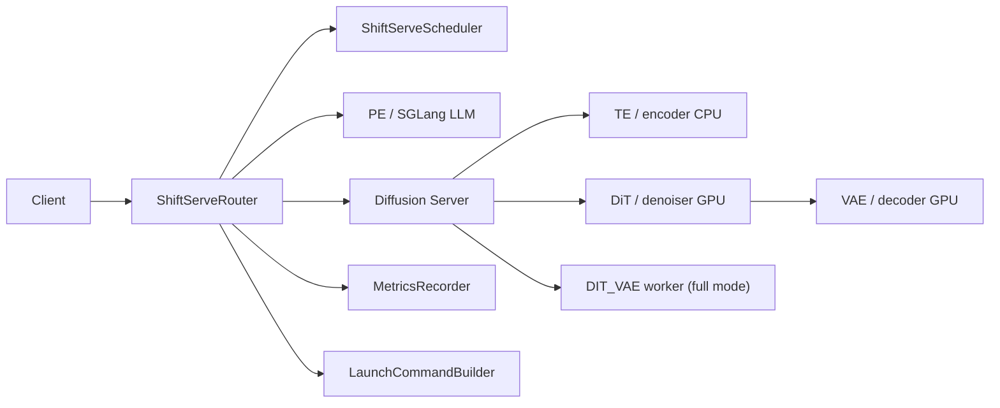
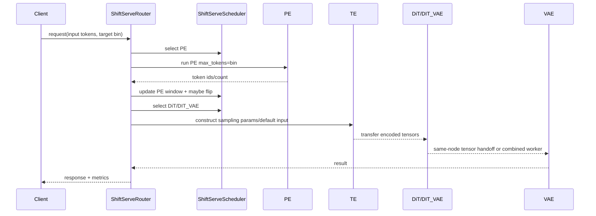
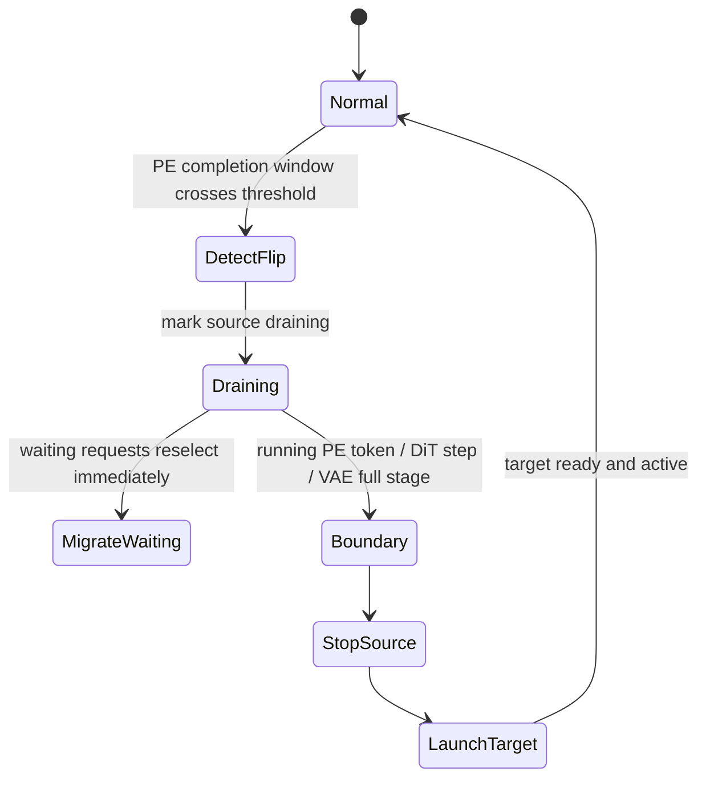
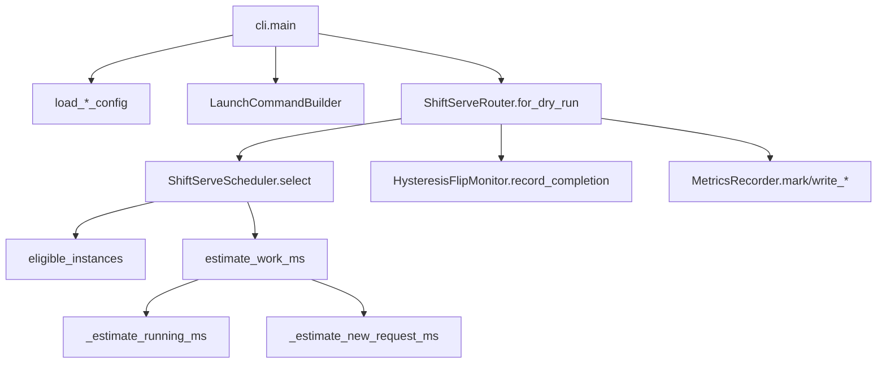

# ShiftServe 架构与代码 Cookbook

本 cookbook 介绍 `python/sglang/shiftserve/` 中新增的 orchestration 代码，以及 `python/sglang/multimodal_gen/runtime/` 中的最小 diffusion 扩展。它和 `shiftserve_cli.md` 对应：每个会改变代码分支的设计点，都会标出对应 CLI 参数。

## Architecture



ShiftServe 被写成一个薄 orchestration layer。Scheduling、launch command construction、metrics、traffic generation、documentation 都可以在 CPU 环境测试；已有 diffusion runtime 继续负责 tensor transfer 和 role execution。这样 validation 版本能先跑通三角色链路，full 版本再把 DiT 和 VAE 合并成 `DIT_VAE`。

## Entire Request Life Workflow



在当前 validation 实现中，`ShiftServeRouter.submit` 会记录 `system_enter`，选择 PE，记录 PE enter/end，更新 PE token window，检查 flip hysteresis，然后记录 TE/DiT/VAE lifecycle events。真实 PE 和 diffusion client 后续可以替换 `MockStageClient`，但 scheduler 和 metrics 的语义不变。

## Flip Workflow



当前代码实现了 control-plane primitive：`InstanceRuntimeState.active`、`ready`、`draining`、`launching`，以及 `ShiftServeRouter.mark_draining` 和 `activate`。真实 GPU process stop/start 由 `LaunchCommandBuilder` 和 explicit deployment manifest 表达。对应 CLI 参数：`--mode manual_flip|can_flip|no_flip`。

## Class/Function Call DAG



## Module Hierarchy


## Code Walkthrough

### `python/sglang/shiftserve/config.py`

文件功能：解析 `deployment.json`、`profile.json`、`traffic.json`，并验证 request routing 所需的关键字段。它会检查 id、instance kind、node reference、flip-plan reference、bin 顺序。

主要 class：

- `NodeConfig`：一个物理或逻辑 node，包含 host 和可选 node type。
- `InstanceConfig`：一个 PE/TE/DiT/VAE/DIT_VAE instance，包含 device、ranks、GPU ids、ports、active flags、grouping ids。
- `DeploymentConfig`：验证后的 node/instance/flip-plan manifest。
- `TrafficConfig`：duration、rate、interval 输入，用来复现实验流量。

主要 function：

- `normalize_instance_kind`：把 `llm`、`encoder`、`denoiser`、`decoder`、`ddit_worker` 等 alias 映射到 `pe`、`te`、`dit`、`vae`、`dit_vae`。
- `load_deployment_config`、`load_profile_config`、`load_traffic_config`：UTF-8 JSON loader，供 CLI 调用。

设计思路：scheduler 正确性依赖的字段要严格校验；实验附加信息保留到 `metadata`，这样 profile/config 可以继续加注释或启动 hint，而不需要频繁改 parser。

### `python/sglang/shiftserve/scheduler.py`

文件功能：集中保存所有会改变实验分支的 scheduling 和 flip 逻辑。

主要 class：

- `StageKind`：公开 stage enum：PE、TE、DiT、VAE、DIT_VAE。
- `SchedulerMode`：`ROUND_ROBIN` 或 `WEIGHTED`；由 CLI `--weighted-schedule` 控制。
- `InstanceRuntimeState`：记录 active/ready/draining/launching、queue、running request、grouping constraint、PE token window。
- `WindowedTokenEstimator`：按 PE instance 维护 output length window，并映射 short/long bin。
- `HysteresisFlipMonitor`：全局 PE completion window 和 high/low threshold crossing。
- `ShiftServeScheduler`：真正选择 instance 和估算 work 的 class。

实验关键源码：weighted vs round-robin 分支。

```python
if self.mode == SchedulerMode.ROUND_ROBIN:
    chosen = self._rr.choose(request.stage, candidates)
    return SelectionResult(
        instance_id=chosen.instance_id,
        estimated_work_ms=0.0,
        mode=self.mode,
        fallback_reason=fallback_reason,
    )

scored = [
    (self.estimate_work_ms(instance, request), instance.instance_id, instance)
    for instance in candidates
]
work_ms, _, chosen = min(scored, key=lambda item: (item[0], item[1]))
```

为什么这样写：`--weighted-schedule false` 必须是干净的 round-robin baseline，不能读 profile cost，也不能退化成 `max_free_slots`。weighted mode 才计算 remaining work，并用稳定 tie-break 保证可复现。

实验关键源码：flip hysteresis。

```python
if self.direction == "short" and avg > self.high_threshold:
    self.direction = "long"
    return "short_to_long"
if self.direction == "long" and avg < self.low_threshold:
    self.direction = "short"
    return "long_to_short"
```

为什么这样写：margin hysteresis 可以避免 short/long midpoint 附近频繁 flip/re-flip。对应 CLI 参数：`--window-size`、`--margin-enabled`、`--margin-ratio`。

函数粒度说明：

- `eligible_instances`：按 stage、active/ready/draining/launching、target node、pipeline group 过滤候选。
- `select`：执行 round-robin 或 weighted selection；如果 same-node/pipeline constraint 过滤后没有候选，会放松约束并记录 `same_node_or_pipeline_group_unavailable`。
- `estimate_work_ms`：把 running remaining work、queued work、new request work 相加。
- `_estimate_running_ms`：实现 PE generated-token remaining work 和 DiT remaining-step work。
- `_estimate_new_request_ms`：计算 PE TTFT/TPOT、TE fixed latency、DiT steps、VAE latency、DIT_VAE combined latency。

### `python/sglang/shiftserve/launcher.py`

文件功能：生成 launch command，并在启动前检查 port manifest。

主要 class：

- `LaunchDefaults`：保存计划中的默认值：2GiB transfer pool、slots=1、transfer pin `auto`、PE CUDA graph max bs=1、PE max total tokens=4096。
- `PortAllocator`：在真正启动前发现同一 node 上的 port collision。
- `LaunchCommandBuilder`：生成 PE 和 diffusion role 的 argv list。

实验关键源码：fixed 2GiB transfer buffer。

```python
"--disagg-transfer-pool-size",
str(self.defaults.transfer_pool_size),
"--disagg-transfer-calibration-mode",
"fixed",
"--disagg-max-slots-per-instance",
str(self.defaults.max_slots_per_instance),
"--disagg-transfer-pin-memory",
self.defaults.transfer_pin_memory,
```

为什么这样写：保留现有 transfer buffer 比创建无 buffer tensor handoff path 侵入小；fixed 2GiB 可以避免 validation 时 warmup sizing 拉长启动时间。对应 CLI 参数：`--transfer-pool-size`、`--transfer-pin-memory`、`--max-slots-per-instance`。

实验关键源码：rank0 broadcast ablation。

```python
if self.defaults.rank0_broadcast and instance.kind in {"dit", "vae", "dit_vae"}:
    args.extend(
        [
            "--diffusion-weight-load-mode",
            "rank0-broadcast",
            "--diffusion-weight-broadcast-components",
            "transformer,vae",
        ]
    )
```

为什么这样写：rank0 broadcast 是 ablation switch，不应该默认永远开启。对应 CLI 参数：`--rank0-broadcast`。

函数粒度说明：

- `build_pe_command`：生成 PE/LLM 启动命令，固定禁用 piecewise CUDA graph，开启 CUDA graph max bs=1，chunked prefill=512，max running requests=1，skip warmup。
- `build_diffusion_role_command`：生成 TE/DiT/VAE/DIT_VAE 命令，关闭模型 offload 和模型 pin memory，但保留 transfer buffer pinning。
- `build_launch_plan`：按 deployment instance 生成所有命令，并先调用 `PortAllocator.validate`。
- `format_command`、`iter_launch_table`：把 argv list 转成可读 bash command。

### `python/sglang/shiftserve/router.py`

文件功能：提供 request lifecycle 的 reference implementation 和 validation dry-run。

主要 class：

- `ShiftServeRequest`：request id、input tokens、output tokens、bin label。
- `ShiftServeResponse`：被选中的 PE、被选中的 diffusion instance、generated tokens、可选 flip direction。
- `MockStageClient`：不依赖 GPU 的确定性 adapter。
- `ShiftServeRouter`：负责 lifecycle logging，并调用 scheduler/flip monitor。

函数粒度说明：

- `submit`：完整 PE->TE->DiT->VAE lifecycle：记录 `system_enter`，schedule PE，run PE，更新 PE window/flip monitor，schedule DiT 或 DIT_VAE，执行 TE/DiT/VAE events，最后写 `request_done`。
- `mark_draining`：把 source instance 标记为 draining，使其不再接受新请求。
- `activate`：把 target instance 标记为 active/ready。
- `for_dry_run`：创建最小本地 validation router。

设计思路：真实 GPU adapter 隔离在 `MockStageClient` 形状之后，因此 request workflow、scheduler、metrics 可以先稳定测试。

### `python/sglang/shiftserve/metrics.py`

文件功能：非侵入式 event logging 和固定 summary metrics。

主要 class/function：

- `RequestEvent`：一条 lifecycle event。
- `MetricsRecorder.mark`：追加 event，字段包括 request id、stage、instance、generated tokens、completed steps、reason。
- `write_events`：写 `request_events.csv` 和 `request_events.jsonl`。
- `summarize_events`：计算 `p50`、`p90`、`p99`、`throughput`、`lifespan`、`slo10_attainment`、`slo5_attainment`。

设计思路：event log 可以按 request_id 还原完整生命周期，summary CSV 保持固定 7 指标，便于后续脚本批量分析。

### `python/sglang/shiftserve/client.py`

文件功能：traffic JSON/CSV 转换和 request sending。

主要 function：

- `build_request_specs`：按 interval 生成确定性 request stream。
- `dominant_csv_to_traffic_json`：把 dominant-interval CSV trace 转成 ShiftServe traffic JSON。
- `send_requests`：把 request 发送到 `/v1/shiftserve/generate`。

设计思路：request rate 和 short/long phase 都来自外部 JSON/CSV，不能硬编码到 client 里。

### `python/sglang/shiftserve/cli.py`

文件功能：用户入口。

主要 command：

- `validate-config`：加载三份 JSON 并打印校验摘要。
- `launch-plan`：打印 PE 和 diffusion launch command。
- `simulate`：CPU dry-run request lifecycle。
- `traffic-from-csv`：把 trace CSV 转成 traffic JSON。
- `write-docs`：写 `shiftserve_cli.md` 和 `shiftserve_cookbook.md`。

### Diffusion Extensions

涉及文件：

- `runtime/disaggregation/roles.py`：新增 `RoleType.DIT_VAE`，并添加 `ddit_worker`/`dit_vae_worker` aliases。
- `runtime/disaggregation/dispatch_policy.py`：新增 `weighted_shiftserve`，在 DiffusionServer 内部 fallback 到 round-robin，因为 weighted routing 由 ShiftServe 外层 server 负责。
- `runtime/server_args.py`：接受 `weighted_shiftserve`，新增 `--disagg-transfer-calibration-mode fixed|warmup`，并映射 `DIT_VAE` result offset。
- `runtime/disaggregation/scheduler_mixin.py`：fixed calibration mode 跳过 measured warmup resizing；新增 `_disagg_dit_vae_compute`。
- `runtime/pipelines_core/composed_pipeline_base.py`：`DIT_VAE` 可以加载/执行 denoiser 和 decoder stages/modules。
- `runtime/launch_server.py`：standalone role launcher 接受 `DIT_VAE`。

设计思路：`DIT_VAE` 作为 first-class role 引入，但保留现有三角色 validation path，避免 full mode 改动影响 validation。

## Test Map

- `test/registered/shiftserve/test_shiftserve_core.py`：CPU CI tests，覆盖 config aliases、port collision、round-robin baseline、weighted selection、hysteresis、same-node fallback、launch defaults、traffic generation。
- `python/sglang/multimodal_gen/test/unit/test_dispatch_policy.py`：验证 `weighted_shiftserve` compatibility policy。
- `python/sglang/multimodal_gen/test/unit/test_disagg_roles.py`：验证 `DIT_VAE` aliases 和 denoiser+decoder module filtering。
