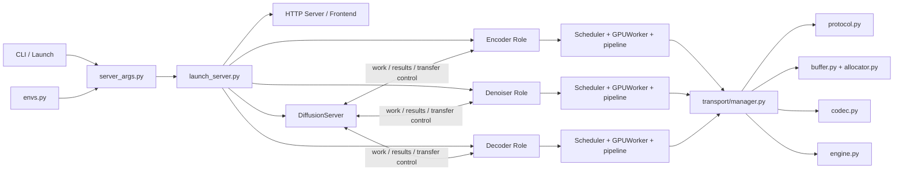
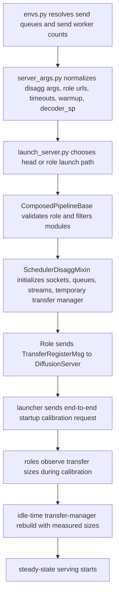
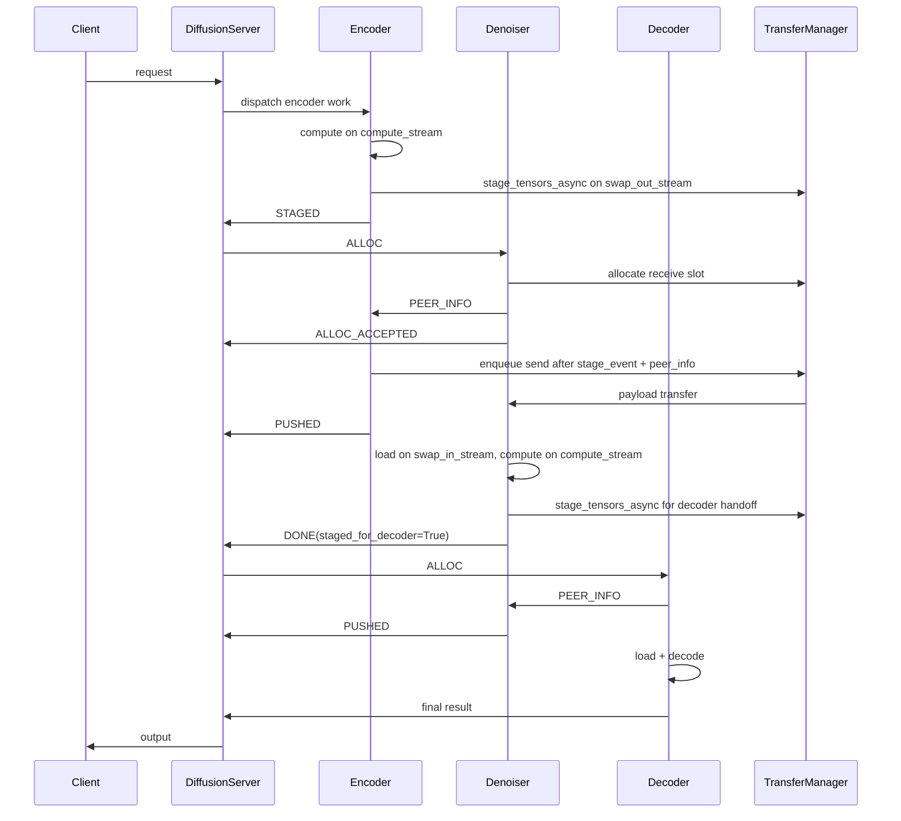
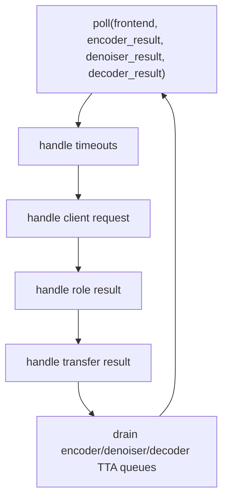
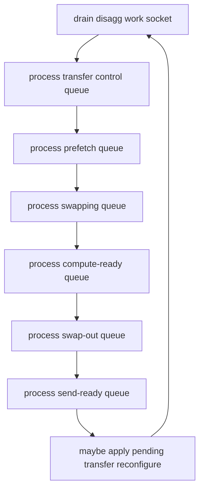

# SGLang Diffusion Disaggregation Cookbook

Version anchor:
- Historical feature stack: `c408a37fe -> acf71cc38`
- Latest committed implementation step covered by this cookbook: `acf71cc38`

Public references:
- RFC issue [#19512](https://github.com/sgl-project/sglang/issues/19512)
- SGLang diffusion CLI docs: [https://docs.sglang.ai/diffusion/api/cli.html](https://docs.sglang.ai/diffusion/api/cli.html)
- SGLang diffusion profiling guide: [https://github.com/sgl-project/sglang/blob/main/docs/diffusion/performance/profiling.md](https://github.com/sgl-project/sglang/blob/main/docs/diffusion/performance/profiling.md)

This cookbook explains how diffusion disaggregation is implemented in SGLang today, how the control and data paths work, how the design evolved commit by commit, what the tests actually lock down, and how to profile the system in disaggregation mode.

It is written for contributors and advanced users. The goal is to make the implementation readable from three angles at once:

1. architecture and dataflow;
2. concrete classes and functions;
3. operational commands for launch and profiling.

Implementation scope covered here:
- centralized `DiffusionServer`;
- role-based module filtering and stage affinity;
- queue-driven scheduler overlap with CUDA events;
- same-host shared-memory fast path and transfer-engine path;
- shape-only Hunyuan3D disaggregation;
- end-to-end startup calibration for transfer-buffer sizing;
- `decoder_sp` as the decoder/VAE parallel decode surface, with `decoder_tp` retained only as a deprecated compatibility alias.

Still out of scope in the implemented system:
- etcd-based decentralized routing;
- proactive buffer-capacity synchronization back to the server.

## 1. Reading Guide

Recommended order:

1. Section 2 for the implementation baseline.
2. Section 3 for design intent vs. implemented behavior.
3. Section 4 for the five Mermaid diagrams.
4. Sections 5 to 8 for init, serve, `DiffusionServer`, and scheduler loops.
5. Section 9 for the module-by-module code walkthrough.
6. Section 10 for the historical commit stack.
7. Section 11 for test coverage.
8. Section 12 for disaggregation-only profiling.

Conventions:

- `headline`: the main class or function that carries a module’s control flow.
- `first-helper`: a helper that directly changes dispatch, state, sizing, cleanup, retries, or resource lifetime.
- `next-helper`: a lower-level helper whose purpose matters, but whose internal branches are not the main decision surface.
- Code snippets are intentionally trimmed to the control logic that matters most.

## 2. Source of Truth

This cookbook combines four layers of truth:

1. the public RFC intent;
2. the committed implementation as of `acf71cc38`;
3. the historical feature stack from `c408a37fe` onward;
4. the current disaggregation test surface.

That distinction matters because the implementation has moved beyond the older `cab882504` baseline:

- Hunyuan3D is no longer simply skipped; shape-only disaggregation is implemented.
- sender-slot release happens after transfer completion rather than at `STAGED`.
- request handoff tracking is more explicit in `DiffusionServer`.
- the scheduler’s main overlap path is the queue-iteration plus `event.query()` model.
- startup sizing uses a real end-to-end calibration request and transfer-manager rebuild.
- decoder parallel decode is expressed through `decoder_sp`.

## 3. Design Intent vs. Implemented System

The implementation still follows the original role split:

- **Encoder**: text/image conditioning and latent preparation.
- **Denoiser**: DiT/denoising compute.
- **Decoder**: VAE decode and final output materialization.
- **DiffusionServer**: centralized request router and lifecycle tracker.

The design has converged into the following committed behavior:

- `DiffusionServer` remains centralized and owns dispatch, slot accounting, and timeout cleanup.
- role-to-role transfer uses explicit control messages such as `STAGED`, `ALLOC`, `PEER_INFO`, `READY`, `PUSHED`, `DONE`, `FAILED`, and `ABORT`.
- the scheduler’s main overlap path is queue-driven:
  - load on `swap_in_stream`,
  - compute on `compute_stream`,
  - outbound stage on `swap_out_stream`,
  - readiness checks via `event.query()`.
- the direct `READY -> prefetch -> wait -> compute` path still exists, but only as a fallback path.
- startup transfer sizing is done in two phases:
  - create a temporary transfer manager;
  - run a real end-to-end calibration request;
  - rebuild each role’s transfer manager with measured sizes when idle.

Two deliberate boundaries remain:

- `RequestState` still exposes `DONE`, `FAILED`, and `TIMED_OUT`, not a separate public `ABORTED` terminal state.
- the cookbook does not describe the future etcd-based decentralized design as if it were already implemented.

## 4. Architecture and Dataflow Diagrams

### 4.1 System architecture



### 4.2 Init-side dataflow



### 4.3 Serve-side request dataflow



### 4.4 `DiffusionServer` event loop



### 4.5 Scheduler event loop



## 5. Init-Side Dataflow

The init path is where disaggregation becomes concrete:

1. runtime send-loop knobs are read from `envs.py`;
2. `server_args.py` normalizes role, URLs, timeouts, warmup, and parallelism;
3. `launch_server.py` derives endpoints and launches the head or role process;
4. `ComposedPipelineBase` filters modules and stages according to the requested role;
5. `SchedulerDisaggMixin` creates queues, streams, sockets, and a temporary transfer manager;
6. each role registers its transfer capabilities with `DiffusionServer`;
7. the launcher issues a real calibration request through the front-end;
8. roles accumulate measured sizes and rebuild their transfer managers when safe.

### 5.1 Config surface: `runtime/server_args.py`

#### Headline: `get_role_parallelism()`

```python
def get_role_parallelism(self, role_type):
    _none = {
        "tp_size": None,
        "sp_degree": None,
        "ulysses_degree": None,
        "ring_degree": None,
    }
    if role_type == RoleType.ENCODER:
        return {**_none, "tp_size": self.encoder_tp}
    elif role_type == RoleType.DENOISER:
        return {
            "tp_size": self.denoiser_tp,
            "sp_degree": self.denoiser_sp,
            "ulysses_degree": self.denoiser_ulysses,
            "ring_degree": self.denoiser_ring,
        }
    elif role_type == RoleType.DECODER:
        return {**_none, "sp_degree": self.decoder_sp}
```

What it controls:
- encoder TP;
- denoiser TP/SP/Ulysses/Ring;
- decoder/VAE parallel decode through `sp_degree`.

#### First-helper: `_adjust_disagg_parallelism_aliases()`

```python
def _adjust_disagg_parallelism_aliases(self):
    if self.decoder_tp is None:
        return
    if self.decoder_sp is not None and self.decoder_sp != self.decoder_tp:
        raise ValueError(...)
    if self.decoder_sp is None:
        logger.warning(...)
        self.decoder_sp = self.decoder_tp
```

This is the compatibility bridge that keeps older `decoder_tp` launch scripts working while publicly steering users to `decoder_sp`.

Other args that materially affect the runtime:
- `disagg_role`
- `encoder_urls`, `denoiser_urls`, `decoder_urls`
- `disagg_timeout`
- `disagg_downstream_wait_timeout`
- `disagg_max_slots_per_instance`
- `warmup`, `warmup_resolutions`, `warmup_steps`

### 5.2 Launch and calibration: `runtime/launch_server.py`

#### Headline: `_run_disagg_startup_calibration()`

```python
def _run_disagg_startup_calibration(frontend_endpoint, server_args):
    warmup_reqs = _build_disagg_calibration_reqs(server_args)
    ...
    for idx, req in enumerate(warmup_reqs, start=1):
        sock.send(pickle.dumps([req]))
        reply = sock.recv_multipart()
        output_batch = pickle.loads(reply[-1]) if reply else None
        if getattr(output_batch, "error", None):
            raise RuntimeError(...)
        time.sleep(0.5)
```

This function matters because it makes startup sizing an end-to-end property:
- the request goes through the actual front-end;
- the actual roles process it;
- the actual transport sizes are observed;
- startup fails fast if calibration fails.

#### First-helper: `_build_disagg_calibration_reqs()`

Purpose:
- builds warmup requests from the configured resolutions and warmup steps;
- gives the calibration path a deterministic workload.

### 5.3 Role-based loading: `runtime/pipelines_core/composed_pipeline_base.py`

#### Headline: `ComposedPipelineBase.__init__()`

```python
self._disagg_role = server_args.disagg_role
self.validate_disagg_role(self._disagg_role)
...
if self._disagg_role != RoleType.MONOLITHIC:
    self._required_config_modules = filter_modules_for_role(
        self._required_config_modules,
        self._disagg_role,
        extra_allowed_modules=self._get_extra_allowed_modules_for_role(...),
    )
...
self.modules = self.load_modules(server_args, loaded_modules)
self.initialize_pipeline(self.server_args)
self.create_pipeline_stages(self.server_args)
```

This is the hinge where role intent becomes actual weight loading behavior.

#### First-helper: `_get_extra_allowed_modules_for_role()`

Why it exists:
- pure role classification is not enough for every pipeline;
- some pipelines need narrowly-scoped cross-role exceptions.

Representative examples:
- `Flux2Pipeline` encoder keeps `vae`;
- `QwenImageLayeredPipeline` encoder keeps `vae` and `transformer`;
- `MOVA` encoder keeps `video_vae` and `audio_vae`.

### 5.4 Module-role mapping: `runtime/disaggregation/roles.py`

#### Headline: `get_module_role()`

```python
if module_name in {"hy3dshape_conditioner", "hy3dshape_image_processor"}:
    return RoleType.ENCODER
...
if module_name == "hy3dshape_model":
    return RoleType.DENOISER
...
if module_name == "hy3dshape_vae":
    return RoleType.DECODER
```

This first-pass classifier is the basis for:
- module filtering;
- model-specific extras;
- stage-to-role alignment review.

#### First-helper: `filter_modules_for_role()`

What it keeps:
- shared modules;
- same-role modules;
- explicit extra-allowed modules.

### 5.5 Scheduler-side init: `runtime/disaggregation/scheduler_mixin.py`

#### Headline: `_init_disagg_state()`

```python
self._swap_in_stream = None
self._compute_stream = None
self._swap_out_stream = None
...
if self._disagg_role != RoleType.MONOLITHIC:
    if self._disagg_uses_cuda():
        self._swap_in_stream = torch.cuda.Stream(device=device)
        self._compute_stream = torch.cuda.Stream(device=device)
        self._swap_out_stream = torch.cuda.Stream(device=device)
    self._init_disagg_sockets()
    self._init_disagg_transfer_manager()
```

This is the current three-stream split:
- `swap_in_stream` for receiver-side load;
- `compute_stream` for forward;
- `swap_out_stream` for sender-side staging.

#### Headline: `_init_disagg_transfer_manager()`

```python
pool_size = getattr(sa, "disagg_transfer_pool_size", 256 * 1024 * 1024)
if measured_transfer_bytes is not None:
    computed_pool_size = max(
        measured_transfer_bytes,
        int(math.ceil(measured_transfer_bytes * max_slots * redundancy)),
    )
    pool_size = computed_pool_size
...
self._transfer_manager = DiffusionTransferManager(...)
...
self._pool_result_push.send_multipart(encode_transfer_msg(register_msg))
```

This function:
- creates the transfer engine and buffers;
- preallocates receive slots for inbound roles;
- sends `TransferRegisterMsg` to `DiffusionServer`.

#### First-helpers: warmup sizing hooks

- `_run_disagg_startup_warmup()`
  - now explicitly defers sizing to end-to-end calibration.
- `_schedule_transfer_reconfigure()`
  - accumulates the maximum measured data/meta sizes.
- `_maybe_apply_pending_transfer_reconfigure()`
  - rebuilds the transfer manager only when there are no active transfers.

## 6. Serve-Side Dataflow

The steady-state serve path is:

1. client request enters `DiffusionServer`;
2. encoder is chosen from encoder TTA when free-slot capacity exists;
3. encoder computes and stages an outbound payload;
4. `DiffusionServer` records sender-side handoff state on `STAGED`;
5. denoiser allocation is attempted;
6. receiver sends `PEER_INFO` directly to the sender and confirms allocation to the server;
7. sender transfer manager issues the actual send when both stage readiness and peer info are present;
8. `DiffusionServer` releases sender capacity only after `PUSHED(success=True)`;
9. receiver loads inbound payload, computes, and either stages the next hop or returns the final result.

Failure handling along that path:
- no free downstream slot: remain waiting;
- retryable alloc reject: clean receiver side and requeue to another instance;
- alloc-result timeout: requeue to another instance;
- send failure: retry locally in the transfer manager, then fail terminally if retries are exhausted;
- global timeout: abort and cleanup sender/receiver state through the server.

## 7. `DiffusionServer` Event Loop

Primary file:
- `runtime/disaggregation/diffusion_server.py`

Role:
- centralized request router;
- request state machine owner;
- slot-accounting authority;
- timeout and terminal cleanup owner.

### 7.1 Headline class: `DiffusionServer`

Class features that materially affect execution:
- per-role free-slot arrays;
- per-role TTA queues;
- peer registration tables for encoder/denoiser/decoder instances;
- `_transfer_state` for live inter-role handoff state;
- `RequestTracker` for the public request lifecycle.

### 7.2 First-helper class: `_TransferRequestState`

This dataclass is the handoff ledger between roles. It stores:
- sender-side staged slot identity and control endpoint;
- receiver-side allocation identity and prealloc bookkeeping;
- sender/receiver instance ids;
- sender-slot and receiver-slot release flags;
- prealloc recycle state;
- transfer completion dedupe state;
- `TransferPhase`, timestamps, rejected instances, send attempts, and last send error.

That is the object that lets the server reason about a request between `STAGED` and terminal completion without bloating the transferred request itself.

### 7.3 Headline: `_event_loop()`

```python
while self._running:
    events = dict(poller.poll(timeout=10))

    self._handle_timeouts()

    if frontend in events:
        self._handle_client_request(frontend)

    if encoder_result_pull in events:
        self._handle_role_result(encoder_result_pull, RoleType.ENCODER)
    if denoiser_result_pull in events:
        self._handle_role_result(denoiser_result_pull, RoleType.DENOISER)
    if decoder_result_pull in events:
        self._handle_role_result(decoder_result_pull, RoleType.DECODER)

    self._drain_all_queues()
```

This loop is where:
- client ingress is accepted;
- role outputs are split into transfer and non-transfer paths;
- timeout cleanup is enforced;
- queued work is turned into dispatch decisions.

### 7.4 Headline: `_handle_client_request()`

Purpose:
- deserialize the client payload;
- create a tracked request;
- remember the client identity for the final reply;
- transition into `ENCODER_WAITING`;
- enqueue into encoder TTA.

This path is intentionally lightweight: the server enqueues and routes, but never executes model code.

### 7.5 Headline: `_handle_transfer_staged()`

```python
p2p = _TransferRequestState(
    sender_role=RoleType.ENCODER.value,
    sender_session_id=msg.get("session_id", ""),
    sender_pool_ptr=msg.get("pool_ptr", 0),
    sender_slot_offset=msg.get("slot_offset", 0),
    ...
    data_size=msg.get("data_size", 0),
    meta_size=msg.get("meta_size", 0),
    sender_instance=encoder_idx,
    transfer_phase=TransferPhase.WAITING_FOR_DOWNSTREAM_SLOT,
    handoff_started_at=time.monotonic(),
    phase_started_at=time.monotonic(),
    downstream_wait_since=time.monotonic(),
)
self._transfer_state[request_id] = p2p
...
self._tracker.transition(request_id, RequestState.DENOISING_WAITING)
self._enqueue_role_wait(self._denoiser_tta, request_id, p2p)
```

This is the boundary where:
- sender-side host staging is complete;
- downstream routing begins;
- sender capacity is **not** released yet.

That last point is important. The implementation now holds the sender slot until transfer completion, which prevents the server from over-dispatching the sender while its staged payload is still part of the active handoff lifecycle.

### 7.6 First-helper: `_dispatch_transfer_alloc()`

What it does:
- chooses a candidate receiver;
- attaches receiver identity and optional preallocated slot information to the handoff state;
- sends `TransferAllocMsg`;
- starts the `WAITING_ALLOC_RESULT` phase.

### 7.7 Headline: `_handle_alloc_accepted()` and `_handle_alloc_reject()`

`_handle_alloc_accepted()`:
- marks the receiver dispatch as accepted;
- clears `downstream_wait_since`;
- advances the handoff into `TransferPhase.SENDING`.

`_handle_alloc_reject()`:
- releases the provisional receiver slot;
- recycles preallocated receiver slot state if present;
- clears the receiver dispatch fields;
- either:
  - requeues the request to another downstream instance; or
  - sends abort to the sender and terminates the request.

### 7.8 Headline: `_handle_transfer_pushed()`

```python
if not msg.get("success", True):
    p2p.last_send_error = ...
    self._set_transfer_phase(p2p, TransferPhase.ABORTING)
    self._send_abort(...)
    self._release_sender_slot_if_needed(p2p, record)
    self._release_receiver_slot_if_needed(p2p, record)
    ...
    self._complete_terminal(...)
    return

self._release_sender_slot_if_needed(p2p, record)
self._set_transfer_phase(p2p, TransferPhase.RUNNING_DOWNSTREAM)
```

This is the committed sender-slot release point.

Meaning:
- sender capacity is released only after transfer completion;
- send failure triggers abort/cleanup;
- successful push is what turns `*_WAITING` into `*_RUNNING` on the downstream role.

### 7.9 Headline: `_handle_transfer_done()`

This function has two different meanings depending on the role:

- when the denoiser sends `DONE`:
  - the first-hop receive resources are released;
  - if `staged_for_decoder=True`, the denoiser becomes the sender for the second hop;
  - decoder waiting is enqueued exactly once.
- when the decoder sends `DONE`:
  - decoder receive-side resources are released;
  - the final result is returned to the client.

### 7.10 Headline: `_handle_timeouts()`

The implementation supervises three timeout surfaces:
- alloc-result timeout;
- downstream wait timeout;
- global request timeout.

Behavior:
- alloc-result timeout triggers receiver cleanup and downstream requeue;
- downstream wait timeout times out the request and aborts the transfer participants;
- global timeout aborts any in-flight handoff and moves the request to `TIMED_OUT`.

### 7.11 First-helpers that decide correctness

- `_release_sender_slot_if_needed()`
  - releases sender compute capacity exactly once.
- `_release_receiver_slot_if_needed()`
  - releases receiver compute capacity exactly once.
- `_recycle_prealloc_slot()`
  - returns a receiver preallocated slot back to the peer registry.
- `_requeue_downstream_transfer()`
  - tracks rejected receivers by capacity epoch and re-enters TTA.
- `_send_abort()`
  - emits explicit abort control messages to sender and/or receiver.
- `_complete_terminal()`
  - normalizes final client reply and queue cleanup.

## 8. Scheduler Event Loop and Overlap Model

Primary file:
- `runtime/disaggregation/scheduler_mixin.py`

Role:
- per-role runtime bridge between inbound control, receiver-side load, compute execution, sender-side stage, and send completion.

### 8.1 Why there are two `READY` paths

The committed scheduler has:

- a **main path**: queue iteration plus `event.query()`;
- a **fallback path**: direct `READY -> prefetch -> wait on compute stream -> compute`.

The main path exists because the scheduler wants request-level readiness:
- multiple requests may wait in `_swapping_queue`;
- only requests whose `load_event` is ready move into `_compute_ready_queue`;
- the host loop can continue progressing other requests and control messages without blocking.

The fallback path exists for correctness:
- if queue infrastructure is absent or bypassed, the role can still safely finish the request;
- it is not the intended overlap path for steady-state serving.

### 8.2 Queue polling vs. `stream.wait_event()`

`queue + event.query()`:
- host-side readiness polling;
- requests enter the next stage only when their event is ready;
- helps avoid head-of-line blocking on one late request;
- costs a small amount of host polling overhead.

`stream.wait_event()`:
- device-side dependency insertion after execution order is already chosen;
- useful for direct fallback and local ordering;
- if used too early on a single compute stream, it can serialize not-yet-ready work ahead of ready work.

Current choice:
- main path: queue iteration plus `event.query()`;
- fallback path: explicit wait on `compute_stream`.

### 8.3 Headline: `_disagg_prefetch_event_loop()`

```python
while self._running:
    handled_work = False
    handled_work |= self._drain_disagg_work_socket() > 0
    handled_work |= self._process_transfer_control_queue()
    handled_work |= self._process_prefetch_queue_once()
    handled_work |= self._process_swapping_queue_once()
    computed = self._process_compute_ready_queue_once(is_multi_rank)
    handled_work |= computed
    handled_work |= self._process_swap_out_queue_once()
    handled_work |= self._process_send_ready_queue_once()
    handled_work |= self._maybe_apply_pending_transfer_reconfigure()
```

The ordering is the design:
- drain control first;
- prefetch inbound payloads;
- move only ready loads into compute;
- move only ready staged payloads into send-ready;
- rebuild transfer state only when safe.

### 8.4 Headline: `_process_transfer_control_queue()`

Handled message types:
- `ALLOC`
- `ABORT`
- `FAILED`
- `READY`

Why it matters:
- control-plane handling is deliberately prioritized before speculative compute progress.

### 8.5 Headline: `_prefetch_transfer_ready()` and `_process_prefetch_queue_once()`

```python
tensors, scalar_fields, load_event = self._transfer_manager.load_transfer_async(
    request_id,
    device=local_device,
    stream=self._swap_in_stream,
)
```

What happens here:
- receiver-side H2D or CPU-side load starts on `swap_in_stream`;
- warmup inbound sizes are recorded for calibration;
- the request becomes a pending inbound item in `_swapping_queue`.

### 8.6 Headline: `_process_swapping_queue_once()`

```python
if not self._transfer_event_ready(load_event):
    self._swapping_queue.put(item)
    return False

self._compute_ready_queue.put(item)
```

This is the core of the queue-driven overlap model:
- no blocking wait here;
- only ready requests move to compute.

### 8.7 Headline: `_run_prefetched_compute_item()`

Purpose:
- release the receive slot;
- rebuild the role-local `Req`;
- run denoiser or decoder compute;
- schedule calibration reconfiguration when warmup data is present.

### 8.8 Headline: `_handle_transfer_alloc()`

This is the receiver-side alloc path:
- allocate or register a receive slot;
- build and send `TransferPeerInfoMsg` directly to the sender;
- send `TransferAllocAcceptedMsg` back to `DiffusionServer`.

### 8.9 Headline: `_handle_transfer_ready()`

Committed behavior:
- if `_transferring_queue` exists, queue the work and return;
- otherwise take the fallback path and bind the wait to `compute_stream`.

That binding is important: the fallback path must not wait on the default stream while compute runs on `compute_stream`.

### 8.10 Headline: `_disagg_encoder_step()`

```python
with self._compute_stream_context():
    req_result = self.worker.execute_forward(reqs, return_req=True)
    if isinstance(req_result, Req) and self._transfer_manager is not None:
        tensor_fields, scalar_fields = extract_transfer_fields(req_result)
        staged, stage_event = self._transfer_manager.stage_tensors_async(
            request_id=request_id,
            tensor_fields=tensor_fields,
            scalar_fields=scalar_fields,
            stream=self._swap_out_stream,
        )

if self._is_request_aborted(request_id):
    self._cleanup_aborted_staged_request(request_id)
    return
```

This shows the current committed sender path:
- forward on `compute_stream`;
- outbound stage on `swap_out_stream`;
- local cleanup if the request is aborted after stage but before finalization.

### 8.11 Headline: `_disagg_denoiser_compute()`

The denoiser mirrors the encoder pattern:
- compute on `compute_stream`;
- stage the decoder handoff on `swap_out_stream`;
- cleanup post-stage abort locally;
- enqueue outbound transfer state only after successful staging.

### 8.12 Headline: `_disagg_decoder_compute()`

The decoder:
- computes on `compute_stream`;
- waits for compute completion before the final result send;
- returns raw result frames to `DiffusionServer`, which reconstructs the client response.

### 8.13 First-helpers that define the overlap semantics

- `_compute_stream_context()`
  - binds local forward to the explicit compute stream.
- `_make_current_stream_wait_for_compute()`
  - synchronizes later actions with compute completion.
- `_wait_transfer_event_on_compute_stream()`
  - fallback wait bound to compute, not the default stream.
- `_cleanup_aborted_staged_request()`
  - local cleanup for requests aborted after staging.
- `_schedule_transfer_reconfigure()` / `_maybe_apply_pending_transfer_reconfigure()`
  - turn warmup observations into final transfer-manager sizing.

## 9. Functional-Module Walkthrough

This section is organized by **functional module -> classes -> functions**, not by file order.

### 9.1 Config and launch

Files:
- `envs.py`
- `runtime/server_args.py`
- `runtime/launch_server.py`

Headline symbols:
- `ServerArgs`
- `get_role_parallelism()`
- `_adjust_disagg_parallelism_aliases()`
- `_run_disagg_startup_calibration()`

First-helpers:
- endpoint derivation helpers;
- warmup adjustment;
- calibration request construction.

Review focus:
- public parallelism surface;
- startup calibration semantics;
- role endpoint derivation.

### 9.2 Role-based filtering and stage alignment

Files:
- `runtime/disaggregation/roles.py`
- `runtime/pipelines_core/composed_pipeline_base.py`
- model-specific pipelines and stages

Headline symbols:
- `RoleType`
- `get_module_role()`
- `filter_modules_for_role()`
- `ComposedPipelineBase.__init__()`

First-helpers:
- `_get_extra_allowed_modules_for_role()`
- model-specific `role_affinity` overrides.

Review focus:
- module loading must match stage execution;
- model-specific exceptions should stay explicit and minimal.

### 9.3 `DiffusionServer` request state machine and dispatch

Files:
- `runtime/disaggregation/request_state.py`
- `runtime/disaggregation/dispatch_policy.py`
- `runtime/disaggregation/diffusion_server.py`

Headline symbols:
- `RequestTracker.transition()`
- `_TransferRequestState`
- `_event_loop()`
- `_handle_transfer_staged()`
- `_handle_transfer_pushed()`
- `_handle_transfer_done()`
- `_handle_timeouts()`

First-helpers:
- `_handle_alloc_accepted()`
- `_handle_alloc_reject()`
- `_dispatch_transfer_alloc()`
- `_release_sender_slot_if_needed()`
- `_release_receiver_slot_if_needed()`
- `_requeue_downstream_transfer()`
- `_send_abort()`
- `_complete_terminal()`

Review focus:
- sender-slot lifetime;
- receiver-slot lifetime;
- retry vs. fatal allocation failure;
- timeout cleanup;
- second-hop correctness.

### 9.4 Transport layer

Files:
- `runtime/disaggregation/transport/protocol.py`
- `runtime/disaggregation/transport/codec.py`
- `runtime/disaggregation/transport/buffer.py`
- `runtime/disaggregation/transport/allocator.py`
- `runtime/disaggregation/transport/engine.py`
- `runtime/disaggregation/transport/manager.py`

Headline symbols:
- `TransferMsgType` and transfer dataclasses
- `TransferTensorBuffer`
- `TransferMetaBuffer`
- `DiffusionTransferManager.stage_tensors_async()`
- `_maybe_enqueue_send_locked()`
- `_execute_send()`
- `_process_send_completion()`

First-helpers:
- `_register_peer_send()`
- `_submit_send_task()`
- `_load_received_transfer()`
- `abort_request()`
- `allocate_receive_slot()`
- `register_prealloc_as_receive()`

Review focus:
- staged payload lifetime;
- same-host local-copy correctness;
- retry semantics;
- terminal dedupe semantics.

### 9.5 Scheduler overlap runtime

Files:
- `runtime/disaggregation/scheduler_mixin.py`
- `runtime/managers/scheduler.py`
- `runtime/managers/gpu_worker.py`

Headline symbols:
- `_init_disagg_state()`
- `_init_disagg_transfer_manager()`
- `_disagg_prefetch_event_loop()`
- `_process_transfer_control_queue()`
- `_process_prefetch_queue_once()`
- `_process_swapping_queue_once()`
- `_process_compute_ready_queue_once()`
- `_process_swap_out_queue_once()`
- `_process_send_ready_queue_once()`
- `_handle_transfer_alloc()`
- `_handle_transfer_ready()`
- `_disagg_encoder_step()`
- `_disagg_denoiser_compute()`
- `_disagg_decoder_compute()`

First-helpers:
- `_prefetch_transfer_ready()`
- `_run_prefetched_compute_item()`
- `_wait_transfer_event_on_compute_stream()`
- `_cleanup_aborted_staged_request()`
- `_schedule_transfer_reconfigure()`
- `_maybe_apply_pending_transfer_reconfigure()`

Review focus:
- queue choreography;
- stream ownership;
- direct fallback correctness;
- warmup calibration transitions.

### 9.6 Model-specific alignment points

Files:
- `runtime/pipelines/hunyuan3d_pipeline.py`
- `runtime/pipelines_core/stages/hunyuan3d_shape.py`
- `runtime/pipelines/qwen_image.py`
- model-specific stage files

#### Headline: `Hunyuan3D2Pipeline.validate_disagg_role()`

```python
def validate_disagg_role(self, role):
    if role == RoleType.MONOLITHIC:
        return
    ...
    if config.paint_enable:
        raise ValueError(
            "Hunyuan3D2Pipeline only supports shape-only disaggregation."
        )
```

Committed meaning:
- shape-only Hunyuan3D disaggregation is supported;
- paint remains explicitly rejected in disaggregated mode.

#### Headline: `Hunyuan3DShapeBeforeDenoisingStage._resolve_runtime_dtype()`

```python
params_fn = getattr(self.conditioner, "parameters", None)
...
for param in params_fn():
    if isinstance(param, torch.Tensor) and torch.is_floating_point(param):
        return param.dtype
...
if isinstance(sample_tensor, torch.Tensor) and torch.is_floating_point(sample_tensor):
    return sample_tensor.dtype
return torch.float32
```

Why it matters:
- the stage resolves dtype from the loaded local module first;
- it no longer relies on guessed variant strings;
- CPU and overridden-dtype scenarios are safer.

### 9.7 Metrics and `/stats`

Files:
- `runtime/disaggregation/metrics.py`
- `runtime/entrypoints/http_server.py`
- `runtime/entrypoints/utils.py`

Important exported fields:
- `requests_completed`
- `requests_failed`
- `requests_in_flight`
- `requests_timed_out`
- `queue_depth`
- `avg_latency_s`
- `throughput_rps`

These fields are useful for operational sanity checks and for profiling evidence, but they do not replace stage-level timing or Nsight traces.

## 10. Commit-by-Commit Appendix

This appendix preserves the historical stack instead of flattening it into one “final state” summary. Each entry names the main touched areas, the behavioral contribution, and why that commit still matters to the implementation shape today.

### Commit 01 - `c408a37fe` - role-based weight separation

- Main areas: `roles.py`, `composed_pipeline_base.py`, stage files, `server_args.py`, `test_disagg_roles.py`
- Contribution: introduced role typing, role-based module filtering, and the earliest role-aware stage hooks.
- Why it matters: made disaggregation a model-loading problem instead of a pure routing idea.

### Commit 02 - `3a6d3360d` - ZMQ zero-copy IPC

- Main areas: `role_connector.py`, `tensor_transport.py`, launch and scheduler integration
- Contribution: added the earliest role-to-role IPC transport skeleton.
- Why it matters: created the first concrete cross-role transport path.

### Commit 03 - `c09962b57` - CLI integration and launch orchestration

- Main areas: `cli/serve.py`, `launch_server.py`, `scheduler.py`, `server_args.py`
- Contribution: connected disaggregation to public launch entrypoints.
- Why it matters: made the runtime operable as a real system.

### Commit 04 - `24dfb8edf` - async pipelining, timeouts, observability

- Main areas: `metrics.py`, `http_server.py`, `entrypoints/utils.py`, scheduler, role connector
- Contribution: added metrics, timeout handling, and server-side observability.
- Why it matters: gave the runtime a survivable control plane.

### Commit 05 - `241f5082c` - pool-based `DiffusionServer`

- Main areas: `diffusion_server.py`, `dispatch_policy.py`, `request_state.py`, `launch_server.py`
- Contribution: introduced centralized pool-mode `DiffusionServer`, request tracking, and role dispatch.
- Why it matters: established the control-plane shape that still exists today.

### Commit 06 - `688e508ef` - `TransferBuffer` with buddy allocator

- Main areas: allocator/buffer files and tests
- Contribution: introduced pooled host-memory staging with buddy-style allocation.
- Why it matters: made variable-sized payload transport practical.

### Commit 07 - `a0a4983d9` - capacity-aware dispatch

- Main areas: `diffusion_server.py`, `dispatch_policy.py`, `request_state.py`
- Contribution: added `FreeBufferSlots` and TTA-based capacity routing.
- Why it matters: dispatch became capacity-aware rather than purely round-robin.

### Commit 08 - `8a0877f55` - per-role parallelism CLI

- Main areas: `launch_server.py`, `server_args.py`, `test_server_args.py`
- Contribution: exposed encoder/denoiser/decoder parallelism knobs.
- Why it matters: role specialization requires independent parallelism surfaces.

### Commit 09 - `ebaec8bd4` - P2P transfer and scheduler integration

- Main areas: `diffusion_server.py`, protocol/engine/manager files, scheduler
- Contribution: introduced the first transfer-manager-based sender/receiver workflow.
- Why it matters: created the role-to-role data path around the server control plane.

### Commit 10 - `1a7b8abdd` - multi-rank pool mode support

- Main areas: scheduler and scheduler tests
- Contribution: extended disaggregation to multi-rank role instances.
- Why it matters: aligned disaggregation with distributed execution inside a role.

### Commit 11 - `ed6fe855f` - remove chain mode

- Main areas: docs, launcher, scheduler, server tests
- Contribution: removed chain mode and kept pool mode only.
- Why it matters: simplified the architecture around a single control-plane model.

### Commit 12 - `5c248ad34` - update pass

- Main areas: docs, `diffusion_server.py`, `roles.py`, launcher, scheduler
- Contribution: alignment cleanup after chain-mode removal.
- Why it matters: stabilized the remaining pool-mode code surface.

### Commit 13 - `a35fda10e` - update pass

- Main areas: docs, `server_args.py`, `test_server_args.py`
- Contribution: refined argument surface and docs.
- Why it matters: improved the public configuration boundary.

### Commit 14 - `25bfcc669` - server fixes

- Main areas: `diffusion_server.py`, transport protocol, roles, scheduler, denoising stage
- Contribution: fixed correctness issues in routing and role alignment.
- Why it matters: showed that transport correctness and pipeline alignment were already tightly coupled.

### Commit 15 - `b7ef0baf0` - update pass

- Main areas: docs, roles, role tests
- Contribution: more role-filter cleanup.
- Why it matters: strict role classification remained foundational.

### Commit 16 - `4923be8b8` - transport reorganization

- Main areas: `transport/` subtree, tests
- Contribution: reorganized transport code into clearer submodules.
- Why it matters: prepared the codebase for the later unified transport package.

### Commit 17 - `e71aae0a2` - P2P bug fixes and decoder return optimization

- Main areas: `diffusion_server.py`, launcher, `gpu_worker.py`, scheduler, server tests
- Contribution: fixed routing bugs and improved decoder-to-client behavior.
- Why it matters: reduced inefficiency on the final hop.

### Commit 18 - `e349f5a79` - temporary fix pass

- Main areas: server, transport protocol/manager, scheduler
- Contribution: temporary consistency fixes between the server, transport, and scheduler.
- Why it matters: smoothed the path toward the later refactor wave.

### Commit 19 - `8e2befa89` - remove legacy d2h/h2d path

- Main areas: transfer buffer/engine, scheduler, tests
- Contribution: removed an older explicit D2H/H2D path.
- Why it matters: reduced duplicated data-movement models.

### Commit 20 - `b614fc98b` - remove relay mode

- Main areas: docs, server, transport tree, scheduler, `server_args.py`
- Contribution: eliminated relay mode.
- Why it matters: further converged the architecture around one primary transfer model.

### Commit 21 - `6a85122f4` - clean code pass

- Main areas: launcher, scheduler, `server_args.py`
- Contribution: code cleanup around launch and scheduler behavior.
- Why it matters: reduced noise before larger refactors.

### Commit 22 - `8628c5a45` - improve `TransferTensorBuffer`

- Main areas: transfer buffer, scheduler, utils, tests
- Contribution: improved transfer-buffer behavior.
- Why it matters: strengthened the staging layer before event-driven scheduling landed.

### Commit 23 - `b9168c28f` - simplify code

- Main areas: server, protocol, transfer manager, scheduler
- Contribution: reduced incidental complexity in transport and server code.
- Why it matters: made the later event-driven redesign easier to reason about.

### Commit 24 - `fa6813be5` - better multi-rank receive

- Main areas: scheduler
- Contribution: improved multi-rank inbound handling.
- Why it matters: tightened receiver-side distributed coordination.

### Commit 25 - `cdf0ec50c` - rename pass

- Main areas: `diffusion_server.py`, transport protocol, scheduler, tests
- Contribution: aligned naming around the transfer protocol vocabulary.
- Why it matters: helped establish the message naming that the current code still uses.

### Commit 26 - `31ce7b6ee` - transfer all fields

- Main areas: connector and scheduler
- Contribution: expanded transferred request fields.
- Why it matters: made inbound request reconstruction more faithful.

### Commit 27 - `38f3c749e` - zimage fix

- Main areas: transfer buffer, connector, scheduler, `composed_pipeline_base.py`, server tests
- Contribution: fixed model-specific image-generation alignment issues.
- Why it matters: made pipeline-specific alignment a first-class concern.

### Commit 28 - `7836071e7` - slot-free bug fix

- Main areas: `diffusion_server.py`, `server_args.py`
- Contribution: corrected slot-release behavior.
- Why it matters: slot lifetime errors directly affect deadlocks and throughput collapse.

### Commit 29 - `3f8924dbb` - comment simplification

- Main areas: server, dispatch, roles, transport
- Contribution: comment and readability cleanup.
- Why it matters: clarified transport-layer naming before the big refactor.

### Commit 30 - `4d77cb19d` - transport directory refactor

- Main areas: modern `transport/allocator.py`, `buffer.py`, `codec.py`, `engine.py`, `manager.py`, `protocol.py`
- Contribution: introduced the transport directory layout used now.
- Why it matters: structurally anchored the current transport layer.

### Commit 31 - `adcad4a42` - scheduler mixin refactor

- Main areas: `scheduler_mixin.py`, transport buffer/codec, launcher, scheduler, composed pipeline
- Contribution: moved disaggregation logic into the mixin and refined role loading.
- Why it matters: created the mixin architecture used by the current runtime.

### Commit 32 - `06df97a7d` - scheduler refactor

- Main areas: `scheduler_mixin.py`, launcher, scheduler
- Contribution: continued refactoring around the mixin boundary.
- Why it matters: separated disaggregation control from generic scheduler code.

### Commit 33 - `3f6738ffa` - connector refactor

- Main areas: `scheduler_mixin.py`, `transport/connector.py`
- Contribution: clarified scheduler/connector responsibilities.
- Why it matters: reduced interface ambiguity between work sockets and transport callbacks.

### Commit 34 - `92e493946` - request-state simplification

- Main areas: `request_state.py`, `scheduler_mixin.py`, request-state tests
- Contribution: simplified the request-state logic.
- Why it matters: made later handoff-state refinement easier.

### Commit 35 - `3c893c351` - event-driven scheduler and transport convergence

- Main areas: `envs.py`, server, dispatch, request state, roles, scheduler mixin, transport buffer/manager/protocol, launcher, `gpu_worker.py`, platforms, tests
- Contribution: introduced event-driven scheduling, transfer meta buffer, send/receive loops, same-host fast path, model-specific SP handling, and failure/timeout cleanup.
- Why it matters: this is the major convergence point from feature pile to coherent runtime architecture.

### Commit 36 - `cab882504` - filter granularity and stage-affinity refinement

- Main areas: roles, Hunyuan3D pipeline, Qwen image pipeline, `composed_pipeline_base.py`, model-specific stages, alignment tests
- Contribution: refined cross-role module granularity and stage affinity.
- Why it matters: moved review emphasis from pure transport correctness to model-alignment correctness.

### Commit 37 - `acf71cc38` - Hunyuan3D support, state refinement, queue iteration, real E2E warmup

- Main areas:
  - `runtime/disaggregation/diffusion_server.py`
  - `runtime/disaggregation/request_state.py`
  - `runtime/disaggregation/roles.py`
  - `runtime/disaggregation/scheduler_mixin.py`
  - `runtime/disaggregation/transport/manager.py`
  - `runtime/launch_server.py`
  - `runtime/pipelines/hunyuan3d_pipeline.py`
  - `runtime/pipelines_core/stages/hunyuan3d_shape.py`
  - `runtime/server_args.py`
  - relevant unit tests
- Contribution:
  - enabled Hunyuan3D shape-only disaggregation;
  - refined `DiffusionServer` request/handoff state handling;
  - made queue iteration plus `event.query()` the primary scheduler overlap model;
  - implemented real end-to-end startup warmup for final transfer-buffer sizing.
- Why it matters: this is the commit that turns the previously refined design ideas into the current public implementation baseline.

## 11. Test Coverage Appendix

This appendix explains what the disaggregation-related tests validate. The focus is not only correctness in the steady-state path, but also retries, cleanup, sizing, fallback behavior, and model-specific alignment.

### 11.1 `python/sglang/multimodal_gen/test/unit/test_diffusion_server.py`

- `test_basic_init`: validates baseline `DiffusionServer` construction, role counts, and free-slot tables.
- `test_transfer_register_tracks_host_meta_and_prealloc`: validates transfer registration, receiver host metadata capture, and preallocated receive-slot ingestion.
- `test_transfer_staged_dispatches_alloc_with_meta_and_host`: validates that `STAGED` triggers an `ALLOC` dispatch carrying data size, meta size, and sender host fields.
- `test_transfer_staged_keeps_encoder_slot_busy_until_push_and_starts_wait_timer`: validates that the sender slot remains occupied after `STAGED` and that downstream waiting starts at the handoff point.
- `test_transfer_pushed_releases_sender_slot_once_and_starts_running`: validates the committed "release sender slot only after transfer completion" rule.
- `test_fatal_alloc_reject_releases_sender_slot`: validates fatal alloc-reject cleanup and sender-slot recovery.
- `test_retryable_alloc_reject_requeues_request`: validates retryable alloc rejection, receiver exclusion, and requeue semantics.
- `test_alloc_accepted_stops_downstream_wait_timer`: validates that `ALLOC_ACCEPTED` closes the alloc-wait phase.
- `test_alloc_result_timeout_requeues_request_instead_of_failing`: validates alloc-result timeout as a retry/requeue event rather than immediate terminal failure.
- `test_downstream_wait_timeout_aborts_sender_only_and_times_out`: validates downstream wait timeout, sender abort notification, and terminal `TIMED_OUT`.
- `test_denoiser_done_keeps_slot_busy_for_decoder_handoff_and_enqueues_once`: validates second-hop handoff creation and that the denoiser sender slot stays busy until push completion.
- `test_second_hop_push_releases_denoiser_slot_once`: validates sender-slot release on the denoiser-to-decoder hop.

### 11.2 `python/sglang/multimodal_gen/test/unit/test_disagg_metrics.py`

- `test_initial_snapshot`: validates zero-state metrics snapshots.
- `test_request_lifecycle`, `test_multiple_requests`: validate lifecycle accounting across one or many requests.
- `test_timeout_tracking`: validates timeout counters.
- `test_queue_depth`: validates queue-depth recording.
- `test_throughput`: validates throughput-window aggregation.
- `test_to_dict`: validates the JSON shape exposed by `/stats`.
- `test_max_latency_tracks_worst_case`: validates worst-case latency tracking.

### 11.3 `python/sglang/multimodal_gen/test/unit/test_disagg_pipeline_alignment.py`

- `test_flux_encoder_keeps_vae`, `test_qwen_image_edit_encoder_keeps_vae`, `test_qwen_image_layered_encoder_keeps_required_cross_role_modules`, `test_glm_image_encoder_keeps_vae_and_transformer`: validate model-specific encoder exceptions in role-based filtering.
- `test_wan_ti2v_denoiser_keeps_vae`, `test_ltx2_ti2v_denoiser_keeps_vae_and_audio_vae`: validate denoiser-side decoder extras for models that require them.
- `test_ltx2_encoder_does_not_keep_decoder_modules`, `test_mova_encoder_keeps_video_and_audio_vaes`, `test_mova_alias_uses_same_encoder_extras`: validate role-filter strictness versus intentional cross-role exceptions.
- `test_helios_denoising_stage_is_denoiser_affine`, `test_mova_denoising_stage_is_denoiser_affine`, `test_mova_decoding_stage_is_decoder_affine`: validate stage-affinity rules for model-specific stages.
- `test_hunyuan3d_shape_only_disagg_accepts_non_monolithic_roles`: validates committed Hunyuan3D shape-only support.
- `test_hunyuan3d_disagg_rejects_paint_pipeline`: validates explicit rejection of Hunyuan3D paint disaggregation.
- `test_hunyuan3d_shape_export_and_save_are_decoder_affine`, `test_hunyuan3d_stage_filtering_matches_shape_only_roles`: validate the role split of Hunyuan3D shape stages.
- `test_hunyuan3d_shape_stage_no_longer_stores_model_dtype`, `test_conditioner_parameter_dtype_wins_over_sample_dtype`, `test_runtime_dtype_falls_back_to_sample_tensor_without_module_dtype`: validate runtime dtype resolution from loaded modules instead of config-string guessing.

### 11.4 `python/sglang/multimodal_gen/test/unit/test_disagg_roles.py`

- `test_from_string`, `test_from_string_backward_compat`, `test_from_string_invalid`, `test_choices`: validate public role parsing and CLI-facing role choices.
- `test_encoder_modules`, `test_denoiser_modules`, `test_decoder_modules`, `test_shared_modules`, `test_monolithic_keeps_all`: validate the base module-role classification.
- `test_encoder_does_not_keep_decoder_modules_by_default`, `test_encoder_can_keep_explicit_cross_role_modules`: validate strict encoder filtering and opt-in cross-role exceptions.
- `test_denoiser_skips_encoders_and_vae`, `test_denoiser_can_keep_ti2v_decoder_components`: validate default denoiser strictness and task-specific denoiser allowances.
- `test_decoder_keeps_vae_and_scheduler`, `test_decoder_includes_audio`: validate decoder essentials and decoder-side audio support.

### 11.5 `python/sglang/multimodal_gen/test/unit/test_dispatch_policy.py`

- `test_cycles_through_instances`, `test_single_instance`, `test_ignores_active_counts`: validate the round-robin policy.
- `test_invalid_num_instances`: validates constructor rejection on invalid instance counts.
- `test_selects_least_loaded`, `test_selects_least_loaded_all_busy`, `test_fallback_without_counts`, `test_all_at_capacity`, `test_tie_breaking`: validate least-loaded routing and its edge cases.
- `test_skips_full_instances`, `test_returns_none_when_all_full`, `test_cycles_among_available`, `test_respects_excluded_instances`: validate capacity-aware filtering and explicit exclusions.
- `test_picks_most_free`, `test_returns_none_when_all_zero`: validate the max-free-slots policy.
- `test_round_robin`, `test_max_free_slots`, `test_unknown_policy_raises`: validate policy-factory behavior.

### 11.6 `python/sglang/multimodal_gen/test/unit/test_launch_server_disagg.py`

- `test_build_calibration_reqs_for_image_task`: validates warmup/calibration request construction for image tasks.
- `test_run_startup_calibration_sends_all_requests`: validates that startup calibration uses the real front-end path and submits all generated requests.
- `test_run_startup_calibration_fails_fast_on_error_reply`: validates startup fail-fast behavior when calibration replies contain an error.

### 11.7 `python/sglang/multimodal_gen/test/unit/test_request_state.py`

- `test_all_states_defined`: validates the public `RequestState` enumeration.
- `test_submit_and_get`, `test_duplicate_submit_raises`, `test_unknown_request_raises`, `test_remove`: validate tracker insertion, uniqueness, lookup failure, and removal.
- `test_full_lifecycle`, `test_invalid_transition_raises`: validate legal and illegal state transitions.
- `test_fail_from_any_active_state`, `test_timeout_from_active_state`, `test_timeout_from_terminal_raises`: validate failure and timeout semantics around active and terminal states.
- `test_snapshot`, `test_elapsed`: validate tracker snapshotting and elapsed-time helpers.
- `test_waiting_states_lifecycle`, `test_fail_from_waiting_states`, `test_skip_waiting_when_capacity_available`, `test_timeout_from_waiting_state`: validate the newer waiting-state behavior and timeout semantics.

### 11.8 `python/sglang/multimodal_gen/test/unit/test_scheduler_transfer.py`

- `test_transfer_frames_detected`, `test_non_transfer_frames_not_detected`: validate transfer-frame identification.
- `test_alloc_sends_peer_info_to_upstream_with_meta_and_local_copy`: validates receiver-side alloc success and peer-info content.
- `test_alloc_failure_reports_alloc_reject`: validates alloc failure reporting.
- `test_direct_callbacks_queue_work_without_inline_execution`, `test_control_queue_is_serviced_before_transferring_queue`: validate the queue-driven scheduler model.
- `test_encoder_ignores_ready_callback`: validates that upstream roles do not consume downstream `READY` callbacks.
- `test_swapping_queue_only_advances_ready_loads`, `test_handle_transfer_ready_reuses_prefetched_compute_path`: validate the relationship between prefetch, swap, and compute-ready queues.
- `test_wait_transfer_event_on_compute_stream_binds_event_to_compute_stream`: validates the direct fallback path after the dedicated `compute_stream` split.
- `test_prefetch_uses_swap_in_stream`, `test_encoder_staging_uses_swap_out_stream`, `test_encoder_forward_runs_on_compute_stream`, `test_decoder_forward_runs_on_compute_stream_and_waits_before_send`, `test_follower_compute_uses_compute_stream`: validate the three-stream runtime model.
- `test_encoder_abort_after_stage_cleans_local_transfer_state`, `test_denoiser_abort_after_stage_cleans_local_transfer_state`: validate post-stage abort cleanup without leaked staged payloads.
- `test_schedule_transfer_reconfigure_keeps_max_sizes`, `test_apply_pending_transfer_reconfigure_rebuilds_idle_manager`: validate the deferred transfer-manager rebuild path.
- `test_encoder_warmup_send_completion_schedules_reconfigure`, `test_denoiser_warmup_send_completion_uses_max_inbound_and_outbound`, `test_decoder_warmup_compute_schedules_reconfigure_from_inbound_sizes`: validate end-to-end startup calibration sizing for all three roles.
- `test_denoiser_stage_managed_sp_shards_and_marks_req`, `test_denoiser_model_managed_sp_keeps_full_inputs`, `test_decoder_parallel_decode_keeps_full_latents`, `test_preprocess_sp_latents_skips_disagg_pre_sharded_fields`: validate sequence-parallel handling under disaggregation.
- `test_encoder_transfer_stage_enqueues_then_sends_staged_msg`: validates the `STAGED` message timing relative to outbound staging.

### 11.9 `python/sglang/multimodal_gen/test/unit/test_server_args.py`

- `test_tilde_model_path_is_expanded`, `test_absolute_path_is_unchanged`, `test_component_paths_are_expanded_before_pipeline_resolution`, `test_model_id_overrides_arbitrary_local_path`, `test_model_id_works_after_tilde_expansion`, `test_model_id_unknown_falls_back_without_crash`: validate path normalization and model-id behavior.
- `test_defaults_are_none`, `test_encoder_overrides`, `test_denoiser_overrides`, `test_decoder_overrides`, `test_monolithic_returns_all_none`, `test_mixed_roles_independent`: validate per-role parallelism surfaces.
- `test_decoder_tp_is_alias_of_decoder_sp`, `test_conflicting_decoder_tp_and_decoder_sp_raise`: validate decoder alias semantics.
- `test_cli_args_parsed`, `test_resolution_flag_overrides_qwen_image_layered_pipeline_config`, `test_disagg_defaults_match_reviewed_values`, `test_downstream_wait_timeout_cli_arg_is_parsed`: validate CLI parsing and reviewed disaggregation defaults.

### 11.10 `python/sglang/multimodal_gen/test/unit/test_transfer_allocator.py`

- `test_power_of_2_pool`, `test_exact_power_of_2`, `test_invalid_min_block`, `test_initial_state`: validate allocator construction and buddy-pool constraints.
- `test_allocate_min_size`, `test_allocate_exact_min`, `test_allocate_rounds_up`, `test_allocate_full_pool`, `test_allocate_exceeds_pool`, `test_allocate_until_full`, `test_allocate_with_request_id`, `test_allocate_zero_raises`: validate allocation size handling and pool exhaustion behavior.
- `test_splitting_creates_correct_blocks`: validates buddy splitting.
- `test_free_basic`, `test_free_invalid_offset`, `test_free_already_free`: validate free semantics and invalid-free rejection.
- `test_coalesce_buddies`, `test_full_coalesce`, `test_partial_coalesce`: validate buddy coalescing.
- `test_count_empty_pool`, `test_count_after_alloc`, `test_count_larger_slots`, `test_can_allocate`: validate allocator capacity bookkeeping.
- `test_concurrent_alloc_free`: validates basic thread-safety expectations.
- `test_encoder_denoiser_slots`: validates slot sizing assumptions used by disaggregation staging.

### 11.11 `python/sglang/multimodal_gen/test/unit/test_transfer_buffer.py`

- `test_basic_alloc_free`, `test_alloc_failure`, `test_free_slots_count`, `test_stats`: validate buffer-pool lifecycle and capacity reporting.
- `test_pool_uses_shared_memory`, `test_pool_data_ptr`, `test_slot_count_and_shared_memory_descriptor`: validate shared-memory-backed pool creation and descriptor exposure.
- `test_write_read_cpu_tensor`, `test_write_read_bfloat16`, `test_write_multiple_at_offsets`, `test_write_exceeds_slot_raises`: validate single-slot tensor IO semantics.
- `test_write_read_manifest`, `test_write_read_with_list_tensors`, `test_write_skips_none`, `test_realistic_encoder_output`, `test_roundtrip_scalar_and_manifest_metadata`: validate manifest-based staging and scalar-field metadata.
- `test_gpu_pool_allocation`, `test_gpu_write_read_roundtrip`, `test_gpu_write_read_bfloat16`, `test_gpu_batch_write_read_manifest`, `test_gpu_pool_read_to_cpu`: validate GPU-backed buffer behavior.
- `test_mock_engine_no_gpu_direct`: validates mock-engine behavior when GPU-direct transport is not available.

### 11.12 `python/sglang/multimodal_gen/test/unit/test_transfer_engine.py`

- `test_session_id_unique`, `test_custom_session_id`: validate engine session identity behavior.
- `test_register_and_deregister`: validates registration lifecycle.
- `test_transfer_sync_copies_data`, `test_batch_transfer_sync`: validate synchronous transfer APIs.
- `test_is_base_transfer_engine`, `test_returns_base_interface`: validate engine abstraction boundaries.
- `test_reset_clears_state`, `test_force_mock`: validate reset and mock-engine selection.

### 11.13 `python/sglang/multimodal_gen/test/unit/test_transfer_manager.py`

- `test_stage_single_tensor`, `test_stage_with_scalar_fields`, `test_free_staged_is_idempotent`: validate sender-side staging and idempotent staged cleanup.
- `test_allocate_receive_slot`, `test_free_receive_slot_is_idempotent`: validate receiver-side slot lifecycle.
- `test_full_transfer_cycle`: validates the end-to-end sender/receiver workflow inside the manager.
- `test_duplicate_peer_info_is_ignored_after_queueing`, `test_send_executor_completes_and_dedupes_terminal_state`: validate queue deduplication and terminal-state idempotence.
- `test_send_failure_retries_before_terminal_success`, `test_send_failure_exhausts_retries_before_terminal_failure`: validate the committed retry model for send failures.
- `test_same_host_local_copy_path_moves_data_and_meta`, `test_same_host_local_copy_fails_if_meta_copy_fails`: validate the same-host fast path.
- `test_missing_staged_payload_reports_failure`: validates missing-payload failure reporting.
- `test_abort_request_frees_staged_and_dynamic_receive_and_tombstones`: validates local abort cleanup and tombstone handling.
- `test_encode_decode_staged`, `test_encode_decode_alloc`, `test_encode_decode_peer_info`, `test_is_transfer_message`, `test_encode_decode_alloc_reject`, `test_encode_decode_abort`: validate transport protocol encoding/decoding and message classification.
- `test_default_runtime_config_uses_single_queue_and_fallback_workers`, `test_queue_only_override_promotes_total_workers`, `test_explicit_thread_pool_override_is_evenly_distributed`, `test_invalid_thread_pool_smaller_than_queue_count_fails`, `test_same_downstream_identity_maps_to_same_queue`: validate runtime queue and worker configuration.

### 11.14 Integration and regression tests outside `test/unit/`

`python/sglang/multimodal_gen/test/server/test_disagg_server.py`
- `test_health_check` for the Wan and ZImage fixtures validates service health and full-stack launch.
- `test_video_generation`, `test_image_generation` validate real end-to-end disaggregated serving for representative video and image pipelines.

`test/multimodal_gen/test_disagg_control_plane_unittest.py`
- `test_transfer_register_round_trip_preserves_direct_connect_fields`: validates control-plane round-trip preservation of direct-connect fields.
- `test_transfer_peer_info_round_trip_preserves_receiver_fields`: validates peer-info transport correctness.
- `test_server_args_resolve_control_endpoint_and_role_device`: validates launch-time endpoint and role-device derivation.
- `test_max_free_slots_policy_uses_explicit_capacity`: validates policy behavior in the lightweight control-plane harness.
- `test_encoder_module_filtering_requires_decoder_opt_in`: validates filter strictness in an isolated regression harness.

`test/multimodal_gen/test_disagg_transfer_sizing_unittest.py`
- `test_transfer_size_alignment_matches_scheduler_estimator`: validates estimator alignment between sizing helpers and scheduler-observed payloads.
- `test_transfer_size_estimator_handles_empty_payload`: validates sizing behavior on empty transfers.

## 12. Disaggregation-Only Profiling Appendix

This appendix intentionally stays inside disaggregation mode. It does not cover monolithic profiling. The commands below assume a diffusion-capable SGLang build with the standard CLI surface and benchmark scripts available in the repository.

### 12.1 Common conventions

Common placeholders:

- `<MODEL>`: a diffusion model supported by the chosen task, for example `Wan-AI/Wan2.2-T2V-A14B-Diffusers`
- `<PROMPT>`: a representative prompt
- `<N>`: GPU count in `{1, 2, 4, 8}` where supported by the model and hardware
- `<FRONTEND_HOST>`, `<FRONTEND_PORT>`: head server host and port
- `<DS_ADDR>`: `tcp://host:port` address used by role instances to reach `DiffusionServer`

Useful output files:

- `logs/disagg_perf/perf.json`
- `logs/disagg_perf/serving.json`
- `logs/disagg_perf/offline.jsonl`
- `logs/disagg_perf/nsys_report`

Create the output directory first:

```bash
mkdir -p logs/disagg_perf
```

Inspect a single-request perf dump:

```bash
python -c "import json; d=json.load(open('logs/disagg_perf/perf.json')); print(d['total_duration_ms']); print(d['steps']); print(d['denoise_steps_ms']); print(d['memory_checkpoints'])"
```

Inspect `bench_serving` results:

```bash
python -c "import json; d=json.load(open('logs/disagg_perf/serving.json')); print(d['throughput_qps']); print(d['latency_mean']); print(d['latency_median']); print(d['latency_p99']); print(d['peak_memory_mb_max'])"
```

Inspect `bench_offline_throughput` results:

```bash
python -c "import json; d=json.loads(open('logs/disagg_perf/offline.jsonl').read().strip().splitlines()[-1]); print(d['results']['requests_per_second']); print(d['results']['latency_per_request_seconds']); print(d['results']['peak_memory_mb'])"
```

Inspect runtime stats:

```bash
curl -s "http://<FRONTEND_HOST>:<FRONTEND_PORT>/stats" | python -c "import json,sys; d=json.load(sys.stdin)['disagg']; print(d['requests_completed']); print(d['requests_failed']); print(d['requests_in_flight']); print(d['requests_timed_out']); print(d['queue_depth']); print(d['avg_latency_s']); print(d['throughput_rps'])"
```

Trace viewing:

- load `trace.json.gz` in [Perfetto](https://ui.perfetto.dev/) or `chrome://tracing`
- open `.nsys-rep` files in Nsight Systems

### 12.2 Scenario A - encoder, denoiser, and decoder on the same machine and the same GPU set

Use this when all three roles see the same visible GPU set. Choose `<N>` in `{1, 2, 4, 8}` when the model and hardware support it.

Launch:

```bash
# Head / DiffusionServer
sglang serve \
  --model-path "<MODEL>" \
  --host "<FRONTEND_HOST>" \
  --port <FRONTEND_PORT> \
  --disagg-role server \
  --encoder-urls http://127.0.0.1:31011 \
  --denoiser-urls http://127.0.0.1:31021 \
  --decoder-urls http://127.0.0.1:31031

# Encoder
CUDA_VISIBLE_DEVICES=0,1,2,3,4,5,6,7 sglang serve \
  --model-path "<MODEL>" \
  --port 31011 \
  --disagg-role encoder \
  --num-gpus <N> \
  --warmup \
  --disagg-server-addr "<DS_ADDR>"

# Denoiser
CUDA_VISIBLE_DEVICES=0,1,2,3,4,5,6,7 sglang serve \
  --model-path "<MODEL>" \
  --port 31021 \
  --disagg-role denoiser \
  --num-gpus <N> \
  --denoiser-tp <N> \
  --warmup \
  --disagg-server-addr "<DS_ADDR>"

# Decoder
CUDA_VISIBLE_DEVICES=0,1,2,3,4,5,6,7 sglang serve \
  --model-path "<MODEL>" \
  --port 31031 \
  --disagg-role decoder \
  --num-gpus <N> \
  --decoder-sp <N> \
  --warmup \
  --disagg-server-addr "<DS_ADDR>"
```

Single-request stage timing and memory checkpoints:

```bash
sglang generate \
  --model-path "<MODEL>" \
  --host "<FRONTEND_HOST>" \
  --port <FRONTEND_PORT> \
  --prompt "<PROMPT>" \
  --num-inference-steps 30 \
  --perf-dump-path logs/disagg_perf/perf.json
```

Online serving benchmark:

```bash
python -m sglang.multimodal_gen.benchmarks.bench_serving \
  --host "<FRONTEND_HOST>" \
  --port <FRONTEND_PORT> \
  --prompt "<PROMPT>" \
  --num-prompts 32 \
  --request-rate 2.0 \
  --output-file logs/disagg_perf/serving.json
```

Offline throughput benchmark:

```bash
python -m sglang.multimodal_gen.benchmarks.bench_offline_throughput \
  --host "<FRONTEND_HOST>" \
  --port <FRONTEND_PORT> \
  --prompt "<PROMPT>" \
  --num-prompts 32 \
  --output-file logs/disagg_perf/offline.jsonl
```

Nsight Systems:

```bash
CUDA_VISIBLE_DEVICES=0,1,2,3,4,5,6,7 nsys profile \
  --trace=cuda,nvtx,osrt \
  --output logs/disagg_perf/nsys_report \
  sglang serve \
  --model-path "<MODEL>" \
  --port 31021 \
  --disagg-role denoiser \
  --num-gpus <N> \
  --denoiser-tp <N> \
  --warmup \
  --disagg-server-addr "<DS_ADDR>"
```

What to inspect:

- `perf.json`: stage-level latency, denoise-step latency, memory checkpoints
- `serving.json`: throughput, latency mean/median/p99, peak memory
- `/stats`: queue depth and long-run throughput
- Nsight: whether `swap_in_stream`, `compute_stream`, and `swap_out_stream` overlap as expected

### 12.3 Scenario B - encoder, denoiser, and decoder on different GPU subsets of the same machine

Use this when roles live on disjoint GPU subsets but still share a host. The same-host fast path can still be exercised.

Launch:

```bash
# Example split: encoder on GPU 0, denoiser on GPUs 1-4, decoder on GPUs 5-6
sglang serve \
  --model-path "<MODEL>" \
  --host "<FRONTEND_HOST>" \
  --port <FRONTEND_PORT> \
  --disagg-role server \
  --encoder-urls http://127.0.0.1:31011 \
  --denoiser-urls http://127.0.0.1:31021 \
  --decoder-urls http://127.0.0.1:31031

CUDA_VISIBLE_DEVICES=0 sglang serve \
  --model-path "<MODEL>" \
  --port 31011 \
  --disagg-role encoder \
  --num-gpus 1 \
  --warmup \
  --disagg-server-addr "<DS_ADDR>"

CUDA_VISIBLE_DEVICES=1,2,3,4 sglang serve \
  --model-path "<MODEL>" \
  --port 31021 \
  --disagg-role denoiser \
  --num-gpus <N> \
  --denoiser-tp <N> \
  --denoiser-sp <N> \
  --warmup \
  --disagg-server-addr "<DS_ADDR>"

CUDA_VISIBLE_DEVICES=5,6 sglang serve \
  --model-path "<MODEL>" \
  --port 31031 \
  --disagg-role decoder \
  --num-gpus <N> \
  --decoder-sp <N> \
  --warmup \
  --disagg-server-addr "<DS_ADDR>"
```

Benchmarks and result inspection:

- use the same `sglang generate`, `bench_serving`, `bench_offline_throughput`, `/stats`, and `nsys profile` commands from Scenario A;
- compare against Scenario A to see the effect of removing GPU-set colocation while still staying on the same host.

### 12.4 Scenario C - encoder on CPU, denoiser and decoder on the same machine

This scenario is useful when encoder compute is intentionally offloaded to CPU while denoiser and decoder remain on GPU.

Launch with denoiser and decoder colocated:

```bash
sglang serve \
  --model-path "<MODEL>" \
  --host "<FRONTEND_HOST>" \
  --port <FRONTEND_PORT> \
  --disagg-role server \
  --encoder-urls http://127.0.0.1:31011 \
  --denoiser-urls http://127.0.0.1:31021 \
  --decoder-urls http://127.0.0.1:31031

CUDA_VISIBLE_DEVICES= sglang serve \
  --model-path "<MODEL>" \
  --port 31011 \
  --device cpu \
  --disagg-role encoder \
  --warmup \
  --disagg-server-addr "<DS_ADDR>"

CUDA_VISIBLE_DEVICES=0,1,2,3 sglang serve \
  --model-path "<MODEL>" \
  --port 31021 \
  --disagg-role denoiser \
  --num-gpus <N> \
  --denoiser-tp <N> \
  --warmup \
  --disagg-server-addr "<DS_ADDR>"

CUDA_VISIBLE_DEVICES=0,1,2,3 sglang serve \
  --model-path "<MODEL>" \
  --port 31031 \
  --disagg-role decoder \
  --num-gpus <N> \
  --decoder-sp <N> \
  --warmup \
  --disagg-server-addr "<DS_ADDR>"
```

Launch with denoiser and decoder on different GPU subsets:

```bash
CUDA_VISIBLE_DEVICES=0,1,2,3 sglang serve \
  --model-path "<MODEL>" \
  --port 31021 \
  --disagg-role denoiser \
  --num-gpus <N> \
  --denoiser-tp <N> \
  --warmup \
  --disagg-server-addr "<DS_ADDR>"

CUDA_VISIBLE_DEVICES=4,5,6,7 sglang serve \
  --model-path "<MODEL>" \
  --port 31031 \
  --disagg-role decoder \
  --num-gpus <N> \
  --decoder-sp <N> \
  --warmup \
  --disagg-server-addr "<DS_ADDR>"
```

Benchmarks and inspection:

- reuse the commands from Scenario A;
- compare encoder stage time and total memory footprint with GPU-encoder baselines;
- use Nsight primarily on denoiser or decoder because the CPU encoder will not produce CUDA traces.

### 12.5 Scenario D - encoder on node A, denoiser and decoder on node B

This is the distributed deployment mode where the encoder is remote and the denoiser/decoder are colocated on another host. In this setup the same-host fast path no longer applies to the encoder-to-denoiser hop.

Node A:

```bash
# Head / DiffusionServer may live on either node; this example keeps it on node A.
sglang serve \
  --model-path "<MODEL>" \
  --host "<FRONTEND_HOST>" \
  --port <FRONTEND_PORT> \
  --disagg-role server \
  --encoder-urls http://node-a:31011 \
  --denoiser-urls http://node-b:31021 \
  --decoder-urls http://node-b:31031

# Encoder can be GPU or CPU
CUDA_VISIBLE_DEVICES=0,1,2,3 sglang serve \
  --model-path "<MODEL>" \
  --port 31011 \
  --disagg-role encoder \
  --num-gpus <N> \
  --warmup \
  --disagg-server-addr "tcp://<FRONTEND_HOST>:31000"
```

Node B:

```bash
CUDA_VISIBLE_DEVICES=0,1,2,3 sglang serve \
  --model-path "<MODEL>" \
  --port 31021 \
  --disagg-role denoiser \
  --num-gpus <N> \
  --denoiser-tp <N> \
  --denoiser-sp <N> \
  --warmup \
  --disagg-server-addr "tcp://<FRONTEND_HOST>:31000"

CUDA_VISIBLE_DEVICES=0,1,2,3 sglang serve \
  --model-path "<MODEL>" \
  --port 31031 \
  --disagg-role decoder \
  --num-gpus <N> \
  --decoder-sp <N> \
  --warmup \
  --disagg-server-addr "tcp://<FRONTEND_HOST>:31000"
```

Benchmarks and inspection:

- run the same request-side commands from Scenario A against the front-end host and port;
- compare total latency and queue depth against same-host deployments;
- use Nsight on node B to inspect the denoiser/decoder overlap, and use the transport-manager logs or `/stats` to confirm the remote hop is active.

### 12.6 Notes on transport backends and decoder parallelism

- same-host deployments can use the local-copy fast path when sender and receiver are colocated and the receiver advertises local-copy support;
- remote payload transfer uses the configured transfer engine path;
- there is no separate tensor-data TCP backend documented here as a third peer to local copy and engine-backed transfer;
- `decoder_sp` is the public decoder/VAE parallel decode surface;
- `decoder_tp` remains a deprecated compatibility alias and should not be used in new profiling scripts.

## 13. Quick Review Checklist

Use this checklist when reviewing a disaggregation change or preparing a public PR:

1. Does the pipeline's role-based module filter agree with its stage affinities?
2. Does the role use the correct per-role parallelism surface, especially `decoder_sp` instead of `decoder_tp` semantics?
3. Is sender capacity released only after transfer completion?
4. Are receiver-slot release and prealloc recycling paired correctly on retry, failure, timeout, and abort paths?
5. Does the scheduler keep the steady-state path queue-driven rather than accidentally forcing inline compute?
6. Are `swap_in_stream`, `compute_stream`, and `swap_out_stream` used consistently?
7. Does the direct fallback bind load readiness to `compute_stream`?
8. Does startup calibration describe the implemented two-stage behavior: temporary manager, real calibration request, rebuild?
9. If a model needs an exception, is it encoded in role filtering or explicit `role_affinity` rather than as a hidden side effect?
10. Do the affected tests cover steady-state, retry, timeout, cleanup, and fallback paths where relevant?
