# SFWan2.1 最小即时视频服务：代码与运行机制说明

> 本文面向代码审核、科研修改和性能分析。它描述的是本目录代码的实际
> 控制流、数据所有权和计时边界，而不是一个泛化 diffusion 框架设计。

## 1. 先读结论

- batch size 固定为 1；engine 的 running capacity 固定为 1。
- 81 个 RGB frame 对应 21 个 latent frame、7 个 chunk，chunk ID 为
  `0..6`。
- monolithic 严格执行
  `DiT chunk i -> clean-KV -> VAE chunk i -> RGB CPU -> DiT chunk i+1`，
  DiT 和 VAE 不重叠。
- disaggregated 模式中，VAE job 是完整视频级 FCFS job，不会把 feature
  cache 在请求间换入换出。
- HTTP 与 SHM 的 CUDA event 只在创建它的进程内使用；跨进程只传
  safetensors 或 ready control message。
- `--enable-profile` 默认关闭。关闭时不会创建纯计时 CUDA Event，也不会
  为每次 forward 做纯计时同步；异步 copy 正确性所需的 ready event 仍然
  存在。
- `profile_execution` 只表示模型执行。queue、HTTP、parse、D2H/H2D、
  RGB D2H 和 MP4 不得与它相加。
- TensorRT 逐物理 layer 的细粒度 profile 是另一个默认关闭的诊断开关；
  只允许专用 `role=vae` profile server。它会扰动执行，只用于性能归因，
  不能替代关闭该开关后得到的 `trt_engine_cuda_ms` 真实性能结果。
- CPU offload 的启动默认值固定为 T5 开、DiT 关、VAE 关；三个选择由
  server CLI 明确传到 loader，SGLang 自动调优不会改写它们。完整 C10d
  环境使用原 FSDP 路径；Jetson 无 C10d 环境把 T5/DiT offload 映射为
  layerwise，把 VAE offload 保持为 per-chunk module。
- Jetson local distributed backend 严格固定 world size/rank/local rank 为
  `1/0/0`；它不创建 TCPStore、ProcessGroup 或 NCCL communicator，也不
  宣称支持任何多 rank 能力。

## 2. 文件地图

| 文件 | 职责 | 不负责什么 |
|---|---|---|
| [`protocol.py`](protocol.py) | 请求/响应 schema、帧数和 shape 校验、safetensors 编解码、SHM descriptor | 不加载模型，不管理 queue |
| [`model.py`](model.py) | FastVideo 对齐的 prompt、DMD、clean-KV、causal VAE 低层调用 | 不接 HTTP，不决定 FCFS |
| [`vae_trt_build.py`](vae_trt_build.py) | 在目标 Orin 上捕获原生 Wan VAE、收集 dummy scale、导出 initial/steady ONNX，执行全 signature preflight、事务式 timing cache、full-plan tactic audit 与断点恢复 | 不进入 server 热路径，不实现新的 decoder 数学 |
| [`vae_trt_qdq.py`](vae_trt_qdq.py) | 对 ONNX 中 28 个 residual Conv3d 的 84 个展开 call site 分别插入 input/output Q/DQ，并支持独立 FP32-weight Q/DQ 或预量化 INT8-weight DQ，做结构审计并提取真实 Conv signature | 不加载 Torch、TensorRT 或模型权重 |
| [`vae_trt_runtime.py`](vae_trt_runtime.py) | 校验 manifest/plan，绑定 PyTorch CUDA tensor，执行 initial/steady context 并管理双 cache bank | 不接 HTTP，不执行 latent 传输，不提供动态 shape |
| [`vae_trt_profile_build.py`](vae_trt_profile_build.py) | 从同一 opset-19 FP16 源图构建独立 DETAILED FP16 profile plans，生成 Inspector/profile manifest，并以独立 state/timing cache 支持断点恢复 | 不重建已审计 INT8 v5 plan，不覆盖 production artifact |
| [`vae_trt_profile.py`](vae_trt_profile.py) | 按需挂载 TensorRT `IProfiler`、建立物理 layer catalog、校验逐 chunk callback，并汇总详细/紧凑 profile 产物 | 开关关闭时不导入，不参与普通 VAE 执行 |
| [`engine.py`](engine.py) | request-level FCFS、job 状态、HTTP DiT→VAE sender | 不做模型 forward |
| [`transport.py`](transport.py) | pinned H2D、POSIX SHM、CUDA host registration、SHM sender | 不决定请求顺序 |
| [`server.py`](server.py) | 角色装配、FastAPI 接口、model thread、job handler、MP4 | 不实现 Transformer/VAE 数学 |
| [`client.py`](client.py) | 异步请求调度、burst/fixed/Poisson、DiT/VAE profile client | 不持有服务端 cache |
| [`README.md`](README.md) | 快速启动命令和数值契约摘要 | 不替代本文的实现审计 |
| `__init__.py` | 标记 Python package，并重导出四个常用 protocol 符号 | 不启动任何运行时资源 |
| `multimodal_gen/__init__.py` | 延迟导出 `DiffGenerator`/配置公共 API | 导入窄 runtime 子模块时不预加载通用 pipeline/engine |
| `runtime/layers/quantization/__init__.py` | 延迟解析具体量化 backend | BF16/FP32 SFWan 不导入未使用的 FP8/DeepGEMM/SRT 依赖 |
| `runtime/loader/transformer_load_utils.py` | 使用 diffusion 本地 `QuantizationConfig` 描述 Transformer checkpoint | 不因类型注解导入 LLM SRT quantization/DeepGEMM/C10d |
| `runtime/cache/__init__.py` | 立即导出 TeaCache、按需导出 Cache-DiT 集成 | SFWan 导入 causal DiT 时不加载未启用的 `cache_dit`/C10d collectives |
| `kernels/ops/attention/flash_attention_v3.py` | FA-family kernel dispatch；SM87 转发到外部 FA2 | Jetson 不导入缺失的 `sgl_kernel.flash_attn` |
| `runtime/platforms/cuda.py` | CUDA 架构级 attention 选择 | SM120/RTX 5090 选择 FA4，避免误走 FA3 |
| `runtime/distributed/local_single_process.py` | 无 C10d 时的严格 world-size-one group/coordinator | 不实现跨 rank send/recv，不伪造 ProcessGroup |
| `test/registered/multimodal_gen/test_jetson_sfwan_service.py` | CPU fake 注册测试 | 不下载 checkpoint，不运行 CUDA |

依赖方向是单向的：

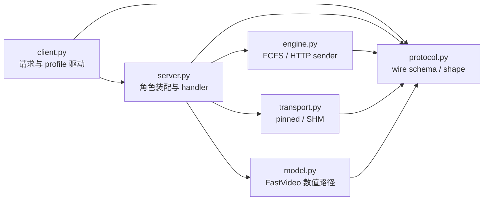

### 2.1 关键自由函数

| 函数 | 调用者 | 输入 → 输出 | 审核重点 |
|---|---|---|---|
| `resolve_video_num_frames()` / `latent_*_count()` | Pydantic request validator、client | duration/frames → 严格合法帧数和 chunk 数 | 不自动向上/向下修正，必须满足 `9 mod 12` |
| `serialize_latent_tensor()` | HTTP sender | BF16 BCTHW tensor → safetensors bytes | wire format 只允许一个 `latents` key，不使用 pickle |
| `parse_latent_safetensors_payload()` | VAE HTTP ingress | safetensors body → `SafetensorsLatentPayload` | 只解析 header；tensor-data 始终引用原始 body，不生成 pageable tensor |
| `materialize_latent_tensor_for_cpu()` / `deserialize_latent_tensor()` | CPU fake/兼容测试 | safetensors data/body → CPU tensor | 不进入真实 CUDA VAE HTTP ingress |
| `_fastvideo_t5_postprocess()` | `SfWanDitModel` | T5 hidden + mask → `[1,512,4096]` FP32 | 按 mask 截取，再补零，不转 BF16 |
| `_map_fastvideo_dmd_timesteps()` | DiT 加载 | scheduler tensor + raw indices → 四个映射 timestep | request/chunk 内不再 `set_timesteps` |
| `_pred_noise_to_pred_video_fastvideo()` | 每个 DMD step | prediction/noise/timestep → BF16 x0 | sigma 查询和减法使用 FP64，不调用 `scheduler.step` |
| `_denormalize_vae_latents_fastvideo()` | 每个 VAE chunk | normalized BF16 → denormalized FP32 | 必须先升 FP32再乘 std 加 mean |
| `_timed_cuda_call()` | T5、DMD、clean-KV、post-quant、decoder | callable → result + 可选 elapsed | profile 关闭时直接调用；NVTX 与 timing 独立 |
| `build_interarrival_delays()` | generate client | count/mode/seed/λ → 每次发送前 delay | Poisson 直接调用 `expovariate(λ)` |
| `_make_dummy_latents()` | VAE profile client | spec/seed → 全部 BF16 chunks | 先生成完整 FP32 latent，只整体转 BF16一次 |
| `_run_*_profile_iteration()` | profile client | 一次完整请求 → execution-only summary | 不把 submit、upload、queue、H2D 或 raw status复制进测量结果 |
| `build_shared_memory_descriptor()` | VAE SHM 注册 | shape/chunks → page-aligned descriptor | mapping 为 request-level，预留全部 chunk slot |
| `stage_shared_chunk_to_device()` | VAE handler | shared slot → `StagedDeviceChunk` | 只创建 VAE 本地 H2D event |
| `create_app()` | server CLI/tests | config/model factory → FastAPI app | endpoint 只做验证/排队，不在 event loop 跑模型 |
| `_write_mp4()` | mono/VAE handler | CPU uint8 chunks → MP4 | 整体编码时间与模型 execution 分开 |
| `validate_trt_layer_profile_manifest()` | TRT runtime 启动 | 独立 profile manifest + precision → 已解析 plan/Inspector contract | 绑定 source/plan/audit SHA；只在细粒度开关开启时调用 |
| `build_physical_layer_catalog()` | `TensorRTVaeRuntime` | Inspector + FP16 source-node map 或 v5 audit → 有序物理 layer catalog | FP16/INT8 精确对齐同一组 84 个目标 call site；融合 layer 只出现一次；证据不足归入 `other` |
| `aggregate_trt_layer_profile_iterations()` | profile-vae client | warmup/measured chunk records → detailed artifact + compact summary | 统计只使用 measured；保留 warmup 原始数组 |
| `detailed_artifact_reference()` | profile-vae client | detailed JSON 路径/内容 → 绝对路径 + SHA256 | summary 不复制完整 catalog 和时间数组 |

## 3. 数据与数值契约

### 3.1 帧数、chunk 和 shape

```text
T_latent = (T_video - 1) / 4 + 1
T_latent % 3 == 0
T_video % 12 == 9
total_chunks = T_latent / 3
```

| RGB frames | Latent frames | Chunks | RGB chunk 输出 |
|---:|---:|---:|---|
| 81 | 21 | 7 | `9 + 6 × 12` |
| 93 | 24 | 8 | `9 + 7 × 12` |

默认 480×832 时，一个传输 chunk 是：

```text
shape  = [B, C, T, H, W] = [1, 16, 3, 60, 104]
dtype  = torch.bfloat16
layout = contiguous BCTHW
bytes  = 1 × 16 × 3 × 60 × 104 × 2 = 599,040
```

### 3.2 DiT 的真实输入与调用

1. tokenizer 输出 `input_ids`、`attention_mask`，均为 int64。
2. UMT5 输出经 mask 截取并补零为 `[1,512,4096]` FP32。
3. 一个 CPU generator 一次生成完整 `[1,16,T_latent,H/8,W/8]` FP32
   初始噪声。
4. 每个 3-latent chunk：
   - 四次 causal Transformer DMD forward；
   - 每步执行 FastVideo 对齐的 FP64 `pred_noise_to_pred_video`；
   - 前三步在 CPU 生成 BF16 noise 并调用 `scheduler.add_noise`；
   - 最后执行一次 int64 zero timestep 的 clean-KV forward。
5. clean-KV 返回后才构造 `LatentChunk`。

DiT KV/cross-attention cache 始终属于当前 DiT request，不进入
`LatentChunk`，也不传给 VAE。

### 3.3 VAE 的真实输入与调用

每个 VAE chunk 固定执行：

```text
normalized BF16
  -> FP32
  -> z * latents_std_fp32 + latents_mean_fp32
  -> post_quant_conv（一次）
  -> decoder([1,16,1,h,w])（三次）
  -> cat / optional unpatchify / FP32 clamp
```

feature cache 由 Wan 原生 causal convolution 管理，服务层不人工拼接
latent：

| 请求内 latent 位置 | 历史 | RGB 输出 |
|---|---|---:|
| 第 1 个 | 两个零历史 | 1 |
| 第 2 个 | 一个真实 + 一个零历史 | 4 |
| 第 3 个及以后 | 两个真实历史 | 4 |

因此 chunk 0 是 `1/4/4 = 9` 帧；chunk 1 及以后都是
`4/4/4 = 12` 帧。`reset_request()` 只在完整 VAE job 开始时调用一次，
`finish_request()` 在完整 job 结束或失败清理时调用。

## 4. 类和关键抽象

下表先给出本实现新增的全部类/状态类型，避免阅读时只靠名字猜所有权。
`client.py` 没有新增 class，只提供窄职责函数和 CLI parser。

| 所在文件 | 类型 | 所有者与生命周期 | 为什么存在 |
|---|---|---|---|
| `protocol.py` | `GenerationRequest` / `DitProfileRequest` | client 构造，server 校验；单次提交 | 固化文本请求、合法帧数和 profile iteration |
| `protocol.py` | `LatentJobSpec` | DiT 或 profile client 构造，VAE job 全生命周期持有 | 固化完整 latent job 的 shape、chunk 数、source 和 transport |
| `protocol.py` | `SafetensorsLatentPayload` | HTTP PUT 创建，`VaeJobRecord` 持有到该 chunk 被 stage | 持有原始 body、shape 和 data offset；`data_view()` 不复制 latent data |
| `protocol.py` | `SharedMemoryDescriptor` / `SharedMemoryChunkReady` | VAE 创建 descriptor；两端持有到 job terminal | 使两进程对 mapping、lease 和 ready digest 有同一解释 |
| `protocol.py` | `JobState` / `JobEvent` / `JobStatus` | `JobRecord` 维护，查询时复制 | 对外暴露状态机、事件和指标 |
| `protocol.py` | `SubmissionResponse` / `LatentJobRegistrationResponse` / `EngineStatus` / `HealthResponse` | endpoint 临时构造 | 固化 HTTP 响应，不泄漏内部对象 |
| `model.py` | `ModelLoadConfig` | runtime 创建一次，注入模型角色 | 控制加载路径、精度、device 和低层插桩 |
| `model.py` | `LatentChunk` | DiT clean-KV 后创建，callback/transport 消费 | 表示“允许发布”的 normalized BF16 latent |
| `model.py` | `DecodedChunk` / `MonolithicOutput` | VAE/monolithic 返回，handler 消费 | 携带 RGB chunk、帧数和角色指标 |
| `model.py` | `_ComponentSet` | 一个进程一次；monolithic 两角色共享 | 收口 SGLang loader 和 world-size=1 初始化 |
| `model.py` | `SfWanDitModel` / `SfWanVaeModel` / `SfWanMonolithicModel` | 唯一 model executor thread 使用 | 三种明确数值角色；不做通用 pipeline 抽象 |
| `vae_trt_runtime.py` | `TensorRTVaeRuntime` | VAE model 创建一次；两个 context/cache bank 维持到 server 退出 | 把 request 的 chunk 0 路由到 initial engine，其余 chunk 路由到 steady engine |
| `vae_trt_profile.py` | `TrtLayerProfileCapture` | 细粒度开关开启时每个 initial/steady context 各一个；server 生命周期 | 串行维护 active capture、callback 顺序和稳定 catalog；异常时 fail closed |
| `runtime/distributed/local_single_process.py` | `LocalSingleProcessGroupCoordinator` | 无 C10d 进程初始化一次；各逻辑并行组共享 | 提供单 rank identity collective；跨 rank P2P 明确失败 |
| `engine.py` | `ReceivedChunk` | `VaeJobRecord` 从接收到消费 | 把 `data`（HTTP body view、SHM ref 或 CPU fake）、digest、接收时间和 ingress 诊断绑在一起 |
| `engine.py` | `PendingChunk` | HTTP DiT sender 从 D2H 启动到序列化完成 | 保持 GPU source、pinned slot 和 ready event 生命周期 |
| `engine.py` | `JobRecord` / `VaeJobRecord` | runtime 注册，FCFS engine 驱动至 terminal | 保存请求级状态；VAE 子类再保存乱序 chunk |
| `engine.py` | `SingleWorkerEngine` | runtime 启动/关闭 | FIFO waiting queue + 唯一 running slot |
| `engine.py` | `_TransferState` / `AsyncChunkSender` | 每个 HTTP DiT job / DiT runtime | 跟踪 accepted chunk 数并执行有界异步 HTTP 发送 |
| `transport.py` | `StagedDeviceChunk` | VAE H2D 启动到 decode 完成 | 保持 GPU tensor、ready event 和 pinned slot |
| `transport.py` | `SharedMemoryChunkRef` | ready control 接收到 VAE H2D 启动 | 延迟解释某个 SHM slot，避免 API thread 提前做 H2D |
| `transport.py` | `PinnedH2DLoader` | CUDA VAE runtime | bounded safetensors-body→pinned→GPU 一块前瞻路径 |
| `transport.py` | `SharedMemoryRegion` | VAE owner 或 DiT attachment，直到 terminal | mmap、CUDA host registration、slot copy 和 unlink |
| `transport.py` | `_SharedPendingChunk` / `_SharedTransferState` | SHM sender 内部 | 以 `pending_sources/events` 保持 D2H source/event 至完成，并跟踪 request mapping |
| `transport.py` | `SharedMemoryChunkSender` | SHM DiT runtime | D2H 到 shared slot，再发送 control-only ready |
| `server.py` | `ServerConfig` / `SfWanRuntime` | 进程启动到关闭 | 角色装配、资源所有权、endpoint 与 handler 的中心 |

### 4.1 Protocol 数据类型

| 类型 | 重要字段 | 作用 |
|---|---|---|
| `GenerationRequest` | prompt、height、width、num_frames/duration、fps、seed | 文本生成请求；负责解析最终帧数和 server limit |
| `DitProfileRequest` | GenerationRequest + warmup、iteration | 一次完整 DiT profile iteration |
| `LatentJobSpec` | request_id、shape 参数、total_chunks、source、transport、discard_output | DiT/VAE 之间或 VAE profile 的请求级契约 |
| `SafetensorsLatentPayload` | 原始 body、shape/dtype、data offset/bytes | header-only HTTP ingress；通过 `memoryview` 引用 tensor-data |
| `SharedMemoryDescriptor` | name、lease、offset、stride、bytes、shape、chunks | 两进程解释同一 SHM mapping 的固定布局 |
| `SharedMemoryChunkReady` | lease_token、digest | DiT D2H 已完成的跨进程可见性通知 |
| `JobEvent` / `JobStatus` | sequence、state、timestamps、metrics | 查询和诊断 |
| `SubmissionResponse` | request ID、status/result URL | 202 响应 |
| `LatentJobRegistrationResponse` | created、transport、可选 SHM descriptor | VAE 注册响应及重复注册语义 |
| `EngineStatus` / `HealthResponse` | queue snapshot、contract、load state | 只读运行状态 |

HTTP wire 只允许一个名为 `latents` 的 BF16、五维 BCTHW tensor，不接受
pickle。CUDA VAE 使用 `parse_latent_safetensors_payload()` 做严格 header
校验；`deserialize_latent_tensor()` 只保留给 CPU/兼容测试。

### 4.2 Model 层

#### `ModelLoadConfig`

重要变量：

- `model_path`：Hugging Face ID 或本地 checkpoint。
- `device_index`：当前单 GPU 进程使用的 CUDA device。
- `vae_precision`：`fp32` 是参考精度，`fp16` 是原生 PyTorch
  非参考路径；`fp16_trt` / `int8_trt` 选择固定 shape TensorRT backend。
- `vae_engine_dir`：仅 TensorRT VAE 使用；包含 manifest、initial/steady
  plan 和 INT8 audit。原生 PyTorch precision 设置该值会启动失败。
- `text_encoder_cpu_offload`：请求 T5 CPU offload；默认开。完整 C10d
  环境使用原 FSDP CPU offload，Jetson local 环境使用 layerwise offload。
- `dit_cpu_offload`：请求 causal DiT CPU offload；默认关。完整 C10d
  环境使用单卡 FSDP inference，Jetson local 环境使用 layerwise offload。
- `vae_cpu_offload`：VAE 是否在每个三 latent chunk 周围整模型搬入/搬出；
  默认关。
- `enable_profile`：是否执行低层计时。
- `enable_trt_layer_profile`：是否在专用 VAE profile server 上挂载
  TensorRT `IProfiler`；默认关，开启时必须同时启用 `enable_profile`。
- `enable_nvtx`：是否发出 NVTX range，和计时开关独立。

#### `_ComponentSet`

这是“一次 loader 上下文”的所有者。它初始化 world-size=1 运行时并调用
SGLang `PipelineComponentLoader`。monolithic 创建一次 `_ComponentSet`，
再把同一套 components 注入 DiT/VAE 角色，避免 loader 和权重初始化两次。

配置链严格为：

```text
server CLI
  -> ServerConfig
  -> SfWanRuntime.start()
  -> ModelLoadConfig
  -> _ComponentSet
  -> SGLang ServerArgs
  -> component loader
```

`_ComponentSet` 强制 `performance_mode="manual"`，因此 ServerArgs 的 auto
tuner 不会改写用户选择。它先初始化 distributed runtime，再按实际 backend
解析 offload：

- 完整 C10d backend：保持原实现，T5 offload 使用 FSDP CPU offload；
  `dit_cpu_offload=true` 同时设置 `use_fsdp_inference=true`。
- Jetson local backend：不请求任何 FSDP。T5/DiT 的 true 值写入
  `layerwise_offload_components`；所有组件加载后再显式调用
  `configure_layerwise_offload_modules()`，缺少可配置组件时立即失败。
- VAE 的 true 值在两类 backend 中都保持 per-chunk 整体 module 搬迁。

为保证上述 local 初始化能先于通用框架发生，`multimodal_gen` 的三个公共
顶层导出使用模块级 `__getattr__` 延迟解析；diffusion quantization registry
也只在实际选择 `fp8/modelopt/...` 时导入相应 backend。参考 SFWan 的
BF16/FP32 路径不会因为一次 package import 而进入未使用的 DeepGEMM 或
`sglang.srt.distributed`。

关闭某组件 offload 时，该组件常驻目标 device。服务不额外暴露
`use_fsdp_inference`，从而避免“local backend + FSDP”等无效组合。
`_ComponentSet` 同时记录 backend、requested 和 effective 三组只读信息，
供 `/v1/engine` 审核实际运行条件。

#### `LatentChunk`

字段为 `chunk_index`、`tensor`、`metrics`。它不是网络格式，而是模型层的
语义边界：只有 clean-KV 已完成的 normalized BF16 tensor 才能成为
`LatentChunk`。monolithic 直接使用 tensor；disaggregated sender 将它
转为 HTTP 或 SHM。

#### `SfWanDitModel`

关键成员：

| 变量 | 含义 |
|---|---|
| `tokenizer` / `text_encoder` | 正向 prompt 编码；不编码 negative prompt |
| `scheduler` | 加载时已设置 1000 timesteps；request 内不再 set |
| `transformer` | causal Wan DiT |
| `_dmd_timesteps_cpu` | 从 raw `[1000,750,500,250]` 映射出的 FP32 timestep |
| `_kv_cache` / `_crossattn_cache` | 当前 request 专属 cache |
| `sliding_window_num_frames` | 21 latent-frame KV 窗口 |
| `target_dtype` | BF16 |

重要函数：

- `_encode_prompt()`：tokenizer → T5 → FastVideo 补零；只返回正向 FP32
  embedding。
- `_prepare_initial_latents()`：用请求 seed 和 CPU generator 生成完整 FP32
  latent。
- `_prepare_caches()`：按空间 patch token 数创建请求级 KV/cross cache。
- `_forward_transformer()`：设置 SGLang low-level forward context 后直接调
  causal Transformer。
- `_denoise_chunk()`：四步 DMD、三次 re-noise、一次 clean-KV。
- `generate()`：遍历所有 chunk，在 clean-KV 后同步调用 callback，finally
  reset cache；finally 覆盖 prompt/latent/cache 准备和 chunk loop，因此
  准备阶段异常也不会把上一请求的 cache state带入下一请求。

`generate()` 的 callback 是同步函数。这一点同时决定：

- monolithic 会等 VAE chunk 完全结束后才继续下一个 DiT chunk；
- disaggregated 会等当前 chunk 成功进入有界 transfer queue 后才继续；
- queue/slot 满时会给 DiT model thread 施加 backpressure。

#### `SfWanVaeModel`

`SfWanVaeModel` 在构造时只做一次严格 backend 分支：

```text
fp32 / fp16
  -> 原有 _ComponentSet VAE
  -> 原有 post_quant_conv + 三次 per-latent decoder

fp16_trt / int8_trt
  -> 不加载 PyTorch VAE decoder
  -> TensorRTVaeRuntime(initial plan + steady plan + two cache banks)
```

两条路径共享 BF16 ingress 验证、FP32 mean/std 反归一化、输出 FP32 clamp、
RGB CPU/MP4 和 profile 汇总。TensorRT mean/std 来自构建时写入并由 model ID
约束的 manifest，不通过网络传输。

关键成员：

| 变量 | 含义 |
|---|---|
| `vae` | 只使用 post-quant 和 decoder 的 causal Wan VAE |
| `_latents_mean` / `_latents_std` | checkpoint config 中的 16-channel FP32 参数 |
| `_request_active` | 防止未 reset 就 decode |
| `vae._feat_map` / `_conv_idx` | 请求专属 causal feature cache 状态 |
| `_vae_weights_on_device` | 仅在 VAE offload 模式跟踪整模型当前是否已搬入 GPU |
| `_trt_runtime` | 原生路径为 `None`；TRT 路径持有两个 execution context、双 cache bank 和静态 RGB output buffer |

重要函数：

- `reset_request()`：清空并激活一个 request 的 causal decode state。
- `decode_chunk()`：验证 BF16 BCTHW、升 FP32、反归一化、执行低层 decode，
  可选转 CPU uint8。
- `_activate_vae_for_chunk()`：若开启 VAE offload，在执行计时开始前把整个
  VAE 的注册参数/缓冲区阻塞搬到目标 GPU。
- `_offload_vae_weights()`：若开启 VAE offload，在数值计时、可选 RGB
  CPU 转换和 `DecodedChunk` 组装之后，把整个 VAE 阻塞搬回 CPU。
- `_decode_per_latent()`：每 chunk 一次 post-quant，三次单 latent decoder；
  只在请求第一个 latent 设置 `first_chunk=True`。
- `_decode_trt_chunk()`：把 FP32 denormalized latent 交给 TRT runtime；
  runtime 内 cast FP16并执行 initial/steady plan，返回后统一转 FP32 clamp。
- `finish_request()`：清理 feature cache，并在嵌套 `finally` 中保证权重
  回到 CPU、请求所有权结束；decode 异常也走该路径。

profile 模式下，`chunk_execution_cuda_ms` 的 start event 被排在
`StagedDeviceChunk.wait_on_current_stream()` 之后，因此 H2D dependency
不会计入 VAE execution；VAE 权重 H2D 又发生在 start event 之前。结束点
位于 FP32 clamp 之后、RGB 转换和权重 D2H 之前。因此 VAE 权重 swap 不在
`profile_execution`，但会进入外层 `decode_wall_ms` 和请求总 wall time。

`vae._feat_map` 是普通 Python list 中的请求级 tensor，不是注册 parameter
或 buffer，所以 `vae.to("cpu")` 不会把它随权重搬回 CPU。这是有意设计：
同一请求的 chunk 之间保留 GPU feature cache，只交换模型权重；请求结束
仍由 `reset_causal_decode_state()` 清理一次。

#### `SfWanMonolithicModel`

组合一个 `SfWanDitModel` 和一个 `SfWanVaeModel`。它不包含 sender、
pinned latent staging 或 SHM。其 callback 直接调用 `vae.decode_chunk()`：

```text
for chunk i:
    DiT denoise(i)
    DiT clean-KV(i)
    if vae_cpu_offload: VAE weights -> GPU
    VAE decode(i)
    RGB -> CPU(i)
    if vae_cpu_offload: VAE weights -> CPU
```

callback 同时校验 chunk 0 必须为 9 帧、后续 chunk 必须为 12 帧；任何
偏差会先进入两角色的 finally cache reset，再使 job failed。
因此 VAE offload 打开时，DiT 与 VAE 仍不重叠；每块的两次整模型搬迁也
位于下一个 DiT chunk 之前。关闭时执行顺序与原实现完全一致，且没有
额外 module move。

### 4.3 Engine 层

#### `JobRecord`

保存 request ID、payload、FCFS sequence、state、timestamps、events、
metrics 和 output path。`mark_running/completed/failed/cancelled` 是唯一状态
变更入口。生命周期计时来自 `time_ns()`，始终开启且不做 CUDA 同步。
`add_event()` 追加单调 sequence 的事件；`to_status()` 复制当前状态形成
Pydantic 响应，不把可变内部字典直接交给 endpoint。

#### `VaeJobRecord`

在 `JobRecord` 上增加：

- `_chunks[index]`：乱序到达但尚未消费的 chunk。
- `_chunk_digests[index]`：即使 chunk 已消费，也保留内容身份用于幂等。
- `_chunk_condition`：当前 FCFS job 等待指定 index。

注册 job 时它就进入 FCFS；ready/PUT 只改变 chunk readiness，不重新排序。
`put_chunk()` 验证 index 并以 digest 做幂等插入；`wait_for_chunk()` 带
timeout、只弹出指定 index；`existing_chunk_digest()` 在消费后仍能判重；
`clear_chunks_and_wake_waiters()` 释放未消费 chunk data并唤醒 cancel
waiter。HTTP waiting/out-of-order chunk 只持有原始 pageable body，不提前占用
pinned slot。

#### `SingleWorkerEngine`

重要变量：

- `_waiting`：`deque`，严格 FIFO。
- `_running`：`None` 或一个完整 request。
- `_condition`：唤醒唯一 worker。

worker 从队首弹出 job，设置 `_running`，完整执行 handler，终态后才清空
running slot。`snapshot()` 只复制 waiting/running ID供 `/v1/engine` 查询。
VAE 在等待下一 chunk 时也不会切到别的 request。

#### `PendingChunk`

HTTP sender 对一个在途 chunk 的所有权包：

- `tensor`：pinned CPU slot；
- `source_tensor`：保持 GPU source 生命周期；
- `ready_event`：D2H 完成边界；
- `copy_start_event`：仅 profile 使用；
- `release_callback`：D2H/序列化结束后把 slot 放回 pool。

#### `AsyncChunkSender`

负责远端 HTTP：

1. `register_job()` 先在 VAE 注册 request。
2. `stage_tensor()` 在独立 copy stream 发起 GPU→pinned D2H。
3. `enqueue()` 将 `PendingChunk` 放入有界 asyncio queue。
4. sender 等 ready event，序列化 safetensors，释放 pinned slot。
5. PUT payload；相同 payload 重试是幂等的。
6. 全部 chunk 被接受后唤醒 DiT handler。

`wait_for_job()` 等 request-level accepted count 或 transfer error；
`cancel_remote_job()` 在上游失败时 DELETE VAE job；`release_job()` 只在
所有 sender work 已结束后删除本地 `_TransferState`。

### 4.4 Transport 层

#### `StagedDeviceChunk`

封装 VAE 端的 GPU latent、H2D ready event 和 pinned-slot release callback。

- `wait_on_current_stream()` 使用 compute stream `wait_event`，并对 GPU
  tensor 调用 `record_stream(compute_stream)`；前者建立依赖，后者防止
  wrapper 返回后 allocator 在 decoder kernel 完成前复用 device allocation。
  这里不会在 FastAPI event loop 做全设备同步。
- `completed_metrics()` 只在 profile 模式读取 H2D elapsed time。
- `release()` 始终确保 ready event 完成后才复用 pinned slot，这是正确性
  逻辑，不能随 profile 关闭。

#### `PinnedH2DLoader`

HTTP PUT 只解析 safetensors header，得到引用原始 Python `bytes` 的
`SafetensorsLatentPayload`。loader：

1. 获取有界 semaphore slot；
2. 通过 raw byte view 把 body 中的 tensor-data 一次复制到可复用 pinned
   BF16 tensor，不构造中间 pageable Torch tensor；
3. 在独立 H2D stream 异步复制到新 GPU tensor；
4. 返回 `StagedDeviceChunk`；
5. decode 完成后归还 pinned slot 和 semaphore。

`Request.body()` 之前的网络栈/ASGI 拷贝不属于这里的统计范围。修复后，
从 Python HTTP body 到 GPU 的应用层完整数据移动是一次 body→pinned CPU
copy 加一次 pinned→GPU H2D；这不是端到端 zero-copy。CPU fake/no-CUDA
路径才会显式 materialize CPU tensor。

#### `SharedMemoryRegion`

每个进程分别 mmap 同一 POSIX SHM，再在本进程执行
`cudaHostRegister(mapping_address, total_bytes)`。descriptor 的第一页保存
magic 和 canonical descriptor hash；attach 进程必须匹配。

```text
offset 0
+---------------- page 0 ----------------+
| magic + SHA256(descriptor) + zero pad  |
+--------------- data_offset ------------+
| chunk 0 BF16 bytes | page padding      |
+--------------- chunk_stride -----------+
| chunk 1 BF16 bytes | page padding      |
+----------------------------------------+
| ... total_chunks slots ...             |
+----------------------------------------+
```

VAE 是 owner：创建、close、unlink。DiT attach：close 但不 unlink。
`host_tensor(index)` 只创建 shared bytes 的 BF16 view；`copy_from_cuda()`
和 `copy_to_cuda()` 使用 CUDA runtime async memcpy，不生成第二份 staging
tensor；`digest(index)` 对固定有效字节而不是 page padding 做 SHA-256。

#### `SharedMemoryChunkSender`

DiT 直接把 GPU chunk D2H 到对应 shared slot。sender 必须等待本地 D2H
event，然后计算 shared bytes digest，最后发送 ready control。VAE 收到后
校验 lease、index、shape、dtype 和 digest，再在自己的 H2D stream 创建
另一个 event。CUDA event 从不跨进程。

它的 `wait_for_job()`、`cancel_remote_job()` 和 `release_job()` 与 HTTP
sender 具有相同 request-level 语义；区别是 release 还必须等待所有本地
D2H event并关闭 DiT attachment。因为这里调用的是裸
`cudaMemcpyAsync`，`_SharedTransferState.pending_sources` 显式持有每个
GPU source；只有对应 event 完成后才释放，cancel/close 也遵守同一顺序。

### 4.5 `SfWanRuntime`

关键成员：

| 变量 | 作用 |
|---|---|
| `_executor(max_workers=1)` | 唯一模型线程 |
| `_transfer_executor` | 仅 VAE 的 pageable/pinned/SHM staging |
| `engine` | request-level FCFS |
| `sender` | 仅 disaggregated DiT |
| `_h2d_loader` | 仅 CUDA VAE |
| `_shm_regions` | VAE 拥有的 request-level mappings |

`start()` 按 role 只装配需要的组件：

| role | model | sender | H2D loader |
|---|---|---|---|
| monolithic | DiT+VAE | 无 | 无 latent H2D |
| dit | DiT | 有 VAE URL 时创建 | 无 |
| vae | VAE | 无 | CUDA 时创建 |

`start()` 还把 `ServerConfig` 的三个 offload bool 原样写入
`ModelLoadConfig`。未加载组件对应的选项只是无效配置：例如 vae role
不会构造 T5/DiT，因此 text/DiT offload 不会产生权重、stream 或 buffer。
`/v1/engine` 的每个角色 contract 保留旧 `cpu_offload` 字段，并新增：

- `distributed_backend`：例如 `local` 或 `nccl`。
- `cpu_offload_requested`：当前角色组件对应的 CLI bool。
- `cpu_offload_effective`：`resident`、`layerwise`、
  `per_chunk_module`、`fsdp` 或 `fsdp_cpu_offload`。

monolithic 在嵌套的 `contract.dit` 与 `contract.vae` 中分别展示实际加载
组件；未加载组件的选项不会分配权重、stream 或 buffer。

重要 handler：

- `_handle_monolithic_job()`：执行 interleaved model，校验总帧数，写 MP4。
- `_handle_dit_job()`：profile 时丢弃所有 clean chunk；普通模式注册 VAE、
  stage/enqueue 每块、等待 sender 接受全部 chunk。
- `_handle_vae_job()`：reset 一次、按 index 等待/预取/解码全部 chunk、
  finish 一次、校验总帧数、可选写 MP4。只要 reset 已经开始，finally
  就会尝试 finish；即使 reset 中途异常也不会跳过第二次清理。

其余关键方法的调用边界：

| 方法 | 谁调用 | 做什么 | 失败/清理 |
|---|---|---|---|
| `start()` | FastAPI lifespan | 唯一线程加载角色模型，创建 FCFS，并按角色创建 sender/H2D loader | 任一步失败则 lifespan 不进入服务态 |
| `close()` | lifespan finally | 取消/等待 engine，关闭 sender/loader/mapping/executor | 幂等，不能遗留本任务启动的 worker |
| `submit_generation()` | `/v1/generations` | 校验 area/role，创建 `JobRecord`，append FCFS tail | 配置不完整返回 422 |
| `submit_dit_profile()` | `/v1/dit-profiles` | 要求 dit + profile flag，创建完整请求级 job | 不存在“只跑一个 chunk”的分支 |
| `register_latent_job()` | DiT sender 或 VAE profile client | 幂等注册 `VaeJobRecord`；SHM 时先创建 mapping | metadata 冲突为 409；失败回滚 job/mapping |
| `put_latent_chunk()` | HTTP PUT endpoint | 限 payload 大小、解析/校验 safetensors、按 digest 插入 | 相同 digest 幂等；不同 digest 冲突 |
| `ready_shared_memory_chunk()` | SHM ready endpoint | 校验 lease、重算 shared bytes digest、插入 `SharedMemoryChunkRef` | 不复制跨进程 CUDA event |
| `cancel_latent_job()` | upstream DELETE | 标记 cancel，唤醒 waiter；安全时立即清 SHM | running job 的 in-flight H2D 由 handler finally join |
| `_cleanup_shm_region()` | terminal/cancel/close | 删除 mapping 并 unregister/close/unlink | descriptor 小元数据保留到进程关闭，使已接受 ready 的重试仍可校验 lease/digest |
| `job_status()` / `engine_status()` | GET endpoints | 复制单 job 或 queue/contract snapshot | 不改变 queue，不触发 GPU work |

## 5. 类调用结构

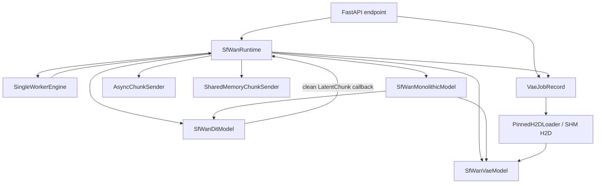

## 6. Job 状态机

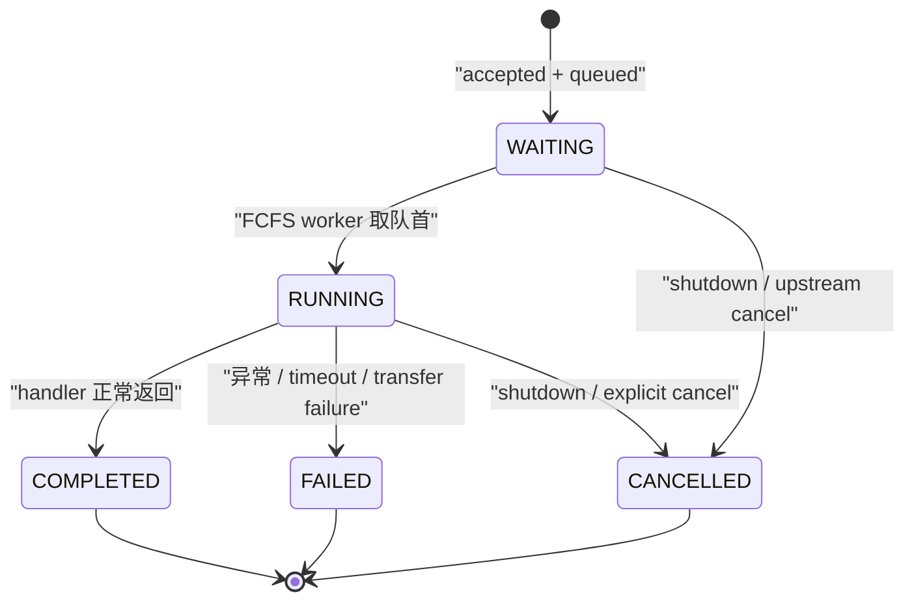

## 7. 请求生命周期

### 7.1 Client 异步生成与 FCFS

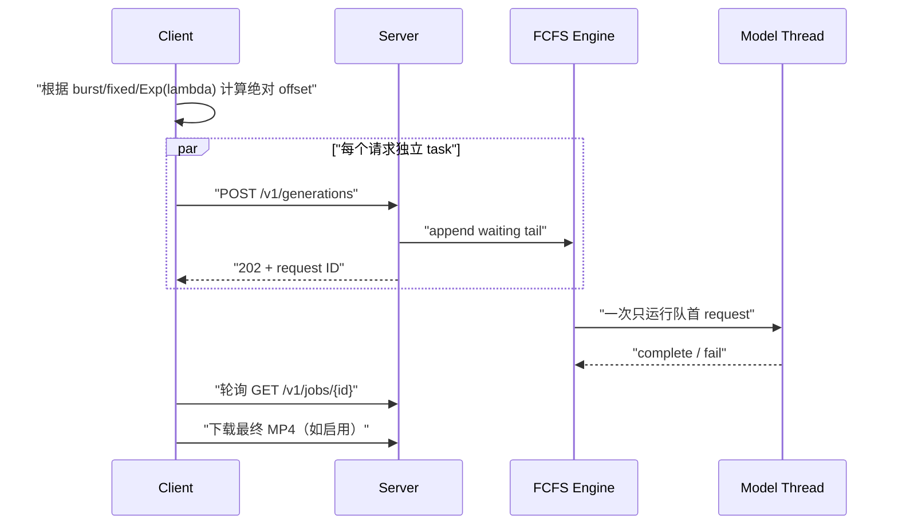

Poisson 参数是到达率 λ（requests/s），间隔采样调用
`Random.expovariate(lambda)`，期望间隔为 `1/lambda` 秒。

### 7.2 Monolithic generate

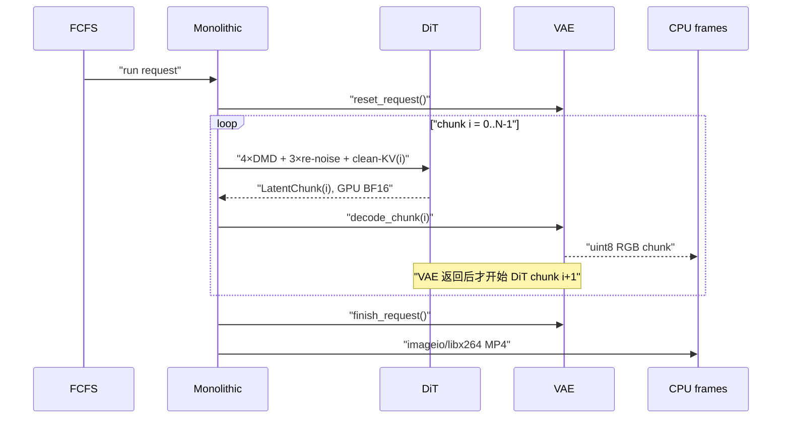

没有 latent D2H/H2D、safetensors、sender、SHM 或 transfer queue。

### 7.3 Disaggregated HTTP

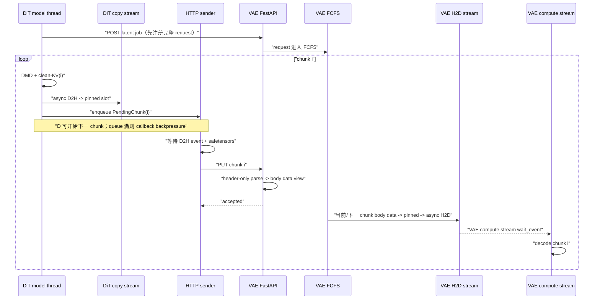

`_handle_vae_job()` 只预取下一块。即使后续 chunk 已经乱序到达，也按
index 消费。

### 7.4 Disaggregated SHM

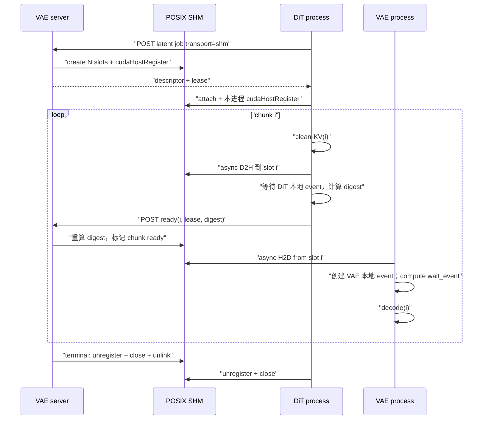

ready control 是跨进程内存可见性边界；不是 CUDA event 传递。

### 7.5 DiT-only profile

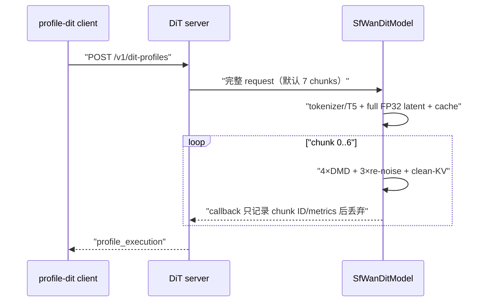

没有 VAE 注册、D2H、sender 或 transfer buffer。

### 7.6 VAE-only profile

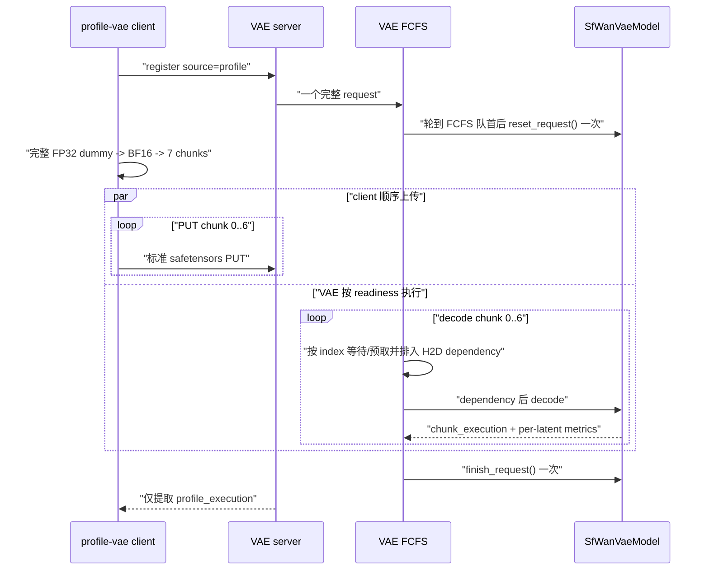

client 输出不包含 dummy 构造、序列化、upload RTT、parse、H2D 或 queue
时间。若显式保存视频，路径单列在 top-level `saved_outputs`，不会混入
`measured/all_iterations`。chunk 0 报告 9 帧；chunk 1–6 分别报告 12 帧。

## 8. `transfer-depth` 到底控制什么

| 场景 | depth 控制 | depth=1 | depth=2 | depth>2 |
|---|---|---|---|---|
| HTTP DiT | sender queue 容量和 pinned D2H slot 上限都分别设为 depth | 很快 backpressure | 两个独立边界都为 2 | 可容纳更多 D2H/serialize/send 在途 |
| HTTP VAE | pinned H2D semaphore/pool | 当前 chunk 持有 slot 时下一块不能 stage | 当前 decode 与下一块 H2D 可重叠 | 当前代码仍只 look-ahead 1 块 |
| SHM DiT | pending D2H/ready control queue | 强 backpressure | 默认两条 pending control | 不改变 SHM 总大小 |
| SHM mapping | 不受 depth 控制；固定为 `total_chunks` 个 slot | 同左 | 同左 | 同左 |
| monolithic | 未构造 transfer manager | 无影响 | 无影响 | 无影响 |
| DiT profile | 未构造 sender/D2H | 无影响 | 无影响 | 无影响 |

HTTP DiT 的 `stage_tensor()` 会在 pinned slot pool 满时阻塞 model callback；
随后 `enqueue_future.result()` 也会在 sender queue 满时阻塞。这是刻意的有界
内存 backpressure，不是死锁。

HTTP VAE 不在 PUT handler 中获取 pinned slot。否则 waiting job 或乱序远期
chunk 可以占满有限 slot，反过来阻塞真正位于 FCFS 队首的请求。只有 running
job 的当前 chunk 和最多一个 next-chunk prefetch 会进入
`PinnedH2DLoader`。

## 9. Retry、幂等和清理

- sender 执行一次初始请求加 0.5/1/2 秒三次退避重试。
- HTTP chunk 以 safetensors payload digest 判定幂等；相同 index 和 digest
  返回成功，不同内容返回冲突。terminal job 仍接受“相同已见 digest”的
  重试，但拒绝 terminal 后出现的新 chunk。
- SHM ready 同时校验 lease 和 shared slot digest。
- VAE 等待一个 chunk 默认 600 秒；timeout 后 job failed、清 cache、释放
  staged slot/SHM，并继续下一个 FCFS job。
- sender failure 会标记 DiT job 失败、取消远端 VAE job并释放本地 state。
- HTTP `http_rtt_ms` 和 SHM `control_rtt_ms` 包围完整
  request-with-retries；若发生重试，它们包含 backoff，不是单次 wire RTT。
  `safetensors_parse_ms` 现在是 header-only 验证 wall time，
  `pageable_to_pinned_ms` 是 raw body data→pinned 的唯一完整 CPU copy；
  parse/digest wall 指标仍可能包含 `to_thread` 调度，均属于 raw transfer
  diagnostics。
- `finally` 路径负责：
  - DiT KV/cross cache reset；
  - VAE causal feature cache finish；
  - pinned slot/semaphore 归还；
  - pending prefetch join/release；
  - SHM unregister/close/unlink。

V1 不做 job TTL/eviction：terminal `JobRecord`、小型 event/metric 和 SHM
descriptor 元数据保留到 server 重启，以支持状态查询和已接受 ready 的幂等
重试；大 tensor、pinned slot、feature/KV cache 和 SHM mapping 不会因此保留。

## 10. Profiling 口径和开销

| 类别 | 默认 | 包含 | 不包含 |
|---|---|---|---|
| lifecycle | 开 | accepted/start/end、queue wait、job total、model load、chunk/frame count | 细粒度 kernel |
| `profile_execution` | `--enable-profile` | DiT/VAE 模型实际执行及逐 chunk/latent 指标 | queue、网络、D2H/H2D、RGB/MP4 |
| transfer diagnostics | `--enable-profile` | parse、pinned copy、D2H/H2D、serialize、digest、RTT、service interval | 模型 kernel 汇总 |
| output | 按请求 | RGB D2H、MP4 | DiT/VAE execution |
| NVTX | `--enable-nvtx` | range 标记 | 不自动开启 Event timing |

`profile_execution` 的稳定层次如下：

```text
DiT:
  component, num_chunks
  tokenizer/T5/text_encode
  latent_init_cuda_ms/latent_init_ms
  cache_prepare_cuda_ms/cache_prepare_ms
  timestep_to_device_cuda_ms/timestep_to_device_wall_ms
  chunks[i]:
    chunk_index, chunk_execution_wall_ms
    denoise_steps[0..3]:
      timestep, Transformer cuda_ms
      pred_to_video_cuda_ms/wall_ms
      renoise_cuda_ms/wall_ms（最后一步为 None）
    clean_kv_cuda_ms
  dit_execution_wall_ms

VAE:
  component, num_chunks, vae_execution_cuda_ms
  chunks[i]:
    chunk_index, decoded_rgb_frames, chunk_execution_cuda_ms
    bf16_ingress_cuda_ms/wall_ms, denorm_cuda_ms/wall_ms
    post_quant_cuda_ms
    latent_frames[0..2]: latent_index, cuda_ms, decoded_rgb_frames

TensorRT VAE 的 chunks[i] 另外包含:
    trt_engine_kind: initial | steady
    trt_precision: fp16 | int8
    trt_input_cast_cuda_ms
    trt_engine_cuda_ms
    trt_output_finalize_cuda_ms
```

DiT 的 `chunk_execution_wall_ms` 终点在 latent callback 之前。VAE 的
`chunk_execution_cuda_ms` 起点排在 compute stream 的 H2D wait 之后，终点
在 concat、可选 unpatchify 和 clamp 之后、RGB 输出之前。
profile handler 还会校验 DiT chunk ID 连续、每块恰有四个 DMD 与
clean-KV，以及 VAE execution chunk ID 与实际 FCFS decode index 一致；
缺失指标会使 job 失败，不会返回一个看似成功但不完整的 profile。

关闭 profile 时：

- `_timed_cuda_call()` 直接调用 forward；
- 不创建 start/end timing Event；
- 不做 per-call timing synchronize；
- 不构造 DMD/per-latent timing list；
- copy ready event 仍创建，但 `enable_timing=False`。

打开 profile 时，per-call CUDA Event 会同步以得到局部 elapsed time。这会
扰动被测运行，因此它适合科研分解和对比，不代表完全无插桩的 production
throughput。`profile_execution` 与 raw lifecycle/transfer 指标必须分别看。

## 11. 参数审核表

### Server

| 参数 | 默认 | 角色 | 影响 |
|---|---|---|---|
| `--role` | 必填 | 全部 | `monolithic/dit/vae` 装配边界 |
| `--model-path` | SFWan HF ID | 全部 | 权重和 config 来源 |
| `--host/--port` | `0.0.0.0:30000` | 全部 | HTTP 监听 |
| `--public-url` | 无 | 全部 | 返回给 client 的可访问 URL |
| `--vae-url` | 无 | dit | 普通 disaggregated generate 必需；DiT profile 不需要 |
| `--output-dir` | `sfwan_outputs` | mono/vae | MP4 保存 |
| `--max-pixels` | `480×832` | 全部 | 请求面积上限；0 表示不限制 |
| `--transfer-depth` | 2 | dit/vae | bounded sender/pinned pool；见第 8 节 |
| `--chunk-timeout` | 600 s | vae | 当前 FCFS request 等下一块的上限 |
| `--device-index` | 0 | 全部 | 当前进程 CUDA device |
| `--latent-transport` | http | dit/vae | `http` 或同 Linux CUDA 主机 `shm` |
| `--vae-precision` | fp32 | mono/vae | `fp32/fp16` 为原生 PyTorch；`fp16_trt/int8_trt` 为固定 480×832、SM87 TensorRT |
| `--vae-engine-dir` | 无 | mono/vae | TRT precision 必填；原生 precision 禁止；manifest/plan/audit 的目录 |
| `--text-encoder-cpu-offload [true\|false]` | 开 | mono/dit | 完整 C10d 为 FSDP CPU offload；Jetson local 为 layerwise；单独写 flag 等价于 true |
| `--dit-cpu-offload [true\|false]` | 关 | mono/dit | 完整 C10d 为单卡 FSDP inference；Jetson local 为 layerwise；权重搬迁计入 forward |
| `--vae-cpu-offload [true\|false]` | 关 | mono/vae | 每个三 latent chunk 前整模型 H2D、结果组装后整模型 D2H |
| `--enable-profile` | 关 | 全部 | 开启详细计时并允许 profile request |
| `--enable-trt-layer-profile` | 关 | 仅 vae | 仅与 `--enable-profile` 和 TRT precision 联用；把 server 限定为 VAE profile-only 并启用 TensorRT `IProfiler`；见第 15 节 |
| `--enable-nvtx` | 关 | 全部 | 独立 NVTX range |

### Client generate

| 参数 | 作用 |
|---|---|
| `--num-requests` | 请求总数 |
| `--workload-jsonl` | 每行覆盖一个请求；行数必须等于请求总数 |
| `--height/--width` | 必须为 16 的倍数且不超过 server area limit |
| `--num-frames` / `--duration-seconds` | 互斥；最终帧数必须满足 `9 mod 12` |
| `--fps` | duration 换帧数及 MP4 FPS |
| `--seed` | DiT noise seed |
| `--arrival-mode burst` | 所有 POST offset 为 0 |
| `--arrival-mode fixed` | 使用 `--fixed-interval-seconds` |
| `--arrival-mode poisson` | 使用到达率 `--poisson-lambda` requests/s |
| `--arrival-seed` | 只控制请求到达间隔采样 |

### Profile client

| 参数 | 作用 |
|---|---|
| `--warmup W` | W 个完整请求，不进入 `measured` |
| `--repeat R` | R 个完整 measured 请求 |
| `profile-dit --num-frames` | 决定所有 DiT chunk 状态都被覆盖 |
| `profile-vae --seed` | 完整 FP32 dummy latent 的 CPU RNG seed |
| `profile-vae --trt-layer-profile-json PATH` | 细粒度 TRT server 必填；写完整 catalog、逐 layer 数组和 validation，summary 只保存其路径/SHA 与紧凑聚合 |
| `--save-video` | VAE profile 额外做 RGB/MP4，但不并入 execution |

## 12. 推荐代码阅读路径

1. 先读 `protocol.py` 的帧数、shape 和三种 job schema。
2. 读 `model.py` 的三个角色，确认数值函数和 callback 边界。
3. 读 `SingleWorkerEngine` 与 `VaeJobRecord`，理解 request-level FCFS。
4. 分别读 HTTP `PendingChunk/AsyncChunkSender` 和
   `StagedDeviceChunk/PinnedH2DLoader`。
5. 再读 `SharedMemoryRegion/SharedMemoryChunkSender`。
6. 最后读 `SfWanRuntime` 三个 handler；这里负责把前述对象装配起来。
7. 用 CPU registered test 对照每条不变量。

## 13. 审核检查表

- [ ] 每块是否只在 clean-KV 后发布？
- [ ] 81 帧是否出现 chunk ID 0–6？
- [ ] VAE 是否只在 request 开始/结束 reset，未在 chunk 间 reset？
- [ ] monolithic 是否完全没有 latent transfer 资源？
- [ ] HTTP sender 是否保持 source 和 pinned slot 到 D2H/serialize 安全结束？
- [ ] VAE compute stream 是否在 decoder 前 wait H2D event？
- [ ] SHM ready 是否只在 DiT D2H event 完成后发送？
- [ ] 两进程是否各自创建 CUDA event而非传 event？
- [ ] profile 关闭时是否没有纯计时 Event/synchronize？
- [ ] `profile_execution` 是否排除了 queue、network、H2D 和输出编码？
- [ ] 任一 timeout/failure 后是否释放 cache、slot、mapping 并继续 FCFS？

## 14. Jetson TensorRT VAE backend

### 14.1 设计边界

TensorRT 是 `SfWanVaeModel` 的一个窄 backend，不是新的 pipeline。它只在
`vae_precision` 为 `fp16_trt` 或 `int8_trt` 时导入；原有
`fp32/fp16` 分支不会导入 `tensorrt`、不会读取 plan，也不会分配 TRT cache
bank。首版约束固定如下：

| 项目 | 固定值 |
|---|---|
| GPU | Jetson AGX Orin SM87 |
| batch | 1 |
| RGB 分辨率 | 480×832 |
| latent chunk | `[1,16,3,60,104]` FP16 engine input |
| 请求 ingress | `[1,16,3,60,104]` BF16 normalized |
| initial RGB | `[1,3,9,480,832]` FP16 |
| steady RGB | `[1,3,12,480,832]` FP16 |
| effective feature cache | 32 个 FP16 tensor |
| 单 bank | 944,286,720 elements / 1,888,573,440 bytes |
| runtime cache | 两个 bank，约 3.518 GiB |

INT8 只覆盖 14 个 `WanResidualBlock` 的 `conv1/conv2`，即 28 个主要
3×3×3 Conv3d。`post_quant_conv`、首尾卷积、shortcut、attention、norm、
SiLU、add、upsample 和 feature cache 保持 FP16。LightX2V 提供的是
“离线 weight scale + op 入口 activation scale + 低精度 kernel + FP16
外围”的设计参照；它的 FP8 GEMM kernel 没有被复制到 5D Conv3d。

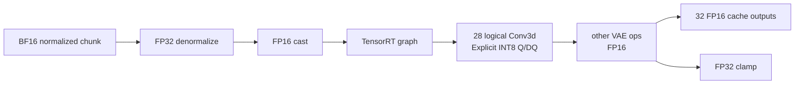

### 14.2 构建调用链

`vae_trt_build.py` 只在离线构建命令中运行：

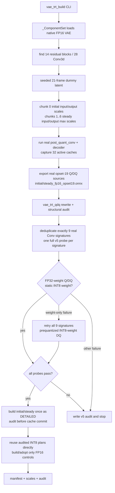

关键点：

1. `_run_decoder_chunk()` 直接调用已经加载的 `vae.post_quant_conv`、
   `vae.decoder`、`wanvae.forward_context` 和原生 cache list；没有复制
   decoder 数学。
2. `_portable_causal_pad_for_export()` 只在构建作用域内暂时禁用 fused
   cat/pad，使 ONNX 看见标准 Torch cat/pad；退出 context 后恢复全局值。
3. 构建先真实运行 chunk 0，依据非 `None` tensor 找到 32 个有效 cache；
   不能仅凭 33 个 causal-conv module 类型推断。
4. initial wrapper 固定展开 `first_chunk=True/False/False` 三次 latent
   decode；steady wrapper 固定展开三次 `first_chunk=False`。
5. dummy latent 先整体生成 FP32，再整体转 BF16；hook 同时收集每个目标 Conv
   的 input/output absmax。chunk 0 的三个 call 共享 initial 最大值，chunk
   1–6 的十八个 call 共享 steady 最大值；scale 为
   `max(absmax/127, 1e-8)`。
6. initial/steady ONNX 各自包含 84 个展开 Conv call site。scale 数值按 logical
   Conv 汇总，但每个 call site 都复制独立 input/output scale、zero point、
   weight、weight scale 和 bias；图中不共享这些 initializer 或 Q/DQ 输出。
7. 主 weight topology 是独立 FP32 constant→Q→DQ；若已映射的静态 filter
   仍未成为 INT8，builder 才会用独立 INT8 constant→DQ 重跑全部九种
   signature。initial/steady 必须选择同一种 encoding。

### 14.3 Q/DQ 重写与 fail-closed audit

`vae_trt_qdq.py` 是纯 ONNX 层，不加载 server、Torch VAE 或 TensorRT。
每个目标 Conv 被改为：

```text
FP16 activation
  -> Cast(FP32)
  -> QuantizeLinear(INT8, scalar FP32 scale, int8 zero)
  -> DequantizeLinear(FP32)
  -> Conv(
       FP32 dequantized activation,
       independent FP32 weight constant
         -> QuantizeLinear(axis=0, INT8)
         -> DequantizeLinear(FP32),
       independent FP32 bias
     )
  -> QuantizeLinear(INT8, output scalar FP32 scale, int8 zero)
  -> DequantizeLinear(FP32)
  -> Cast(FP16)
```

TensorRT 10.3 [release
notes](https://docs.nvidia.com/deeplearning/tensorrt/archives/tensorrt-1030/pdf/TensorRT-Release-Notes.pdf)
记录的限制是 Q/DQ data 与 scale 只支持 FP32；因此所有 local Q/DQ 语义均为
FP32，外围图再通过 Cast 保持 FP16。v4 只有输入/weight Q/DQ，Conv 输出没有
trailing Q；实际 Inspector 因而显示 Float activation、Float weight、Float
output 和 `f32f32_tf32f32` tactic。v5 在 Conv 后直接增加 output Q/DQ，使
TensorRT 有机会融合 INT8 input、静态 INT8 weight 和 INT8 output。它不会生成
`QLinearConv` 或 `ConvInteger`。结构审计必须同时满足：

- ONNX opset 恰为 19，checker 与 shape inference 通过；
- Q/DQ rewriter 只接受真正以 opset 19 导出的图，绝不会只修改旧图的
  `opset_import` 版本号；
- 每个 target activation 必须恰有一个 FP16→FP32 Cast；Conv 输出必须直接
  进入 output Q→DQ，再由唯一 FP32→FP16 Cast恢复原 tensor 名称；
- input/output/weight scale 和 bias 均为 FP32，zero point 必须是全零 INT8；
- 每个图恰有 84 个 target Conv、84 条 input Q/DQ、84 条 output Q/DQ 和
  84 个独立 bias；weight 路径只能全为 84 条 FP32 Q/DQ，或全为 84 条
  prequantized INT8 DQ，禁止混用；
- FP32 weight source 或预量化 INT8 weight source 必须互不共享且 rank 5；
- weight scale 必须为正且 finite，长度等于 output channel，Q/DQ axis
  均为 0；
- 每个 logical module 的 call index 恰为 `0,1,2`；
- 每个 call site 保存 input/weight/output shape、kernel、padding、stride、
  dilation、groups，并生成稳定的 `signature_id`。
- target Conv 的 input/output shape 来自真实 initial/steady dummy forward
  的 hook 捕获（input 包含原生 causal padding）；ONNX shape inference 若也给出
  对应 shape，则必须与捕获值一致。内部 `value_info` 缺失本身不再误判失败。

builder 合并 initial/steady 共 168 个 call site，并严格要求得到九种唯一
signature；每种 signature 用和正式图相同的 helper 生成一个独立 v5 probe，
逐个构建并审计。
`--preflight-only` 在所有 probe 通过后返回 0，不构建完整 VAE plan。任一
signature 失败都会记录它覆盖的 initial/steady call site 并立即停止，不能据此
泛化宣称“Orin 不支持所有 INT8 Conv3d”。

Inspector 映射同时搜索 `Name` 和 `Metadata`，兼容融合 layer。每个 probe 和
full-plan target Conv 必须同时证明：

- activation engine input 的 `Format/Datatype` 为 INT8；
- Conv engine output 的 `Format/Datatype` 为 INT8；
- 不存在 dynamic filter（Inspector 通常报告 `HasDynamicFilter=0`；字段缺失时，
  必须有非空静态 INT8 `Weights` 作为等价证据）；
- `Weights.Count>0` 且 `Weights.Type=Int8`；
- `TacticName` 含 INT8/IMMA/i8 计算证据；
- tactic 不含 `f16f16`、`f32f32` 或 TF32 fallback。

因此即便某个周边 reformat 输出是 INT8，只要 Conv 本身是 dynamic Half filter
或 `f16f16` tactic，仍然严格失败。initial/steady INT8 plan 固定以
DETAILED 构建，各审计 84 个 call site，审计通过的同一份 plan直接成为 runtime
plan，不再另建无法审核的 `profiling_verbosity=none` 副本。

构建状态写在 `build_state_v5.json`，stage 明确区分 `built`、
`audit_failed`、`audit_passed`。每个 stage 记录源 ONNX SHA256、输出 plan
SHA256、Q/DQ schema、profiling verbosity 和 audit SHA；plan 与 JSON 均使用
临时文件后原子替换。`--resume` 可对已经 built/failed 的 plan重新审计，不必
重编。旧 FP16
opset 图和既有 FP16 plan 会保持原样配对使用；若旧图不是 opset 19，构建器
会另行原子导出 `initial_fp16_opset19.onnx` 与
`steady_fp16_opset19.onnx`，仅将它们用于 Q/DQ/INT8 构建。旧图不会被覆盖、
伪升级或送入 Q/DQ rewriter。旧 FP16 ONNX/plan 可在 shape、dtype 和 I/O
验证后接管；v2/v3/v4 INT8 ONNX/plan/state/audit/timing cache 永不接管或
覆盖。v5 使用 `initial_int8_qdq_v5.onnx/plan`、
`steady_int8_qdq_v5.onnx/plan`、`quant_scales_v5.json`、
`int8_audit_v5.json` 与 `tensorrt_timing_qdq_v5.cache`。只有构建 identity
完全匹配时，才可复用 v4 input activation scales 与未量化的 opset-19 source
ONNX；output activation scales必须重新收集。

timing cache 通过
`IBuilderConfig.create_timing_cache/set_timing_cache/get_timing_cache` 管理。
build 只返回 candidate bytes；probe/full-plan 的 tactic audit 通过后才原子提交。
build 失败、dynamic filter、FP16/FP32/TF32 fallback 均不会污染稳定 cache。

### 14.4 Manifest 与启动校验

`manifest.json` 是 plan 的执行契约，不是可选说明文件。启动时
`validate_trt_vae_manifest()` 在导入 TensorRT 前验证：

- schema、model ID、batch、分辨率、latent shape/dtype；
- 32 个 cache binding 的连续 index、shape、dtype、总元素和 bank bytes；
- initial/steady RGB shape；
- 所选 precision 的两个 plan 路径位于 engine directory 内；
- plan SHA256；
- `int8_trt` 额外要求 Q/DQ/audit schema 5、weight encoding 三方一致、九种
  signature probe 全通过、initial 与 steady 各映射 84 个 call site，所有
  unmapped/non-INT8/input-not-INT8/output-not-INT8/dynamic-filter/
  FP16/FP32/TF32 fallback 列表为空；
- physical engine I/O audit 证明 initial 的 32 个 cache output 以及 steady
  的 32 input/32 output 全为 FP16；任何 INT8 cache binding 都拒绝启动；
- audit、manifest engine record、磁盘 plan 三方 SHA256 完全一致，且 INT8
  plan 的 build verbosity 为 detailed。

`TensorRTVaeRuntime` 随后验证当前 compute capability、CUDA major/minor、
TensorRT 精确版本和 plan 的实际 I/O binding 名称/shape/dtype。V1 不做
兼容性猜测或静默回退：任一不一致都会使 server 启动失败。

### 14.5 Runtime 状态机和双 bank

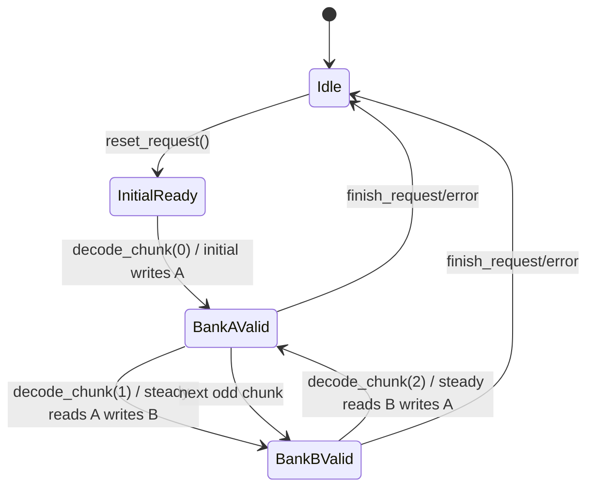

`TensorRTVaeRuntime` 的重要成员：

| 成员 | 所有权/含义 |
|---|---|
| `_engines["initial"/"steady"]` | 反序列化 plan，server 生命周期 |
| `_contexts[...]` | 每个 plan 唯一 execution context，仅 model thread 调用 |
| `_cache_banks[0/1]` | 32-slot FP16 output/input bank；不在 chunk 间重新分配 |
| `_rgb_outputs[...]` | 9-frame / 12-frame 静态 FP16 output buffer |
| `_read_bank_index` | 当前有效历史 bank；reset 后为 `None` |
| `_next_chunk_index` | 强制 chunk 严格连续，防止错误 cache 与 latent 配对 |

执行时所有地址通过 PyTorch CUDA tensor 的 `data_ptr()` 绑定；使用当前
PyTorch stream 的 `cuda_stream` 调用 `execute_async_v3`。chunk 0 只绑定
latent、RGB 和 cache outputs；steady 还绑定上一个 read bank 的 32 个
inputs。output 永远写另一个 bank，执行成功后才切换 `_read_bank_index`。
没有 latent D2H/H2D，也没有每 chunk cache allocation。

INT8 plan 为保留 Inspector 信息以 DETAILED 构建。context 创建后，server 未开
`--enable-nvtx` 时把 `context.nvtx_verbosity` 降为 `NONE`；打开该参数时保留
`DETAILED`。设置后立即回读校验，实际值通过 `/v1/engine` 的
`vae_runtime_nvtx_verbosity` 暴露。这不会改变已保存的 Engine Inspector 信息。

### 14.6 四种请求路径

TensorRT 只替换 VAE model 内部，FCFS 和 transport 不变：

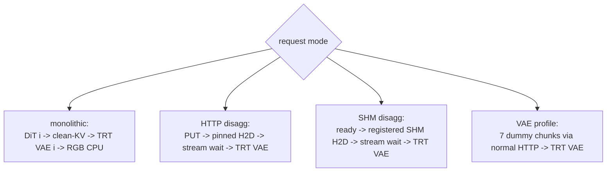

- monolithic TRT `_ComponentSet` 只加载 DiT/T5/scheduler/Transformer；
  `SfWanVaeModel` 从 plan 构造 runtime，不存在第二份 PyTorch VAE 权重。
- HTTP/SHM 的 `StagedDeviceChunk.wait_on_current_stream()` 仍发生在
  `decode_chunk()` 之前，所以 H2D dependency 不进入 VAE execution。
- VAE profile 仍是一个 7-chunk 完整请求；chunk 0 走 initial，chunk
  1–6 走 steady，request 结束一次 reset。
- TensorRT precision 不改变 waiting/running queue、乱序缓存、超时、幂等
  或一块 look-ahead。

### 14.7 TensorRT profile key

只有 server 使用 `--enable-profile` 时才创建以下计时 Event：

| key | value 与边界 |
|---|---|
| `trt_input_cast_cuda_ms` | 当前 chunk 的 denormalized FP32 latent → FP16 |
| `trt_engine_cuda_ms` | 仅 `execute_async_v3` 排入当前 stream 的 GPU elapsed |
| `trt_output_finalize_cuda_ms` | TRT FP16 RGB → FP32 + `clamp(-1,1)` |
| `trt_engine_kind` | chunk 0 为 `initial`，其余为 `steady` |
| `trt_precision` | 实际加载的 plan family：`fp16` 或 `int8` |

它们位于 `metrics.profile_execution.chunks[i]`。
`chunk_execution_cuda_ms` 是包含 denorm、cast、engine 和 finalize 的更大
区间；`vae_execution_cuda_ms` 是七个 chunk execution 的和。HTTP parse、
pageable→pinned、H2D、FCFS wait、RGB D2H 和 MP4 始终不进入这些 key。
profile 关闭时，kind/precision 仍作为低成本状态存在，但三个 `*_cuda_ms`
不会创建或返回。

### 14.8 TensorRT 审核清单

- [ ] build 是否在实际执行 plan 的 SM87 Orin 上完成？
- [ ] initial/steady cache 是否都是 32 个且共 944,286,720 elements？
- [ ] initial/steady RGB 是否分别为 9/12 帧？
- [ ] 两个 Q/DQ graph 是否各有 84 个 input Q/DQ、84 个 output Q/DQ、84 个
  独立 FP32 bias、84 个 output FP16 Cast，且没有共享 scale/weight/Q/DQ？
- [ ] weight encoding 是否全图统一为 `fp32_qdq` 或
  `prequantized_int8_dq`，且 manifest/probe/structural/tactic audit一致？
- [ ] `int8_probe_suite_v5.json` 是否覆盖 initial/steady 各 84 个 call site，
  signature 是否严格为 9/9 并全部通过？
- [ ] `int8_audit_v5.json.passed` 是否为 true，unmapped/non-int8/
  input-not-INT8/output-not-INT8/dynamic-filter/FP16/FP32/TF32 fallback 是否
  全部为空？
- [ ] initial 32 个 cache output、steady 32 input/32 output 是否均为 FP16，
  `quantized_bindings` 是否为空？
- [ ] initial/steady INT8 plan 是否就是经过 detailed audit 的同一份 runtime
  plan，而非另建的 NONE plan？
- [ ] audit、manifest 与磁盘 plan 的 SHA256 是否三方一致？
- [ ] failed audit 是否保持 `tensorrt_timing_qdq_v5.cache` 原值不变？
- [ ] manifest 的四个 plan digest 是否匹配？
- [ ] `GET /v1/engine` 是否显示 `vae_backend=tensorrt`、正确 precision/SM/TRT？
- [ ] `vae_runtime_nvtx_verbosity` 是否与 `--enable-nvtx` 一致？
- [ ] chunk kind 是否为 `initial, steady, steady, steady, steady, steady, steady`？
- [ ] reset 后下一请求的 chunk 0 是否重新走 initial？
- [ ] `fp32/fp16` 启动是否完全不导入 TensorRT runtime？
- [ ] monolithic TRT 是否未加载 PyTorch VAE，且仍按 chunk 同步交错？

## 15. TensorRT 细粒度 layer profile

### 15.1 定位：诊断模式，不是新的性能主路径

细粒度 layer profile 是为了给下一轮量化性能摸高提供证据的中间工具。它
回答“时间落在哪个 TensorRT 物理 layer/算子类别”，不改变模型数学，也不
取代 production latency：

| 模式 | server 开关 | 回答的问题 | 是否用于最终延迟对比 |
|---|---|---|---|
| 普通 TensorRT profile | `--enable-profile` | denorm、cast、整块 engine、finalize 各耗时多少 | 是；重点看 `trt_engine_cuda_ms` |
| TensorRT 细粒度 profile | 再加 `--enable-trt-layer-profile` | engine 内物理 layer 和算子类别占比 | 否；`IProfiler` callback/report 会扰动执行 |
| NVTX | 独立 `--enable-nvtx` | 外部 profiler 的 range 归属 | 不隐式开启上述任何一种 profile |

隔离不变量：

- 默认关闭；关闭时不读 profile manifest、不导入 `vae_trt_profile.py`、不
  构造 `IProfiler`、不访问 context profile API。
- 只支持 `role=vae`、`source=profile` 和 `fp16_trt/int8_trt`。
- 开启后普通 disaggregated latent job 会被拒绝；它必须是专用 profile
  server，避免带插桩与不带插桩的请求混跑。
- 不支持 monolithic、DiT 或 PyTorch VAE。
- 不改 Q/DQ v5、weight encoding、activation scale、32 个 FP16 feature-cache
  binding、双 bank、FCFS、HTTP ingress 和 chunk 顺序。

### 15.2 两种 precision 如何保证可比

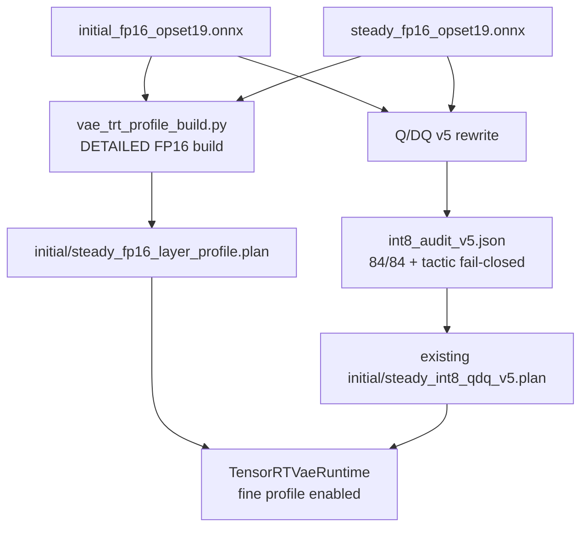

FP16 control 必须直接来自 Q/DQ 重写之前的同一份真实 opset-19 source，不能
拿历史 opset-17 plan 当“同源控制”。INT8 则直接引用已经通过 v5 tactic audit
的 DETAILED runtime plan；profile builder 绝不重新构建第二份 INT8 plan。
因此两者共享 initial/steady 展开方式、shape 和 cache ABI，而量化拓扑只有
INT8 分支存在。

### 15.3 独立 profile-plan 构建与 artifact 所有权

`vae_trt_profile_build.py` 的输入是一个已经完成 production build 的 engine
目录。它新增且只管理：

```text
initial_fp16_layer_profile.plan
steady_fp16_layer_profile.plan
initial_fp16_layer_profile_inspector.json
steady_fp16_layer_profile_inspector.json
trt_layer_profile_manifest.json
trt_layer_profile_build_state.json
trt_layer_profile_timing.cache
```

它不会覆盖：

- `manifest.json`；
- FP16 production plan；
- `initial/steady_int8_qdq_v5.plan`；
- `int8_audit_v5.json`；
- production 或 v5 timing cache。

构建状态绑定 source ONNX SHA、plan SHA、SM、TensorRT/CUDA 版本和构建
参数。`--resume` 只跳过 identity 完全一致且已经验证成功的 stage。
profile timing cache 使用独立文件；builder 先持有 candidate bytes，只有
plan 反序列化、I/O 和 32-cache-binding 校验全部通过后才原子提交，失败或
中断不污染稳定 cache。stage 不会在审计前写成 completed。

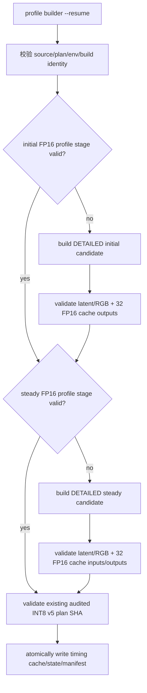

### 15.4 Server 启动约束与可观察 contract

`--enable-trt-layer-profile` 必须与以下设置同时成立：

| 约束 | 原因 |
|---|---|
| `--enable-profile` | 细粒度结果仍需与已有 chunk CUDA Event 区间配对 |
| `--role vae` | 单 worker、完整请求级 feature-cache 所有权是 profiler 串行化前提 |
| `--vae-precision fp16_trt\|int8_trt` | PyTorch VAE 没有 TensorRT execution context |
| `--vae-engine-dir` | profile manifest、profile plan 或 v5 audit/plan 的来源 |
| `trt_layer_profile_manifest.json` 有效 | 绑定 source、plan、I/O 和 environment identity |

启动时逐项探测 TensorRT 10.3 API：`IProfiler`、context `profiler`、
`enqueue_emits_profile` 和 `report_to_profiler`。任一缺失都立即报错，不能像
过去错误假设 builder API 一样在真实执行中才暴露，也不能静默降级成只有
整块 Event 的结果。

`GET /v1/engine` 暴露：

```json
{
  "trt_layer_profile_enabled": true,
  "trt_layer_profile_scope": "vae_profile_only",
  "trt_layer_profile_schema_version": 1,
  "trt_layer_profile_plan_kind": "same_source_fp16|audited_int8_v5",
  "trt_layer_profile_plan_sha256": {
    "initial": "...",
    "steady": "..."
  }
}
```

client 在上传 dummy latent 之前读取这个 contract：server 已开启但 client
没有 `--trt-layer-profile-json`，或 client 指定了该路径而 server 没开，均
在第一个请求发出前报错。

### 15.5 `IProfiler` 调用顺序和状态机

每个 initial/steady execution context 各拥有一个 profiler。runtime 明确
设置：

```text
context.enqueue_emits_profile = False
```

每个 chunk 的唯一合法调用序列为：

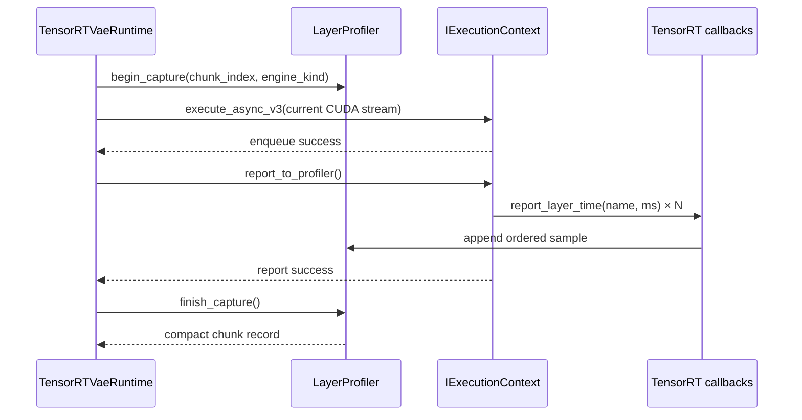

约束：

- `report_to_profiler()` 紧跟同一 context 的成功 enqueue；stream/context 在
  report 完成前保持存活。
- profiler 同时只能有一个 active capture，依赖现有 SingleWorkerEngine
  的单模型线程，不增加锁内并发。
- initial 只接受 chunk 0；steady 只接受 chunk 1–6。
- report 返回 false、零 callback、嵌套 capture、跳号、engine kind 错误、
  layer 数量或有序名称漂移均 fail closed。
- 请求失败/结束会清空 active capture 状态，但不改变正常 cache bank
  reset/释放流程。

### 15.6 物理 layer catalog 与分类

首次 initial/steady 执行分别固定一个 catalog。layer 的稳定身份不是只有
名字，而是 `name + occurrence index`；这样 TensorRT 返回重名 layer 时仍
可与时间数组一一对应。后续每次 callback 必须保持相同顺序和长度。

catalog entry：

```json
{
  "index": 0,
  "name": "...",
  "layer_type": "...",
  "tactic_name": "...",
  "category": "target_quantized_conv",
  "logical_call_sites": ["..."],
  "classification_source": "source_onnx|v5_audit|inspector|name_rule|unknown"
}
```

固定类别：

| 类别 | 含义 |
|---|---|
| `target_quantized_conv` | 跨精度目标集合：INT8 为 v5 audit 证明真实 INT8 tactic 的 residual Conv；FP16 为同一 84 个 call site 的未量化控制层 |
| `target_qdq_cast_reformat` | 目标 Conv 周围独立存在的量化、Cast、layout/reformat |
| `non_target_conv` | 首尾、shortcut、temporal/spatial 等尚未纳入目标的 Conv |
| `attention` | spatial attention 的 Q/K/V、投影和融合 attention layer |
| `upsample_resample` | temporal/spatial upsample、resize/resample |
| `norm_activation_residual` | norm、SiLU、residual/add 及其融合 |
| `cache_layout_copy` | Inspector name/Metadata 明确带 cache 语义的 concat/slice/copy/layout；以及排除 attention、upsample、norm 后，由 causal export 生成的 `Slice`/`SlicCast` 状态更新；普通 Reformat/Shuffle/Reshape 不会被猜成 cache |
| `other` | 证据不足，拒绝只凭名字猜测 |

TensorRT 10.3 会把 Wan RMSNorm 拆成 `ReduceL2`/`Reduce` 与 elementwise，
并把部分 nonlinearity 编译成带 `Sigmoid`/`Tanh` 的 kgen 名称；这些物理层
归入 `norm_activation_residual`。causal cache 更新在导出的静态图中表现为
`Slice`，并可能进一步融合成 `SlicCast`。上述规则只用于已有 initial/steady
固定图，且检查顺序先排除 attention、upsample 和 norm；不把所有 layout
conversion 都宣称为 cache。

INT8 v5 还有一条只对已审计 plan 生效的有序邻接规则。TensorRT 10.3
compiler backend 会把部分 activation Q/DQ + layout 降成匿名
`TranReshSlic`、`ReshTran` 等 `kgen`，原 ONNX 名称完全消失。catalog 仅将
“紧邻 v5 audit 已映射 INT8 Conv 之前、连续不超过三个、且 opcode 明确是
transpose/reshape/slice 的 kgen”归入 `target_qdq_cast_reformat`；相同名字若
不紧邻目标 Conv，仍保留为 `other`。这利用了 Inspector 的物理执行顺序和
84 个 audited consumer，而不是凭 `int8` 文本猜测。`CastCastAddCast`、
`CastCastMulCast` 以及指向 `PWN(.../Add)` 的 Reformat 则是 residual/norm
外围，归入 `norm_activation_residual`。

FP16 映射不是靠 `Conv` 字符串猜测：profile builder 沿用 v5 的静态 weight
initializer 解析得到 28 个逻辑模块和 84 个原始 ONNX node name，再以完整
node-name 边界匹配 Inspector `Name`/`Metadata`；因此 `Conv` 不会误命中
`Conv_1`。INT8 继续只接受 v5 tactic audit 映射。任一 precision 缺少 84 个
target call site 时 fail closed。

一个物理融合 layer 可以映射多个 logical call site，但时间只累计
一次，也不会人为平均分摊给这些 logical Conv。catalog SHA 绑定 plan SHA
和有序 entries，防止把某次运行的数组套到另一份 plan/catalog。

### 15.7 chunk 记录、详细产物和紧凑 summary

server 在原有 `profile_execution.chunks[i]` 中只增加紧凑记录：

```json
{
  "trt_layer_profile": {
    "schema_version": 1,
    "engine_kind": "initial|steady",
    "catalog_sha256": "...",
    "layer_times_ms": [1.2, 0.4, 3.1],
    "layer_sum_ms": 4.7,
    "engine_event_ms": 4.9,
    "layer_sum_over_engine_ratio": 0.959,
    "category_totals_ms": {
      "target_quantized_conv": 2.8,
      "cache_layout_copy": 1.1,
      "other": 0.8
    },
    "reported_layer_count": 3
  }
}
```

`engine_event_ms` 是已有 `trt_engine_cuda_ms` 的同一插桩区间；
`layer_sum_ms` 是 TensorRT callback 之和。两者的差不能简单命名为 Q/DQ
开销：IProfiler 本身、TensorRT 融合/图优化和未 callback 的子图都可能产生
偏差。`layer_sum_over_engine_ratio` 只用于覆盖度判断。

client 的两个输出各有明确边界：

| 参数/文件 | 内容 |
|---|---|
| `--trt-layer-profile-json PATH` | 环境、plan/catalog SHA、完整 initial/steady catalog、所有 warmup/measured 数组、逐 layer 统计、逐 chunk/steady pooled/whole-request/category 汇总、validation/warnings |
| `--summary-json PATH` | 原有 execution 结果 + 紧凑 `trt_layer_profile_summary` + detailed artifact 的绝对路径和 SHA256；不复制完整 catalog/数组 |

两个路径必须不同；client 会在提交第一个请求前拒绝相同路径，避免紧凑
summary 覆盖详细证据并使其中记录的 SHA256 失效。

warmup 原始数据会写入详细文件，但所有 mean、population stddev、min、max
和 count 只使用 measured iteration。81 帧时：

- chunk 0/initial 的样本数是 `repeat`；
- chunk 1–6 各自样本数是 `repeat`；
- steady pooled 样本数是 `repeat × 6`；
- whole request 每个 measured iteration 都包含 7 个 chunk。

client 先写详细诊断文件并计算 SHA，再写紧凑引用；即使 validity 最后判定
失败，也先保留现场再以非零状态退出。

### 15.8 科学有效性与优化决策门槛

`valid_for_optimization_decision` 只有在以下条件同时满足时才为 true：

- plan SHA、profile manifest 和 catalog SHA 一致；
- initial/steady catalog 跨 iteration 稳定；
- 每个时间数组长度等于 catalog 长度，callback/report 均完整；
- FP16 initial/steady 的 84 个 source target，以及 INT8 initial/steady 的
  84 个 audited target call site 都映射完整；INT8 还必须保留 v5 tactic 证据；
- category 总和与 `layer_sum_ms` 在浮点容差内闭合。

下列情况会保存数据但增加 warning/限制结论：

- `layer_sum_over_engine_ratio` 超出 `[0.90, 1.10]`：profile 覆盖不完整，
  `layer_profile_complete=false`；
- `other` 超过 layer sum 的 10%：分类不足，不能据此选择具体算子族；
- instrumented 与 uninstrumented engine 时间明显不同：逐 layer 数据只能看
  占比，不能直接作为真实 latency。

通过后按以下阈值决定下一轮开发：

| 实测条件 | 优先动作 |
|---|---|
| Q/DQ/Cast/Reformat ≥ 10% | 融合/减少量化边界 |
| non-target Conv ≥ 10% | 逐 signature probe 后扩大 Conv 量化覆盖 |
| steady cache ≥ 20% 且 DRAM-bound | 评估 INT8 feature-cache ABI |
| attention/upsample 占主导 | 转向对应 kernel/图融合，而非继续盲目量化 Conv |

完成归因后必须关闭 `--enable-trt-layer-profile`，用同样的 warmup、repeat、
shape、seed 分别重测 FP16/INT8 `trt_engine_cuda_ms`。细粒度结果决定“优化
哪里”，无插桩结果决定“真实加速多少”。

### 15.9 细粒度 profile 审核清单

- [ ] FP16 profile plan 是否来自 `*_fp16_opset19.onnx`，而非历史 opset-17？
- [ ] INT8 是否引用原有 audited v5 plan，且没有重新构建？
- [ ] profile artifacts/state/cache 是否与 production/v5 artifact 完全隔离？
- [ ] initial/steady profile plan 是否仍有 32 个 FP16 cache binding？
- [ ] server 是否同时满足 role、precision、engine-dir 和两个 profile 开关？
- [ ] 缺少任一 TensorRT profiler API 时是否启动即失败？
- [ ] 开关关闭时是否完全没有 profiler import/manifest read/context hook？
- [ ] instrumented server 是否拒绝 `source != profile` 的 latent job？
- [ ] chunk 0 是否只用 initial，chunk 1–6 是否只用 steady？
- [ ] callback 的 layer 名称、occurrence、顺序和数量是否稳定？
- [ ] 融合 layer 是否只累计一次，且未把时间虚构分摊到多个 call site？
- [ ] category totals 是否严格闭合为 `layer_sum_ms`？
- [ ] detailed artifact 是否在 validation failure 前落盘？
- [ ] summary 引用的绝对路径和 SHA256 是否与 detailed 文件一致？
- [ ] warmup 是否保留但排除于所有 measured 统计？
- [ ] 最终性能结论是否来自关闭细粒度开关后的真实性能重测？
